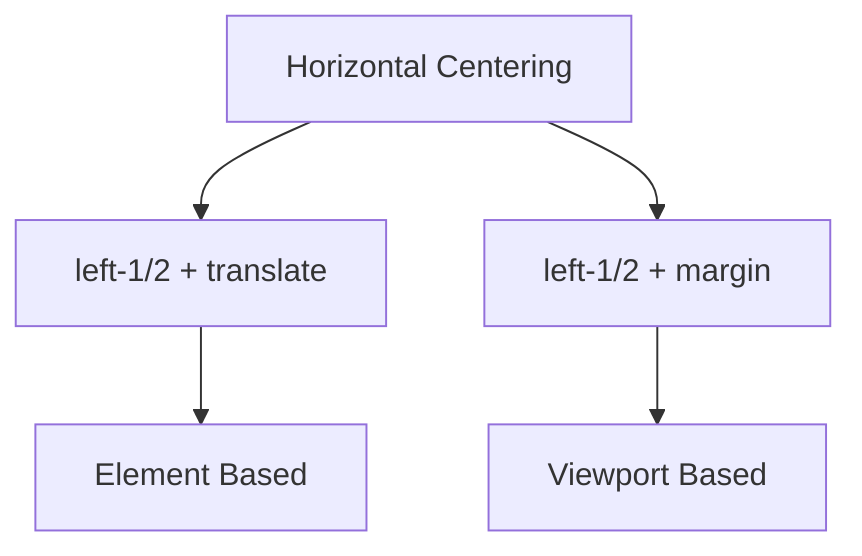

# 기본 개념



# 기본 Centering 방식

## left-1/2와 transform 조합
```html
<div class="relative w-screen h-screen">
    <div class="absolute left-1/2 transform -translate-x-1/2 
                bg-blue-500 w-64 h-32">
        Centered Element
    </div>
</div>
```

작동 방식:
1. `left-1/2`: Element의 left edge를 container 중앙에 위치시킨다
2. `-translate-x-1/2`: Element를 자신의 width의 50%만큼 왼쪽으로 이동시킨다

# Viewport 기준 정렬

## left-1/2와 -ml-[50vw] 조합
```html
<main class="flex max-w-4xl flex-col relative">
    <section class="relative h-screen">
        <div class="absolute left-1/2 -ml-[50vw] w-screen">
            Full Width Content
        </div>
    </section>
</main>
```

작동 방식:
1. `left-1/2`: Element의 left edge를 container 중앙에 위치시킨다
2. `-ml-[50vw]`: Element를 viewport width의 50%만큼 왼쪽으로 이동시킨다
3. `w-screen`: Element를 viewport 전체 width로 확장한다

# Use Case별 구현 방법

## 1. Modal Centering
```html
<!-- transform 사용 -->
<div class="fixed inset-0 flex items-center justify-center">
    <div class="absolute left-1/2 transform -translate-x-1/2
                bg-white p-6 rounded-lg shadow-xl">
        <h2>Modal Title</h2>
        <p>Modal Content</p>
    </div>
</div>
```

## 2. Full Width Carousel
```html
<!-- Viewport 기준 정렬 -->
<div class="relative">
    <div class="absolute left-1/2 -ml-[50vw] w-screen">
        <div class="flex overflow-x-auto">
            
            
        </div>
    </div>
</div>
```

# 방식별 특징

## Transform 방식 (-translate-x-1/2)
1. 장점:
   - Dynamic size에 따라 자동으로 조정된다
   - Precise centering이 가능하다
   - 다른 element의 layout에 영향을 주지 않는다

2. 사용 시기:
   - Modal, Popup 등 fixed width element
   - Container 내부 element centering
   - Dynamic size element centering

## Viewport 기준 방식 (-ml-[50vw])
1. 장점:
   - Viewport full width 활용이 가능하다
   - Parent container 제약을 벗어날 수 있다
   - Full screen layout에 적합하다

2. 사용 시기:
   - Full width banner
   - Carousel
   - Background image나 container

# Performance와 Responsive 고려사항

## 1. Performance 최적화
```html
<!-- GPU 가속 활용 -->
<div class="transform-gpu -translate-x-1/2">
    High Performance Element
</div>
```

## 2. Responsive Design
```html
<!-- Responsive Centering -->
<div class="absolute left-0 md:left-1/2 
            md:-translate-x-1/2 w-full md:w-auto">
    Responsive Element
</div>
```

# 결론

1. 일반적인 centering에는 `transform` 방식을 사용한다
2. Full width가 필요한 경우 `-ml-[50vw]` 방식을 사용한다
3. 각 방식의 특성을 이해하고 use case에 맞게 선택한다
4. Responsive design을 고려하여 구현한다