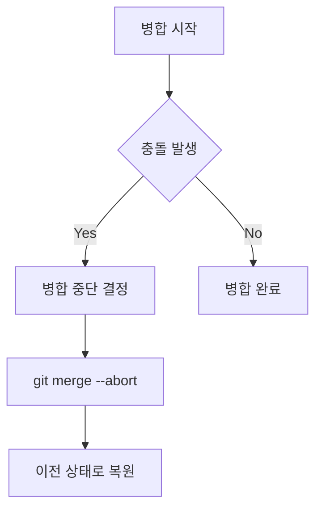

# 개요
Git 병합 중 충돌이나 문제가 발생했을 때, 병합 작업을 안전하게 취소하고 이전 상태로 돌아가는 방법을 설명한다.

# 기본 명령어
```bash
git merge --abort
```

# 작동 방식


# 상황별 해결 방법

## 1. 일반적인 병합 취소
```bash
# 병합 시도
git merge feature-branch

# 충돌 발생 시 취소
git merge --abort
```

## 2. 변경사항 보존 필요시
```bash
# 현재 변경사항을 스태시로 저장
git stash

# 병합 취소
git merge --abort

# 나중에 변경사항 복원
git stash pop
```

## 3. 강제 취소가 필요한 경우
```bash
# 주의: 모든 로컬 변경사항 삭제
git reset --hard HEAD
```

# 주의사항
1. 병합 취소 전 중요한 변경사항 백업
2. working directory가 깨끗한지 확인
3. 취소 후 상태 확인 필수

# 모범 사례

## 병합 전 준비
```bash
# 현재 상태 확인
git status

# 필요시 변경사항 백업
git stash

# 최신 원격 변경사항 가져오기
git fetch origin
```

## 병합 후 검증
```bash
# 병합 취소 후 상태 확인
git status

# 브랜치 정보 확인
git branch -v
```

# 문제 해결

## 병합 취소가 작동하지 않는 경우
```bash
# 1. 강제 리셋
git reset --hard HEAD

# 2. 브랜치 재설정
git checkout -B master origin/master
```

# 결론
Git 병합 취소는 신중하게 수행해야 하는 작업이다. 항상 중요한 변경사항을 백업하고, 상황에 맞는 적절한 명령어를 선택하여 사용해야 한다.