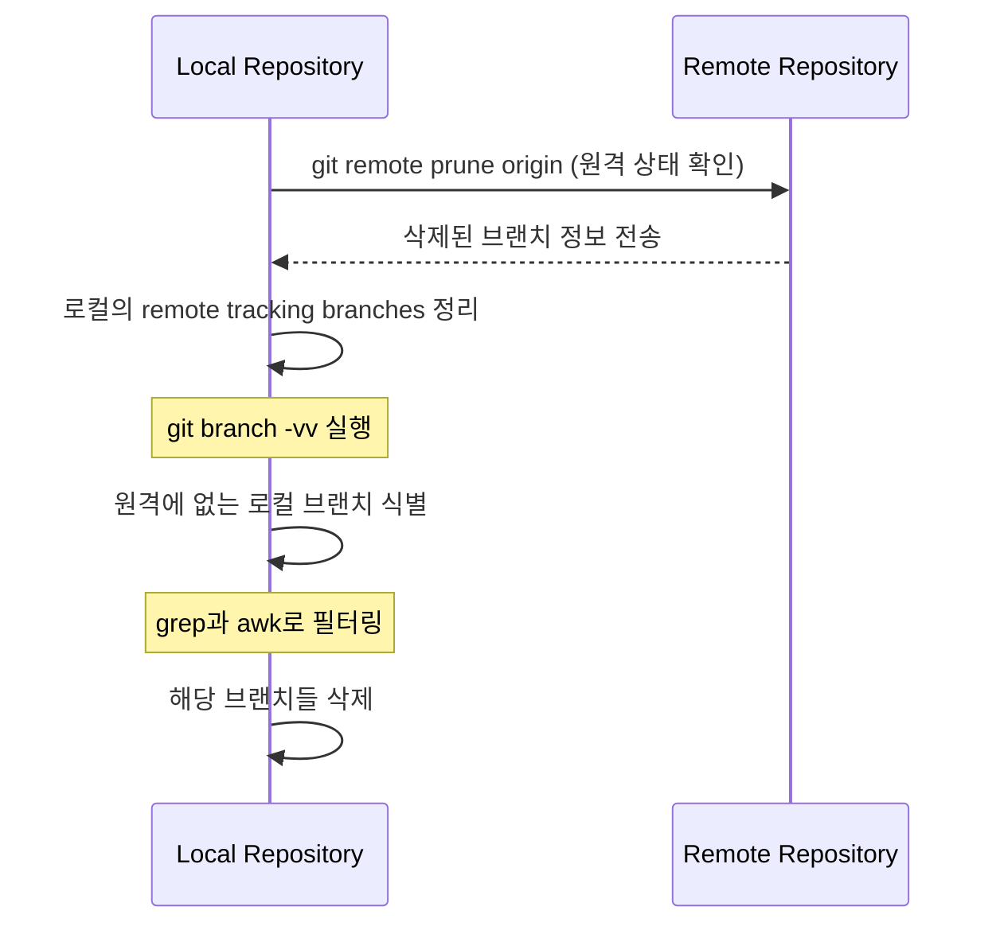

# Git remote prune으로 브랜치 정리하기

Git을 사용하다 보면 로컬 저장소에 불필요한 브랜치들이 쌓이게 된다. 마치 옷장에 더 이상 입지 않는 옷들이 쌓이는 것처럼, Git 저장소도 주기적인 정리가 필요하다. 이번 글에서는 Git remote prune 명령어를 활용해 로컬 브랜치를 효과적으로 정리하는 방법을 알아보자.

# 기본 개념 이해하기

## Remote Tracking Branch란?

Remote tracking branch는 원격 저장소의 브랜치 상태를 추적하는 로컬의 참조다. 예를 들어, `origin/feature-1`은 원격 저장소의 `feature-1` 브랜치를 추적하는 로컬의 참조다.

## Stale Branch란?

Stale branch는 원격 저장소에서는 이미 삭제되었지만, 로컬에는 여전히 남아있는 브랜치를 의미한다. 이는 마치 휴대폰에 있는 삭제된 친구의 연락처와 같다.

# 동작 방식 이해하기



# 실제 사용 예시

## 기본 사용법

```bash
# 1. 가장 간단한 방법 (추천)
git remote prune origin && git branch -vv | grep ': gone]'| awk '{print $1}' | xargs git branch -D

# 2. 단계별 실행
# 2-1. 원격에서 삭제된 브랜치 확인
git remote prune origin --dry-run

# 2-2. 실제 정리 실행
git remote prune origin

# 2-3. 로컬 브랜치 중 원격에서 삭제된 브랜치 확인
git branch -vv | grep ': gone]'

# 2-4. 해당 브랜치들 삭제
git branch -vv | grep ': gone]'| awk '{print $1}' | xargs git branch -D
```

# 고급 활용법

## 특정 브랜치 제외하기

```bash
# 'keep-'으로 시작하는 브랜치는 제외하고 삭제
git branch -vv | grep ': gone]' | grep -v 'keep-' | awk '{print $1}' | xargs git branch -D
```

## 자동화 스크립트 만들기

```bash
#!/bin/bash
# git-cleanup.sh
echo "🔍 Checking for branches to clean..."
git remote prune origin
TO_DELETE=$(git branch -vv | grep ': gone]' | awk '{print $1}')

if [ -z "$TO_DELETE" ]; then
    echo "✨ No stale branches found!"
    exit 0
fi

echo "🗑️ The following branches will be deleted:"
echo "$TO_DELETE"
read -p "Continue? (y/n) " -n 1 -r
echo
if [[ $REPLY =~ ^[Yy]$ ]]; then
    echo "$TO_DELETE" | xargs git branch -D
    echo "✅ Cleanup complete!"
fi
```

# 주의사항

1. **강제 삭제 주의**
   - `-D` 옵션은 강제 삭제이므로 신중하게 사용해야 함
   - 병합되지 않은 변경사항이 있다면 데이터 손실 가능성 있음

2. **현재 브랜치 확인**
   - 현재 체크아웃된 브랜치는 삭제되지 않음
   - 삭제하려는 브랜치가 현재 브랜치라면 다른 브랜치로 전환 필요

3. **백업 권장**
   - 대규모 정리 전에는 브랜치 상태 백업 추천
   ```bash
   # 모든 브랜치 목록 백업
   git branch > branches_backup.txt
   ```

# 실전 시나리오

## 시나리오 1: 피처 개발 후 정리

```bash
# 1. feature 브랜치 병합 완료
git checkout main
git pull origin main
git branch --merged  # 병합된 브랜치 확인

# 2. 원격 브랜치 정리
git remote prune origin

# 3. 로컬 브랜치 정리
git branch -vv | grep ': gone]'| awk '{print $1}' | xargs git branch -D
```

## 시나리오 2: 대규모 프로젝트 정리

```bash
# 1. 현재 브랜치 상태 백업
git branch > branches_backup.txt

# 2. 병합된 브랜치 확인
git branch --merged main > merged_branches.txt

# 3. 원격에서 삭제된 브랜치 정리
git remote prune origin && git branch -vv | grep ': gone]'| awk '{print $1}' | xargs git branch -D

# 4. 정리 후 상태 확인
git branch -a
```

# 성능 고려사항

- 대규모 저장소에서는 `prune` 작업이 시간 소요될 수 있음
- 정기적인 정리로 Git 저장소 성능 개선 가능
- 로컬 저장소 크기 감소 효과

# 보안 고려사항

- 중요한 브랜치는 보호 설정 필요
- 팀 프로젝트에서는 브랜치 삭제 정책 공유 필요
- 실수로 인한 삭제 방지를 위한 백업 절차 수립

# 결론

Git remote prune 명령어는 로컬 저장소를 깔끔하게 유지하는 데 필수적인 도구다. 정기적인 브랜치 정리는 저장소의 가독성을 높이고 관리를 용이하게 만든다. 이 문서에서 설명한 방법들을 활용하면 효율적인 Git 브랜치 관리가 가능할 것이다.

주기적인 브랜치 정리는 마치 옷장 정리와 같다. 당장은 귀찮을 수 있지만, 장기적으로는 개발 생산성 향상에 큰 도움이 된다. 이 가이드를 통해 배운 명령어들을 실무에 적용하여 깔끔한 Git 저장소를 유지하기 바란다.