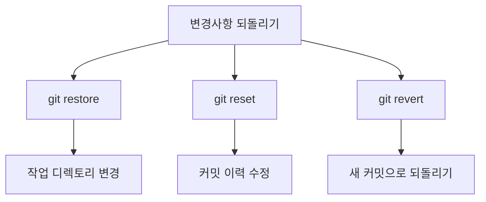

# 명령어 개요



# 기본 사용법

## 1. git restore
작업 디렉토리의 변경사항을 되돌린다.

```bash
# 모든 변경사항 되돌리기
git restore .

# 특정 파일만 되돌리기
git restore src/Controller/UserController.php

# Staged 상태의 파일을 Unstage
git restore --staged database/migrations/*
```

## 2. git reset
커밋 이력을 수정한다.

```bash
# Soft Reset: 커밋만 되돌리고 변경사항은 유지
git reset --soft HEAD~1

# Hard Reset: 커밋과 변경사항 모두 제거
git reset --hard HEAD~1

# Mixed Reset: 커밋을 되돌리고 변경사항은 Unstaged 상태로
git reset --mixed HEAD~1
```

## 3. git revert
새로운 커밋으로 변경사항을 되돌린다.

```bash
# 마지막 커밋 되돌리기
git revert HEAD

# 특정 커밋 되돌리기
git revert abc123

# 여러 커밋 되돌리기
git revert HEAD~3..HEAD
```

# 실제 사용 사례

## 1. 실수로 커밋한 .env 파일 제거
```bash
# .env 파일을 Git에서 제거하고 추적 중지
git reset HEAD .env
git rm --cached .env

# .gitignore에 추가
echo ".env" >> .gitignore
```

## 2. 배포 후 버그 발견 시
```bash
# 안전하게 이전 버전으로 되돌리기
git revert HEAD

# 여러 커밋을 되돌려야 할 경우
git revert HEAD~3..HEAD
```

## 3. 작업 중인 브랜치 정리
```bash
# 불필요한 커밋들을 하나로 합치기
git reset --soft HEAD~3
git commit -m "feat: 사용자 인증 기능 구현"
```

# 상황별 사용 가이드

## 1. 작업 중 변경사항 실수
```bash
# 변경사항만 되돌리기
git restore .

# Staged 파일도 되돌리기
git restore --staged .
git restore .
```

## 2. 커밋 메시지 수정
```bash
# 마지막 커밋 메시지 수정
git commit --amend -m "fix: 오타 수정"

# 이전 커밋 메시지 수정 (reset 사용)
git reset --soft HEAD~3
git commit -m "새로운 메시지"
```

## 3. 원격 저장소 관련 실수
```bash
# 원격 저장소에 push한 커밋 되돌리기
git revert HEAD
git push origin main

# 로컬에서만 실수한 경우
git reset --hard origin/main
```

# 고급 사용 팁

## 1. Reset 후 특정 파일만 복구
```bash
# hard reset 후 특정 파일 복구
git reset --hard HEAD~1
git checkout HEAD@{1} -- src/specific-file.php
```

## 2. 선택적 Revert
```bash
# 특정 파일만 이전 상태로 되돌리기
git checkout abc123 -- src/Controller/UserController.php
```

## 3. 충돌 해결
```bash
# revert 충돌 시
git revert --abort  # 되돌리기 취소
# 또는
git add .           # 충돌 해결 후
git revert --continue
```

# 주의사항

1. Push된 커밋 관리
   - reset보다 revert 사용을 권장한다
   - 팀 작업 시 이력 관리가 중요하다

2. 데이터 손실 방지
   - hard reset 전에 브랜치를 만들어둔다
   ```bash
   git branch backup-branch
   git reset --hard HEAD~3
   ```

3. 공유 브랜치 작업
   - 공유 브랜치에서는 reset 사용을 피한다
   - revert를 사용하여 이력을 남긴다

# 명령어 선택 가이드

상황에 따른 적절한 명령어 선택:

1. 작업 중인 변경사항 취소
   - `git restore` 사용

2. 마지막 커밋 수정
   - 로컬 작업만: `git reset`
   - 공유된 작업: `git revert`

3. 특정 파일 되돌리기
   - 작업 중: `git restore`
   - 커밋된 상태: `git checkout` 또는 `git revert`

# 결론

1. restore는:
   - 작업 디렉토리 변경에 사용한다
   - 안전하고 목적이 명확하다

2. reset은:
   - 로컬 브랜치 정리에 유용하다
   - 커밋 이력을 깔끔하게 관리한다

3. revert는:
   - 안전하게 변경사항을 되돌린다
   - 팀 작업에 적합하다