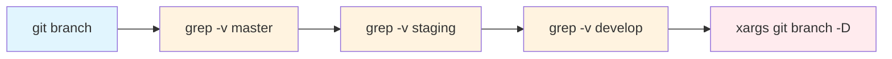

# 명령어 기본 개념

이 명령어는 master, staging, develop을 제외한 모든 로컬 브랜치를 삭제하는 강력한 Git 명령어다. 마치 책장에서 필수 도서만 남기고 나머지를 정리하는 것과 같다.

# 동작 방식 이해하기

명령어를 단계별로 분석해보자:



1. `git branch`: 모든 로컬 브랜치 목록을 출력
2. `grep -v "master"`: master를 제외한 라인 필터링
3. `grep -v "staging"`: staging을 제외한 라인 필터링
4. `grep -v "develop"`: develop을 제외한 라인 필터링
5. `xargs git branch -D`: 필터링된 브랜치들을 삭제

# 실제 사용 예시

## 기본 사용법

```bash
# 1. 삭제될 브랜치 미리 확인
git branch | grep -v "master" | grep -v "staging" | grep -v "develop"

# 2. 실제 삭제 실행
git branch | grep -v "master" | grep -v "staging" | grep -v "develop" | xargs git branch -D
```

## 응용: 더 간단한 버전

```bash
# grep -E를 사용한 한 줄 필터링
git branch | grep -vE 'master|staging|develop' | xargs git branch -D
```

# 고급 활용법

## 1. 커스텀 보호 패턴 추가

```bash
# 'release-' 로 시작하는 브랜치도 보호
git branch | grep -vE 'master|staging|develop|release-' | xargs git branch -D

# 'hotfix-' 브랜치도 보존
git branch | grep -vE 'master|staging|develop|release-|hotfix-' | xargs git branch -D
```

## 2. 스크립트로 만들기

```bash
#!/bin/bash
# branch-cleanup.sh

# 보호할 브랜치 패턴 정의
PROTECTED_BRANCHES="master|staging|develop|release-|hotfix-"

# 삭제될 브랜치 목록 확인
TO_DELETE=$(git branch | grep -vE "$PROTECTED_BRANCHES")

if [ -z "$TO_DELETE" ]; then
    echo "삭제할 브랜치가 없습니다."
    exit 0
fi

echo "다음 브랜치들이 삭제됩니다:"
echo "$TO_DELETE"
echo
read -p "계속하시겠습니까? (y/n) " -n 1 -r
echo
if [[ $REPLY =~ ^[Yy]$ ]]; then
    echo "$TO_DELETE" | xargs git branch -D
    echo "브랜치 정리가 완료되었습니다!"
fi
```

# 주의사항

1. **데이터 손실 위험**
   - `-D` 옵션은 강제 삭제를 의미
   - 병합되지 않은 변경사항은 복구 불가능
   - 실행 전 반드시 삭제될 브랜치 목록 확인

2. **브랜치 이름 주의**
   - 보호하려는 브랜치 이름이 다른 브랜치 이름에 포함된 경우 주의
   - 예: `master-test` 브랜치도 `master` 패턴에 의해 보호됨

3. **현재 브랜치 확인**
   ```bash
   # 현재 브랜치 확인 후 실행
   git branch --show-current
   ```

# 실전 시나리오

## 시나리오 1: 피처 개발 완료 후 정리

```bash
# 1. develop 브랜치로 이동
git checkout develop

# 2. 병합된 브랜치 확인
git branch --merged

# 3. 보호 브랜치 제외하고 삭제
git branch | grep -vE 'master|staging|develop' | xargs git branch -D
```

## 시나리오 2: 릴리스 후 정리

```bash
# 1. 현재 상태 백업
git branch > branches_backup.txt

# 2. 릴리스 관련 브랜치 제외하고 정리
git branch | grep -vE 'master|staging|develop|release-' | xargs git branch -D

# 3. 정리 후 상태 확인
git branch
```

# 성능 고려사항

- 대량의 브랜치 삭제 시 시간 소요 가능
- 많은 브랜치가 있는 경우 grep 패턴 최적화 필요
- 정기적인 정리로 저장소 성능 개선

# 결론

이 명령어는 Git 브랜치 관리를 효율적으로 만들어주는 강력한 도구다. 주요 브랜치를 보호하면서 불필요한 브랜치를 정리할 수 있어, 대규모 프로젝트에서 특히 유용하다. 단, 강력한 만큼 신중하게 사용해야 하며, 실행 전 항상 삭제될 브랜치를 확인하는 습관이 중요하다.

브랜치 관리는 정원 가꾸기와 같다. 주기적인 관리가 필요하지만, 중요한 나무는 보존하면서 불필요한 가지만 제거하는 신중함이 필요하다. 이 가이드를 통해 효율적이고 안전한 브랜치 관리가 가능하길 바란다.