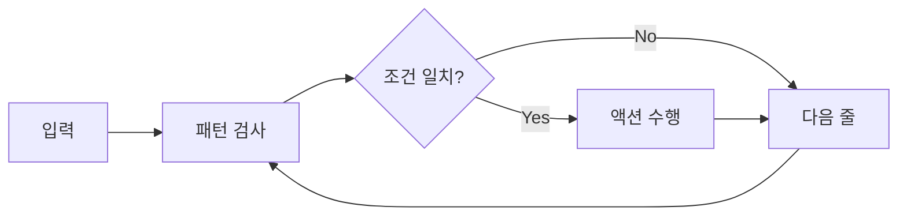

AWK 프로그래밍 언어 가이드

# AWK 기본 개념
## 소개
AWK는 텍스트 처리를 위해 설계된 프로그래밍 언어이다. 1977년 Alfred Aho, Peter Weinberger, Brian Kernighan이 개발했으며, 이들의 이니셜을 따서 AWK로 명명되었다.

## 기본 구조


## 프로그램 구조
```awk
BEGIN { 초기화 코드 }
pattern { action }
END { 종료 코드 }
```

# 기본 문법
## 필드 참조
```awk
# 기본 필드 변수
$0      # 현재 전체 라인
$1      # 첫 번째 필드
$NF     # 마지막 필드
NF      # 필드 개수
NR      # 현재 줄 번호
```

## 변수 사용
```awk
# 변수 선언과 사용
{ 
    counter = 0
    name = "example"
    price = 19.99
}
```

## 연산자
```awk
# 산술 연산자
x = $1 + $2    # 덧셈
y = $1 * $2    # 곱셈
z = $1 / $2    # 나눗셈

# 비교 연산자
$1 == "value"  # 같음
$1 != "value"  # 다름
$1 > 100       # 큼

# 논리 연산자
$1 > 0 && $2 < 100  # AND
$1 == "A" || $1 == "B"  # OR
```

# 제어 구조
## 조건문
```awk
# if 문
{
    if ($1 > 100) {
        print "High value"
    } else if ($1 > 50) {
        print "Medium value"
    } else {
        print "Low value"
    }
}
```

## 반복문
```awk
# for 루프
{
    for (i = 1; i <= NF; i++) {
        print $i
    }
}

# while 루프
{
    i = 1
    while (i <= NF) {
        print $i
        i++
    }
}
```

# 내장 함수
## 문자열 함수
```awk
# 주요 문자열 함수
length(str)     # 문자열 길이
substr(str,m,n) # 부분 문자열
index(str,sub)  # 부분 문자열 위치
split(str,arr,sep)  # 문자열 분할
```

## 수학 함수
```awk
# 수학 함수
int(3.14)      # 정수 부분
sqrt(100)      # 제곱근
rand()         # 난수 생성
```

# 실전 예제
## 1. 로그 분석
```awk
# 접근 로그에서 IP별 접속 횟수 집계
BEGIN {
    print "IP주소\t접속횟수"
}
{
    ip_count[$1]++
}
END {
    for (ip in ip_count) {
        printf "%s\t%d\n", ip, ip_count[ip]
    }
}
```

## 2. 데이터 집계
```awk
# CSV 파일에서 부서별 급여 통계
BEGIN {
    FS = ","
    print "부서\t인원\t평균급여"
}
NR > 1 {
    dept_count[$1]++
    dept_salary[$1] += $3
}
END {
    for (dept in dept_count) {
        avg = dept_salary[dept] / dept_count[dept]
        printf "%s\t%d\t%.2f\n", dept, dept_count[dept], avg
    }
}
```

## 3. 시스템 모니터링
```awk
# 프로세스 메모리 사용량 분석
BEGIN {
    print "PID\tMEM\tCOMMAND"
}
NR > 1 {
    if ($4 > 1.0) {
        printf "%s\t%.1f%%\t%s\n", $2, $4, $11
    }
}
```

# 고급 기능
## 배열 사용
```awk
# 연관 배열
{
    data[$1] = $2        # 키-값 저장
    for (key in data) {  # 배열 순회
        print key, data[key]
    }
}
```

## 함수 정의
```awk
# 사용자 정의 함수
function calculate_avg(sum, count) {
    if (count > 0) {
        return sum / count
    }
    return 0
}
```

# 성능 최적화
## 주요 고려사항
1. 패턴 최적화
   - 불필요한 패턴 매칭 피하기
   - 효율적인 정규식 사용

2. 메모리 관리
   - 큰 배열 사용 시 주의
   - 불필요한 데이터 제거

3. 처리 속도
   - 복잡한 계산 최소화
   - 효율적인 루프 구조 사용

# 디버깅 팁
1. 중간 결과 출력
```awk
{
    print "DEBUG:", $0  # 입력 라인 확인
    print "FIELD1:", $1 # 특정 필드 확인
}
```

2. 변수 상태 확인
```awk
END {
    for (var in PROCINFO) {
        print var, PROCINFO[var]
    }
}
```

# 결론
AWK는 강력한 텍스트 처리 언어로, 단순한 데이터 추출부터 복잡한 리포트 생성까지 다양한 작업을 수행할 수 있다. 특히 시스템 관리, 로그 분석, 데이터 처리 분야에서 매우 유용하게 활용된다.