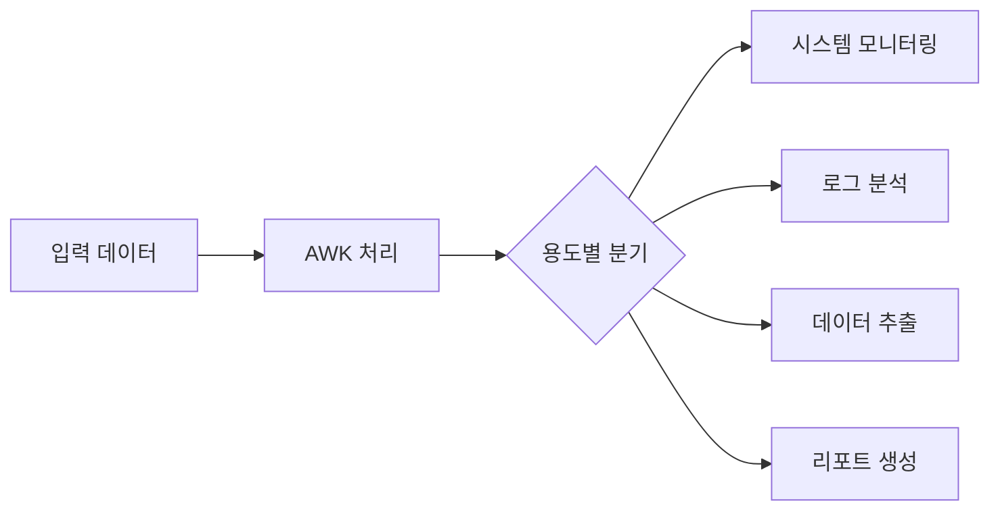
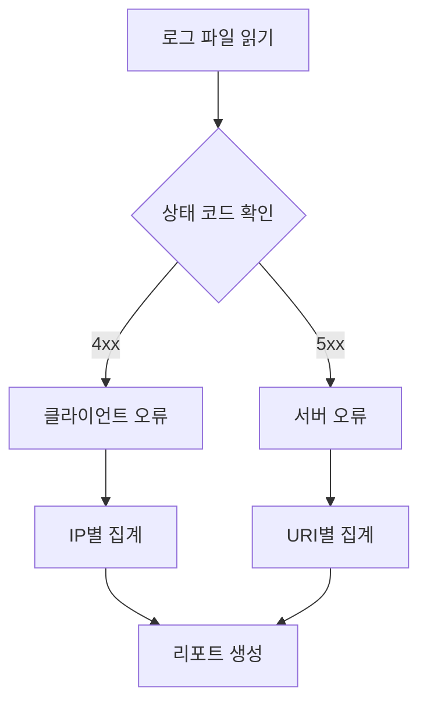

# AWK의 실제 활용
## 개념 이해
AWK는 시스템 관리자와 개발자가 일상적으로 사용하는 텍스트 처리 도구이다. 마치 엑셀에서 특정 열을 필터링하고 계산하는 것처럼, 텍스트 파일에서 원하는 데이터를 추출하고 처리한다.



# 시스템 관리 활용
## 프로세스 모니터링
### 1. 메모리 사용량 분석
```bash
# 메모리 사용량이 높은 프로세스 추출
#!/bin/bash

# 잘못된 예시
ps aux | awk '{print $4,$11}'  # 모든 프로세스 출력으로 불필요한 데이터 포함

# 올바른 예시
ps aux | awk '
    # 헤더 출력
    NR==1 {printf "%-6s %-4s %-10s\n", "PID", "%MEM", "COMMAND"}
    # 메모리 사용량 1% 초과 프로세스만 출력
    NR>1 && $4>1.0 {
        printf "%-6s %-4.1f %-10s\n", $2, $4, $11
    }
'
```

### 2. 디스크 공간 모니터링
```bash
#!/bin/bash

# 디스크 사용량 경고 스크립트
df -h | awk '
    BEGIN {
        print "디스크 공간 모니터링 리포트"
        print "=========================="
    }
    # 헤더 스킵, 사용량 80% 이상 파티션 확인
    NR>1 && $5+0 >= 80 {
        used_pct = $5
        gsub(/%/, "", used_pct)  # % 기호 제거
        
        # 경고 수준 결정
        if (used_pct >= 90) {
            level = "위험"
        } else {
            level = "주의"
        }
        
        printf "파티션: %-20s 사용량: %s (%s)\n", $6, $5, level
    }
    END {
        print "=========================="
    }
'
```

# 로그 분석 활용
## 웹 서버 로그 분석
### 1. 접근 패턴 분석
```bash
#!/bin/bash

# Apache 접근 로그 분석
cat access.log | awk '
    # IP별 접근 횟수 집계
    {
        ip_count[$1]++
        status_count[$9]++
        bytes_sent[$1] += $10
    }
    
    END {
        # IP별 통계
        print "\n상위 접근 IP:"
        for (ip in ip_count) {
            printf "%-15s 횟수: %-5d 전송량: %d bytes\n", 
                   ip, ip_count[ip], bytes_sent[ip]
        }
        
        # 상태 코드 통계
        print "\n응답 코드 분포:"
        for (status in status_count) {
            printf "%-5s: %d회\n", status, status_count[status]
        }
    }
'
```

### 2. 오류 로그 분석


# 데이터 추출 및 변환
## CSV 파일 처리
### 1. 데이터 집계
```bash
#!/bin/bash

# CSV 파일에서 부서별 급여 통계
awk -F, '
    BEGIN {
        print "부서별 급여 통계"
        print "=============="
    }
    # 헤더 스킵
    NR > 1 {
        # 부서별 집계
        dept_count[$1]++
        dept_salary[$1] += $3
        
        # 최소/최대 급여 추적
        if (!dept_min[$1] || $3 < dept_min[$1]) dept_min[$1] = $3
        if (!dept_max[$1] || $3 > dept_max[$1]) dept_max[$1] = $3
    }
    END {
        printf "%-15s %8s %8s %8s %8s\n", 
               "부서", "인원", "평균", "최소", "최대"
        print "----------------------------------------"
        
        for (dept in dept_count) {
            avg = dept_salary[dept] / dept_count[dept]
            printf "%-15s %8d %8.2f %8.2f %8.2f\n", 
                   dept, dept_count[dept], avg, 
                   dept_min[dept], dept_max[dept]
        }
    }
' employee.csv
```

# 성능 최적화
## 처리 속도 향상
```bash
# 잘못된 예시 - 불필요한 처리
awk '{ print $1,$2,$3 }' file | sort | uniq

# 올바른 예시 - AWK 내에서 처리
awk '
    !seen[$1,$2,$3]++ {
        print $1,$2,$3
    }
' file
```

# 보안 고려사항
1. 파일 권한 확인
```bash
# 민감한 파일 권한 검사
ls -l /etc | awk '
    $1 ~ /^.w./ {
        print "경고: 그룹 쓰기 권한 있음:", $9
    }
'
```

2. 로그 파일 무결성
```bash
# 로그 파일 크기 모니터링
ls -l /var/log | awk '
    BEGIN {
        max_size = 1024 * 1024 * 100  # 100MB
    }
    $5 > max_size {
        print "경고: 로그 파일 크기 초과:", $9
    }
'
```

# 주의사항
1. 메모리 사용
- 대용량 파일 처리 시 배열 사용 주의
- 불필요한 데이터는 즉시 삭제

2. 성능 고려
- 복잡한 정규식 사용 최소화
- 불필요한 반복 처리 제거

3. 에러 처리
```bash
# 에러 처리가 포함된 스크립트
awk '
    BEGIN {
        if (ARGC < 2) {
            print "사용법: script.awk filename" > "/dev/stderr"
            exit 1
        }
    }
    # 실제 처리 로직
' "$@"
```

# 결론
AWK는 시스템 관리와 데이터 분석에 필수적인 도구이다. 적절한 사용 패턴을 익히고 성능과 보안을 고려하여 활용하면, 복잡한 텍스트 처리 작업을 효율적으로 수행할 수 있다.