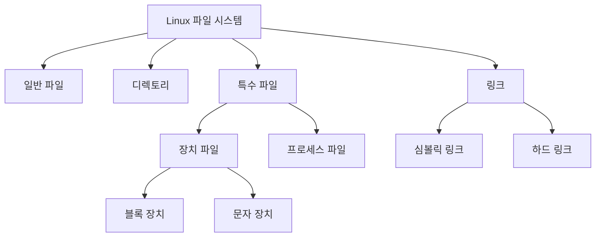

```table-of-contents
title: # 목차
style: nestedList # TOC style (nestedList|nestedOrderedList|inlineFirstLevel)
minLevel: 0 # Include headings from the specified level
maxLevel: 5 # Include headings up to the specified level
includeLinks: true # Make headings clickable
hideWhenEmpty: false # Hide TOC if no headings are found
debugInConsole: false # Print debug info in Obsidian console
```
Linux의 'Everything is a File' 철학의 완벽한 이해

# 필요한 배경 지식
Linux를 이해하기 위해 다음 기본 개념들을 알고 있어야 한다:
- 기본적인 파일 시스템 구조 (/bin, /etc, /dev 등)
- 기본 Linux 명령어 (ls, cat, echo 등)
- 파일 권한 개념 (read, write, execute)
- 프로세스와 프로그램의 차이
- File descriptor의 기본 개념

# 개념 설명

## "Everything is a File" 정의
Linux에서 "모든 것이 파일이다"라는 철학은 모든 시스템 리소스를 파일이라는 단일 추상화로 표현하는 것을 의미한다.

## 실생활 비유: 호텔 운영 시스템
현대적인 호텔 운영 시스템을 통해 Linux의 파일 시스템을 이해해보자:

1. 문서 관리 (일반 파일)
   - 고객 명단 = 텍스트 파일
   - 예약 기록 = 로그 파일
   - 직원 매뉴얼 = 실행 파일

2. 시설 관리 (장치 파일)
   - 객실 키 시스템 = 블록 장치
   - 인터컴 = 문자 장치
   - 엘리베이터 = 하드웨어 인터페이스

3. 조직 구조 (디렉토리)
   - 부서별 구분 = 디렉토리 구조
   - 직위 체계 = 파일 권한 시스템

4. 통신 시스템 (파이프와 소켓)
   - 내선 전화 = 파이프
   - 외부 전화 = 네트워크 소켓

# 기본 동작 방식

## 파일 종류별 특징 


## 시스템 구성요소와 파일의 매핑
각 시스템 리소스가 어떻게 파일로 표현되는지 살펴보자:

1. 하드웨어 리소스
```bash
# 하드디스크 접근
ls -l /dev/sda        # 디스크 장치 파일 확인
# 출력: brw-rw---- 1 root disk 8, 0 Jan 1 00:00 /dev/sda

# 프린터 접근
ls -l /dev/lp0        # 프린터 장치 파일 확인
# 출력: crw-rw---- 1 root lp 6, 0 Jan 1 00:00 /dev/lp0
```

2. 프로세스 정보
```bash
# PID 1의 상태 정보 확인
cat /proc/1/status
# 출력: Name: systemd
#       State: S (sleeping)
#       Pid: 1
#       ...
```

# 실제 사용 예시

## 1. 잘못된 접근 방식
```bash
# 안좋은 예제: 직접적인 디바이스 접근
dd if=/dev/sda of=disk.img    # 권한 문제 발생 가능

# 안좋은 예제: 프로세스 직접 제어
echo "9" > /proc/1234/oom_adj # 시스템 불안정성 유발 가능
```

## 2. 올바른 접근 방식
```bash
# 좋은 예제: 적절한 권한과 도구 사용
sudo dd if=/dev/sda of=disk.img bs=4M status=progress
# 출력: 1048576 bytes (1.0 MB) copied, 0.001773 s, 591 MB/s

# 좋은 예제: 시스템 도구 활용
sudo renice +1 1234  # 프로세스 우선순위 조정
# 출력: 1234 (process ID) old priority 0, new priority 1
```

# 고급 활용법

## Performance 최적화
```bash
# 파일 시스템 캐시 활용
dd if=/dev/zero of=test.file bs=1M count=1024 conv=fdatasync
# 디스크 쓰기 성능 측정

# 버퍼 크기 최적화
dd if=/dev/zero of=test.file bs=4M count=256 conv=fdatasync
# 더 큰 버퍼로 성능 향상
```

## Security 강화
```bash
# 파일 권한 적절히 설정
chmod 600 /etc/sensitive.conf  # 소유자만 읽기/쓰기 가능
chmod 755 /usr/local/bin/script.sh  # 실행 권한 부여
```

# 자주 발생하는 문제와 해결방안

## 1. 장치 파일 접근 권한 문제
증상:
```bash
$ cat /dev/sda
cat: /dev/sda: Permission denied
```

원인과 해결:
```bash
# 원인 확인
ls -l /dev/sda
# 출력: brw-rw---- 1 root disk 8, 0 Jan 1 00:00 /dev/sda

# 해결방법 1: 그룹 멤버십 추가
sudo usermod -a -G disk $USER

# 해결방법 2: 일시적 권한 부여
sudo dd if=/dev/sda of=backup.img bs=4M
```

## 2. 프로세스 파일시스템 접근 오류
증상:
```bash
$ echo 1 > /proc/sys/net/ipv4/ip_forward
-bash: /proc/sys/net/ipv4/ip_forward: Permission denied
```

해결:
```bash
# 올바른 방법: sysctl 사용
sudo sysctl -w net.ipv4.ip_forward=1
# 출력: net.ipv4.ip_forward = 1
```

# 주의사항

## 시스템 안정성
- 시스템 파일 수정 전 백업 필수
- 권한 변경 시 보안 영향 고려
- 대용량 I/O 작업 시 시스템 부하 주의

## 데이터 정합성
- 파일 동시 접근 시 락(lock) 메커니즘 사용
- 중요 데이터 수정 시 트랜잭션 고려
- 임시 파일 적절한 관리

# 결론
Linux의 "Everything is a File" 철학은 단순하면서도 강력한 시스템 디자인 원칙이다. 이를 통해:
1. 일관된 인터페이스로 모든 리소스 접근
2. 표준 도구로 다양한 작업 수행
3. 스크립트 작성과 자동화 용이
4. 시스템 관리와 모니터링 단순화

이러한 장점을 최대한 활용하면서도 적절한 주의사항을 지켜 안정적인 시스템 운영이 가능하다.