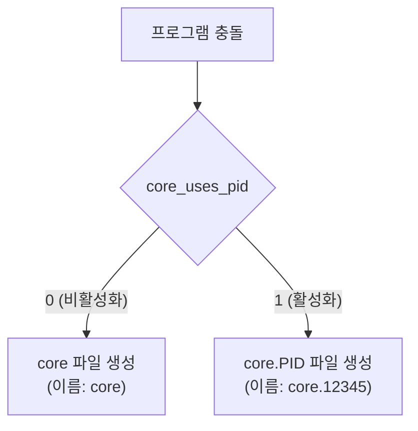
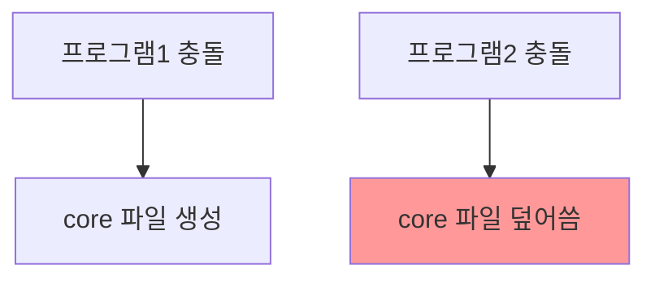
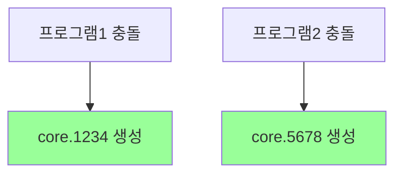

```table-of-contents
title: # 목차
style: nestedList # TOC style (nestedList|nestedOrderedList|inlineFirstLevel)
minLevel: 0 # Include headings from the specified level
maxLevel: 0 # Include headings up to the specified level
includeLinks: true # Make headings clickable
hideWhenEmpty: false # Hide TOC if no headings are found
debugInConsole: false # Print debug info in Obsidian console
```
# Core Dump PID란?

## 기본 개념
core_uses_pid는 프로그램이 비정상 종료될 때 생성되는 코어 덤프 파일의 이름에 프로세스 ID(PID)를 포함할지 결정하는 설정이다. 마치 사고 현장 사진에 시간을 기록하는 것처럼, 코어 덤프 파일에 어떤 프로세스가 문제를 일으켰는지 식별할 수 있게 해준다.

## 동작 방식


# 설정 방법

## 1. 현재 설정 확인
```bash
# 설정값 확인
sysctl kernel.core_uses_pid

# 또는
cat /proc/sys/kernel/core_uses_pid
```

## 2. 설정값 의미
```bash
# 0 = PID 미포함 (파일명: core)
# 1 = PID 포함 (파일명: core.1234)
kernel.core_uses_pid = 1
```

# 실제 사용 예시

## 1. 기본 설정
```bash
# /etc/sysctl.conf 파일에 추가
kernel.core_uses_pid = 1

# 설정 적용
sysctl -p
```

## 2. 전체 코어덤프 설정 예시
```bash
# 코어덤프 파일 패턴 설정
kernel.core_pattern = /var/crash/core.%e.%p.%h.%t
kernel.core_uses_pid = 1

# 설명:
# %e = 실행 파일 이름
# %p = 프로세스 ID
# %h = 호스트명
# %t = 시간
```

# 디버깅 시나리오

## 1. PID 비포함 시 문제점


## 2. PID 포함 시 장점


# 실용적인 활용

## 1. 디버깅 스크립트 예시
```bash
#!/bin/bash
# 코어 덤프 분석 스크립트

# 코어 덤프 디렉토리 설정
CORE_DIR="/var/crash"

# 최근 코어 덤프 찾기
for core in "$CORE_DIR"/core.*; do
    if [ -f "$core" ]; then
        pid=$(echo $core | grep -o '[0-9]*$')
        echo "분석 중인 코어 덤프: $core (PID: $pid)"
        gdb -c "$core" /proc/$pid/exe
    fi
done
```

## 2. 로그 연동
```bash
#!/bin/bash
# 코어 덤프 발생 시 로그 기록

log_core_dump() {
    core_file=$1
    pid=$(echo $core_file | grep -o '[0-9]*$')
    
    echo "$(date): 코어 덤프 발생 - 파일: $core_file, PID: $pid" \
        >> /var/log/coredump.log
}
```

# 시스템 관리 고려사항

## 1. 디스크 공간 관리
```bash
# 오래된 코어 덤프 정리 스크립트
find /var/crash -name "core.*" -mtime +7 -delete
```

## 2. 권한 설정
```bash
# 코어 덤프 디렉토리 권한 설정
mkdir -p /var/crash
chmod 1777 /var/crash
```

# 관련 설정들

## 1. 핵심 설정들
```bash
# 코어 덤프 활성화
kernel.core_pattern = /var/crash/core.%e.%p.%h.%t
kernel.core_uses_pid = 1
fs.suid_dumpable = 2
```

## 2. 크기 제한 설정
```bash
# 코어 덤프 크기 제한 설정
ulimit -c unlimited
```

# 결론
kernel.core_uses_pid 설정은 디버깅과 문제 해결을 더 효율적으로 만들어준다. 여러 프로세스의 코어 덤프를 구별하여 저장함으로써, 시스템 문제 분석이 더욱 용이해진다. 프로덕션 환경에서는 이 설정을 활성화(1)하고, 적절한 코어 덤프 관리 정책과 함께 사용하는 것이 권장된다.