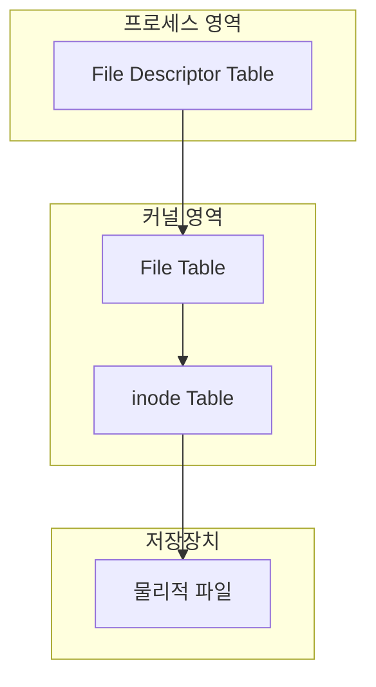
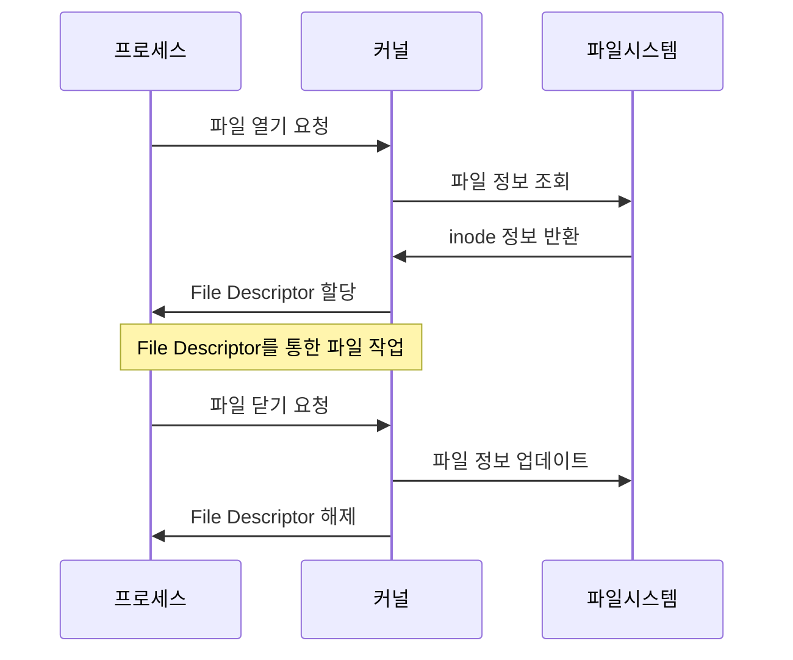
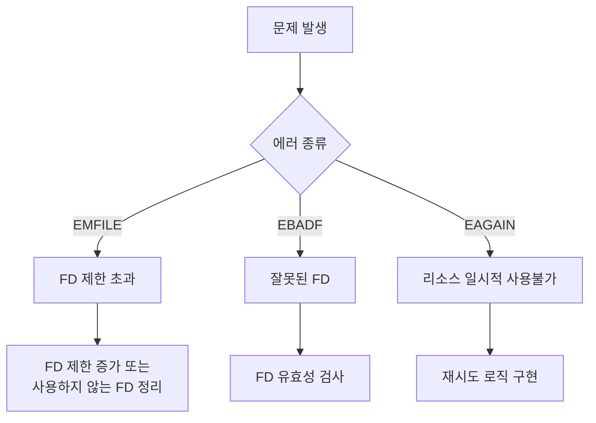

# 개요
File Descriptor는 Unix/Linux 운영체제에서 파일에 접근하기 위해 사용하는 정수형 식별자이다. 이는 도서관의 도서 대출 카드와 유사한 개념으로 이해할 수 있다. 도서 대출 카드가 책의 위치와 상태 정보를 담고 있는 것처럼, File Descriptor는 파일의 접근 정보를 관리한다.

## 기본 개념
운영체제는 프로세스가 파일을 열 때마다 File Descriptor를 할당한다. 프로세스는 할당받은 File Descriptor를 통해 파일 작업을 수행한다.

### 표준 File Descriptor
모든 프로세스는 시작 시 다음 3개의 File Descriptor를 기본적으로 가진다:
- stdin (0): 표준 입력
- stdout (1): 표준 출력
- stderr (2): 표준 에러

# 동작 방식
## System Architecture


## Process Flow


# 기본 사용법
## 1. 파일 열기와 닫기
```c
// 잘못된 예시 - 에러 처리 없음
int fd = open("file.txt", O_RDWR);
write(fd, "data", 4);
close(fd);

// 올바른 예시 - 완전한 에러 처리
#include <fcntl.h>
#include <unistd.h>
#include <stdio.h>
#include <errno.h>

int main() {
    // 파일 열기
    int fd = open("file.txt", O_RDWR | O_CREAT, 0644);
    if (fd == -1) {
        perror("파일 열기 실패");
        return 1;
    }
    
    // 데이터 쓰기
    ssize_t written = write(fd, "data", 4);
    if (written == -1) {
        perror("쓰기 실패");
        close(fd);  // 에러 발생해도 파일은 닫아야 함
        return 1;
    }
    
    // 파일 닫기
    if (close(fd) == -1) {
        perror("파일 닫기 실패");
        return 1;
    }
    
    return 0;
}
```

## 2. File Descriptor 복제
```c
// 단계 1: 기본적인 복제
#include <unistd.h>
#include <fcntl.h>

int fd1 = open("file.txt", O_RDWR);
int fd2 = dup(fd1);  // fd1을 복제하여 fd2 생성

// 단계 2: 지정된 번호로 복제
int fd3 = 4;
dup2(fd1, fd3);  // fd1을 fd3 번호로 복제

// 단계 3: 안전한 복제 (close-on-exec 플래그 설정)
#include <fcntl.h>
int fd4 = fcntl(fd1, F_DUPFD_CLOEXEC, 0);
```

# 고급 활용법
## 1. Non-blocking I/O 구현
```c
#include <fcntl.h>
#include <unistd.h>
#include <errno.h>

// 비차단 모드 설정 함수
int set_nonblocking(int fd) {
    int flags = fcntl(fd, F_GETFL, 0);
    if (flags == -1) return -1;
    return fcntl(fd, F_SETFL, flags | O_NONBLOCK);
}

// 사용 예시
int main() {
    int fd = open("file.txt", O_RDWR);
    if (fd == -1) return 1;
    
    // 비차단 모드 설정
    if (set_nonblocking(fd) == -1) {
        close(fd);
        return 1;
    }
    
    char buf[1024];
    ssize_t n;
    
    // 비차단 읽기 시도
    while ((n = read(fd, buf, sizeof(buf))) == -1) {
        if (errno == EAGAIN || errno == EWOULDBLOCK) {
            // 데이터가 없음 - 다른 작업 수행 가능
            continue;
        }
        // 실제 에러 발생
        break;
    }
    
    close(fd);
    return 0;
}
```

## 2. File Descriptor 제한 관리
```c
#include <sys/resource.h>

// 프로세스의 File Descriptor 제한 설정
void set_fd_limit(rlim_t max_fds) {
    struct rlimit rlim;
    
    // 현재 제한 조회
    if (getrlimit(RLIMIT_NOFILE, &rlim) == -1) {
        perror("getrlimit 실패");
        return;
    }
    
    // 새로운 제한 설정
    rlim.rlim_cur = max_fds;
    if (setrlimit(RLIMIT_NOFILE, &rlim) == -1) {
        perror("setrlimit 실패");
        return;
    }
}
```

# 문제 해결 가이드
## 일반적인 문제와 해결방안


## 성능 최적화
```c
// 잘못된 예시 - 매번 파일을 열고 닫음
for (int i = 0; i < 1000; i++) {
    int fd = open("file.txt", O_WRONLY | O_APPEND);
    write(fd, "data\n", 5);
    close(fd);
}

// 올바른 예시 - 파일을 한 번만 열고 재사용
int fd = open("file.txt", O_WRONLY | O_APPEND);
for (int i = 0; i < 1000; i++) {
    write(fd, "data\n", 5);
}
close(fd);
```

# 보안 고려사항
## File Descriptor 권한 관리
```c
// 권한 설정 예시
#include <sys/stat.h>

// 안전하지 않은 방식
open("file.txt", O_CREAT | O_WRONLY);  // 기본 권한으로 생성

// 안전한 방식
open("file.txt", O_CREAT | O_WRONLY, S_IRUSR | S_IWUSR);  // 소유자만 읽기/쓰기 가능
```

## 보안 체크리스트
1. File Descriptor 유효성 검사를 항상 수행한다
2. 권한 설정을 명시적으로 지정한다
3. 민감한 파일의 File Descriptor는 사용 후 즉시 닫는다
4. symlink 공격 방지를 위해 O_NOFOLLOW 플래그를 사용한다

# 결론
File Descriptor는 Linux 시스템에서 파일 조작의 핵심 메커니즘이다. 올바른 사용을 위해서는:
- 에러 처리를 철저히 한다
- 리소스 관리에 주의한다
- 보안 고려사항을 준수한다
- 성능 최적화를 고려한다

이러한 가이드라인을 따르면 안정적이고 효율적인 파일 처리 시스템을 구현할 수 있다.