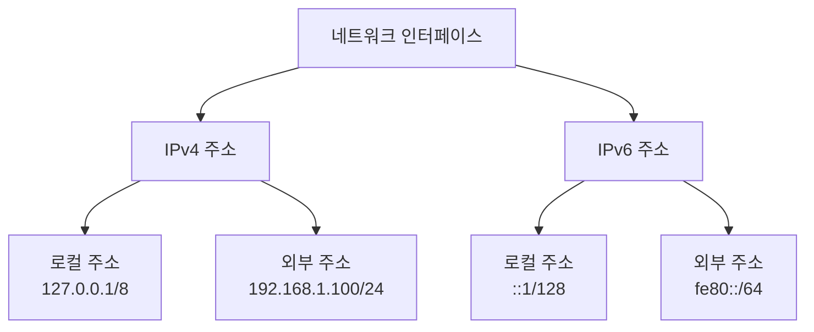

# 네트워크 인터페이스란?
네트워크 인터페이스는 컴퓨터와 네트워크를 연결하는 접점이다. 실생활에서 건물의 출입구와 같은 역할을 한다. 건물에 정문, 후문, 주차장 입구가 있듯이 컴퓨터에도 여러 종류의 네트워크 인터페이스가 존재한다.

# 기본 네트워크 인터페이스 종류

## 1. Loopback Interface (lo)
### 개념
Loopback interface는 컴퓨터 내부의 가상 네트워크 인터페이스다. 실생활에서 건물 내부의 복도와 같은 역할을 한다.

### 기본 구성
```bash
lo: <LOOPBACK,UP,LOWER_UP> mtu 65536
- LOOPBACK: 내부 통신용 인터페이스
- UP: 활성화 상태
- LOWER_UP: 물리 계층 활성화
- mtu 65536: 최대 전송 단위 (바이트)
```

### 주요 특징
- IP 주소: 127.0.0.1 (IPv4), ::1 (IPv6)
- 범위: 로컬 시스템 내부 통신 전용
- 수명: 영구적 (valid_lft forever)

## 2. 물리 네트워크 인터페이스 (ens5)
### 개념
실제 네트워크 통신에 사용되는 인터페이스다. 실생활에서 건물의 정문과 같은 역할을 한다.

### 기본 구성
```bash
ens5: <BROADCAST,MULTICAST,UP,LOWER_UP> mtu 9001
- BROADCAST: 브로드캐스트 지원
- MULTICAST: 멀티캐스트 지원
- UP: 활성화 상태
- mtu 9001: AWS 환경의 최대 전송 단위
```

# 네트워크 인터페이스 구성요소 설명

## IP 주소 체계


## 주요 설정값 설명
1. MTU (Maximum Transmission Unit)
   - 의미: 한 번에 전송할 수 있는 최대 데이터 크기
   - Loopback: 65536 바이트
   - 일반 네트워크: 1500 또는 9001 바이트 (AWS)

2. Queue Discipline (qdisc)
   - noqueue: 큐 없이 즉시 처리 (로컬)
   - mq: 다중 큐 사용 (외부 통신)

# 실제 사용 예시

## 1. 로컬 서비스 통신
```bash
# 웹 서버 로컬 테스트
curl http://127.0.0.1:8080

# 데이터베이스 연결
mysql -h 127.0.0.1 -u user -p
```

## 2. 외부 네트워크 통신
```bash
# 외부 서비스 접속
curl https://api.example.com
curl https://openapi.naver.com

# 네트워크 상태 확인
ping example.com
traceroute google.com
```

# 주의사항
1. 보안
   - Loopback 인터페이스는 외부에서 접근 불가능
   - 물리 인터페이스는 방화벽 설정 필요

2. 성능
   - MTU 값은 네트워크 성능에 영향
   - Queue Discipline은 패킷 처리 방식 결정

# 문제 해결 가이드

## 일반적인 문제와 해결 방법
1. 인터페이스 상태 확인
```bash
# 상태 확인
ip link show

# 활성화
sudo ip link set ens5 up
```

2. IP 주소 설정
```bash
# IP 주소 확인
ip addr show

# IP 주소 추가
sudo ip addr add 192.168.1.100/24 dev ens5
```

# 결론
네트워크 인터페이스는 시스템의 통신 기반이다. Loopback 인터페이스는 내부 통신을, 물리 인터페이스는 외부 통신을 담당한다. 각 인터페이스의 특성과 설정을 이해하면 효율적인 네트워크 구성과 문제 해결이 가능하다.