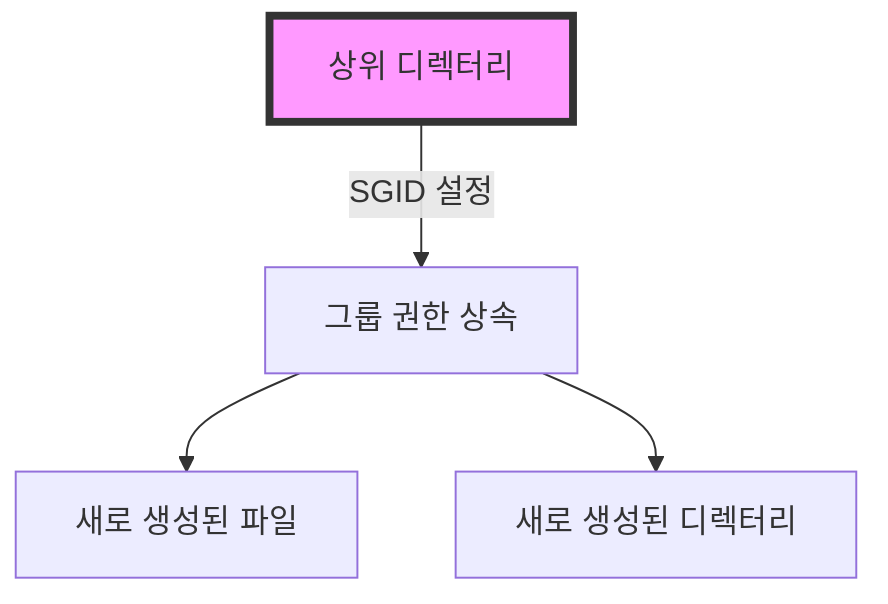

```table-of-contents
title: # 목차
style: nestedList # TOC style (nestedList|nestedOrderedList|inlineFirstLevel)
minLevel: 0 # Include headings from the specified level
maxLevel: 0 # Include headings up to the specified level
includeLinks: true # Make headings clickable
hideWhenEmpty: false # Hide TOC if no headings are found
debugInConsole: false # Print debug info in Obsidian console
```
# SGID의 개념
SGID는 파일이나 디렉터리에 설정하는 특별한 권한 비트이다. 마치 유전자가 부모의 특성을 자식에게 전달하듯이, SGID는 상위 디렉터리의 그룹 권한을 하위 파일들에게 자동으로 전달한다.

# 동작 방식



## 디렉터리에서의 동작
- 새로 생성되는 모든 파일과 디렉터리는 부모 디렉터리의 그룹을 상속받는다
- 파일을 생성하는 사용자의 기본 그룹과 관계없이 상속이 발생한다
- 디렉터리 내부의 그룹 권한 일관성이 유지된다

## 실행 파일에서의 동작
- 실행 시 파일의 그룹 권한으로 프로그램이 동작한다
- 보안상의 이유로 신중하게 사용해야 한다

# 실제 사용 예시

## 1. 웹 서버 로그 디렉터리 설정
```bash
# 로그 디렉터리 생성 및 권한 설정
mkdir /var/log/webserver
chown root:weblog /var/log/webserver
chmod 2770 /var/log/webserver  # SGID 비트 설정
```

## 2. 팀 프로젝트 공유 디렉터리 설정
```bash
# 프로젝트 디렉터리 설정
mkdir /projects/team-a
chown root:team-a /projects/team-a
chmod 2775 /projects/team-a    # SGID 비트 설정
```

# 권한 확인 및 관리

## 권한 상태 확인
```bash
# SGID 설정 확인
ls -l /projects/team-a
# 출력 예시: drwxrws--- root team-a
```

## SGID 권한 설정 방법
```bash
# 심볼릭 방식
chmod g+s /directory_name

# 8진수 방식
chmod 2775 /directory_name  # 2는 SGID를 의미
```

# 보안 고려사항

## 주의해야 할 상황
- 민감한 정보가 있는 디렉터리에는 신중하게 설정한다
- 정기적으로 SGID가 설정된 디렉터리를 검사한다
- 그룹 멤버십을 엄격하게 관리한다

## 권한 감사
```bash
# SGID가 설정된 디렉터리 찾기
find / -type d -perm /2000 -ls

# 결과 분석 및 불필요한 SGID 제거
chmod g-s /unnecessary/sgid/directory
```

# 문제 해결

## 일반적인 문제
1. 그룹 상속이 동작하지 않는 경우
   - SGID 비트 설정 확인
   - 파일시스템 지원 여부 확인
   - 상위 디렉터리 권한 검증

2. 권한 거부 발생 시
   - 사용자의 그룹 멤버십 확인
   - 디렉터리 권한 구조 검증
   - 상위 경로 접근 권한 확인

# 성능과 보안
- SGID는 파일 시스템 수준에서 동작하여 성능 영향이 미미하다
- 그룹 권한 상속으로 인한 보안 위험을 고려해야 한다
- 정기적인 권한 감사가 필요하다

# 결론
SGID는 다중 사용자 환경에서 그룹 기반 접근 제어를 위한 효과적인 도구이다. 적절히 사용하면 파일 권한 관리를 자동화할 수 있지만, 보안 고려사항을 항상 염두에 두어야 한다.