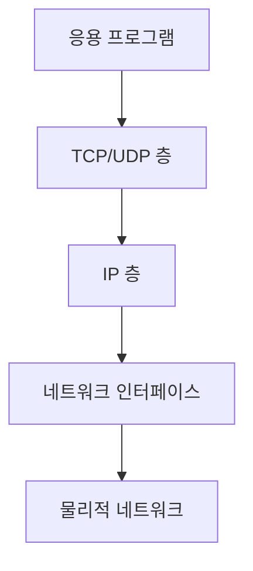
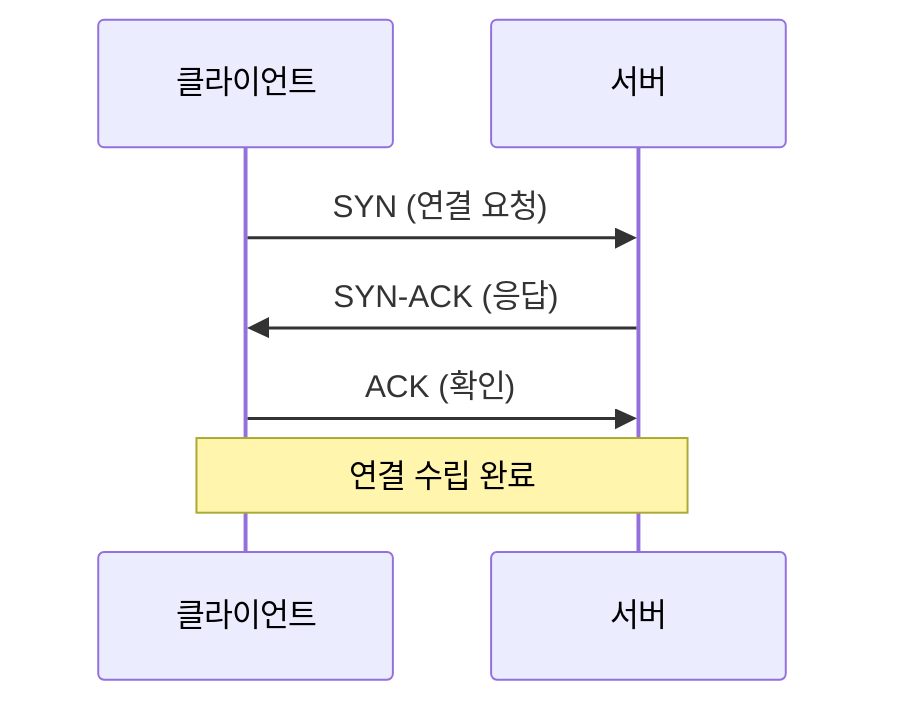

```table-of-contents
title: # 목차
style: nestedList # TOC style (nestedList|nestedOrderedList|inlineFirstLevel)
minLevel: 0 # Include headings from the specified level
maxLevel: 0 # Include headings up to the specified level
includeLinks: true # Make headings clickable
hideWhenEmpty: false # Hide TOC if no headings are found
debugInConsole: false # Print debug info in Obsidian console
```
# 네트워크란 무엇인가?

## 기본 개념
네트워크는 마치 도로 체계와 같다. 차량(데이터)이 도로(네트워크)를 통해 목적지까지 이동하듯이, 데이터는 네트워크를 통해 한 컴퓨터에서 다른 컴퓨터로 전달된다.

이 문서를 이해하기 위해 필요한 사전 지식:
- 컴퓨터 사용 경험
- 인터넷 사용 경험

## 네트워크 기본 구성요소

### 1. IP 주소
- 집 주소와 같은 역할
- 예: 192.168.0.1 (내부 네트워크)
- 예: 8.8.8.8 (Google DNS 서버)

### 2. 포트(Port)
- 아파트의 호수와 같은 역할
- 범위: 0 ~ 65535
- 주요 포트:
  - 80: 웹 서버
  - 443: 보안 웹 서버
  - 22: SSH 접속

# TCP/IP 프로토콜의 이해

## 시스템 구조


## 주요 개념 설명

### 1. TCP 연결
TCP 연결은 전화 통화와 비슷하다:
1. 연결 시작(전화 걸기) - SYN
2. 응답 확인(받기) - SYN-ACK
3. 연결 수립(통화 시작) - ACK



### 2. TCP 상태

#### SYN (연결 시작)
- 새로운 연결을 요청하는 상태
- syn_cookies 설정으로 SYN 플러드 공격 방어
```bash
# SYN 쿠키 활성화
net.ipv4.tcp_syncookies = 1
```

#### TIME_WAIT
- 연결이 종료된 후 일정 시간 대기하는 상태
- 같은 연결의 패킷이 늦게 도착하는 경우를 대비
```bash
# TIME_WAIT 재사용 설정
net.ipv4.tcp_tw_reuse = 1
```

### 3. 네트워크 버퍼
- 데이터를 임시 저장하는 공간
- 마치 우체국의 물류창고와 같은 역할

```bash
# 버퍼 크기 설정
net.core.rmem_max = 16777216 # 수신 버퍼
net.core.wmem_max = 16777216 # 송신 버퍼
```

# 실제 네트워크 동작 확인

## 1. 연결 상태 확인
```bash
# 현재 네트워크 연결 확인
ss -tuln

# 출력 예시:
# Netid State  Recv-Q Send-Q Local Address:Port
# tcp   LISTEN 0      128    0.0.0.0:22
```

## 2. 네트워크 인터페이스 확인
```bash
# 네트워크 카드 정보 확인
ip addr show

# 출력 예시:
# 1: lo: <LOOPBACK,UP,LOWER_UP>
# 2: eth0: <BROADCAST,MULTICAST,UP,LOWER_UP>
```

# 일반적인 네트워크 문제와 해결

## 1. 연결 지연 문제
증상:
- 웹페이지 로딩이 느림
- SSH 연결이 지연됨

해결 방법:
```bash
# TCP 타임아웃 설정 조정
net.ipv4.tcp_fin_timeout = 30
net.ipv4.tcp_keepalive_time = 1200
```

## 2. 과도한 TIME_WAIT
증상:
- 포트 부족 현상
- 새로운 연결 실패

해결 방법:
```bash
# TIME_WAIT 재사용 활성화
net.ipv4.tcp_tw_reuse = 1

# TIME_WAIT 타임아웃 감소
net.ipv4.tcp_fin_timeout = 15
```

# 권장 네트워크 설정

## 웹 서버 최적화
```bash
# /etc/sysctl.conf 설정
# 연결 백로그 큐 증가
net.core.somaxconn = 65535

# SYN 백로그 증가
net.ipv4.tcp_max_syn_backlog = 65535

# TIME_WAIT 설정
net.ipv4.tcp_tw_reuse = 1
```

## 데이터베이스 서버 최적화
```bash
# /etc/sysctl.conf 설정
# 로컬 포트 범위 확장
net.ipv4.ip_local_port_range = 1024 65535

# TCP 버퍼 크기 증가
net.core.rmem_max = 16777216
net.core.wmem_max = 16777216
```

# 네트워크 모니터링

## 1. 기본 모니터링
```bash
# 네트워크 통계 확인
netstat -s

# 인터페이스 통계
ip -s link show
```

## 2. 고급 모니터링
```bash
# TCP 연결 상태 모니터링
watch -n1 'netstat -ant | grep -E "SYN|TIME_WAIT" | wc -l'
```

# 결론
리눅스 네트워크 스택은 복잡해 보이지만, 기본 개념들을 이해하면 충분히 다룰 수 있다. 특히 TCP 연결 관리와 버퍼 설정은 시스템 성능에 큰 영향을 미치므로, 자신의 서비스 특성에 맞게 적절히 조정하는 것이 중요하다.