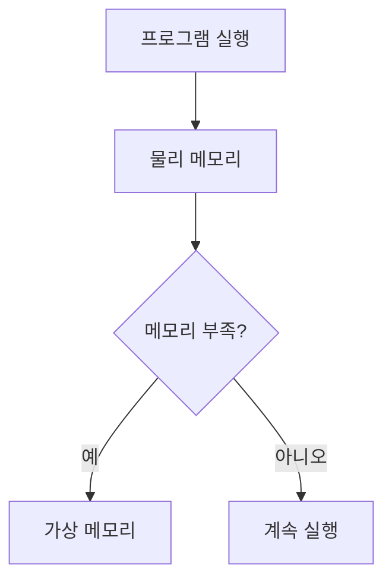
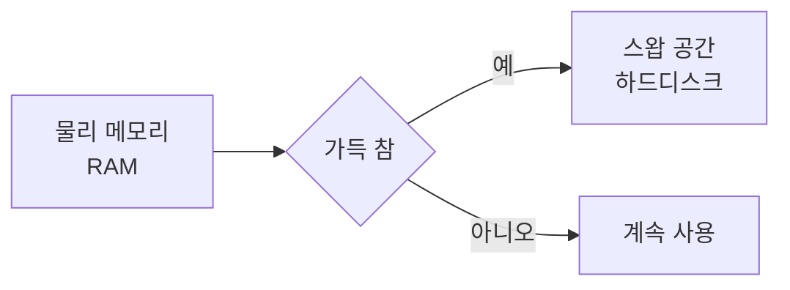

```table-of-contents
title: # 목차
style: nestedList # TOC style (nestedList|nestedOrderedList|inlineFirstLevel)
minLevel: 0 # Include headings from the specified level
maxLevel: 0 # Include headings up to the specified level
includeLinks: true # Make headings clickable
hideWhenEmpty: false # Hide TOC if no headings are found
debugInConsole: false # Print debug info in Obsidian console
```
# 메모리란 무엇인가?

## 기본 개념
컴퓨터의 메모리는 우리가 사용하는 책상과 비슷하다. 책상이 클수록 더 많은 물건을 올려놓을 수 있듯이, 메모리가 클수록 더 많은 프로그램을 동시에 실행할 수 있다.

이 문서를 이해하기 위해 필요한 사전 지식은 없다. 컴퓨터를 사용해본 경험만 있으면 된다.

## 메모리의 종류

### 1. 물리 메모리 (RAM)
- 실제로 컴퓨터에 장착된 메모리
- 예: 8GB RAM, 16GB RAM
- 전원이 꺼지면 내용이 사라짐

### 2. 가상 메모리
- 하드디스크의 일부를 메모리처럼 사용
- 물리 메모리가 부족할 때 사용
- 실제 메모리보다 훨씬 느림

# 리눅스의 메모리 관리 방식

## 시스템 구조


## 주요 개념 설명

### 1. 스왑(Swap)
스왑은 비상용 메모리라고 생각하면 된다. 마치 책상이 꽉 찼을 때 일부 물건을 서랍에 넣어두는 것과 같다.



#### swappiness 값의 의미
- 범위: 0 ~ 100
- 값이 높을수록 스왑을 자주 사용
- 기본값: 60
- 권장값:
  - 데스크톱: 10~30
  - 서버: 0~10

예시:
```bash
# 현재 swappiness 값 확인
cat /proc/sys/vm/swappiness

# swappiness 값 변경
sudo sysctl vm.swappiness=10
```

### 2. 페이지 캐시
자주 사용하는 데이터를 메모리에 임시 저장하는 공간이다. 마치 자주 사용하는 물건을 책상 위에 두는 것과 같다.

### 3. Dirty Page
변경된 데이터지만 아직 하드디스크에 저장되지 않은 페이지를 의미한다. 마치 수정한 문서를 아직 저장하지 않은 상태와 같다.

#### dirty_ratio의 의미
- 전체 메모리 중 Dirty Page가 차지할 수 있는 최대 비율
- 이 값을 넘으면 강제로 하드디스크에 저장
- 기본값: 20 (20%)

예시:
```bash
# dirty_ratio 확인
cat /proc/sys/vm/dirty_ratio

# dirty_ratio 변경
sudo sysctl vm.dirty_ratio=10
```

# 메모리 관리 실습

## 1. 메모리 상태 확인
```bash
# 전체 메모리 상태 확인
free -h

# 출력 예시:
#              total        used        free
# Mem:          15Gi       8.0Gi       7.0Gi
# Swap:         4.0Gi       1.0Gi       3.0Gi
```

## 2. 프로세스별 메모리 사용량 확인
```bash
# 메모리 사용량 순으로 프로세스 확인
ps aux --sort=-%mem | head -n 5

# 실시간 모니터링
top
```

## 3. 캐시 정보 확인
```bash
# 캐시 상태 확인
cat /proc/meminfo | grep Cache
```

# 일반적인 문제와 해결 방법

## 1. 메모리 부족
증상:
- 시스템이 느려짐
- 프로그램이 강제 종료됨

해결 방법:
```bash
# 캐시 비우기
sync; echo 3 > /proc/sys/vm/drop_caches

# 불필요한 프로세스 종료
kill [프로세스ID]
```

## 2. 스왑 과다 사용
증상:
- 시스템 반응 속도 저하
- 디스크 사용량 증가

해결 방법:
```bash
# 스왑 사용량 확인
free -h

# swappiness 값 낮추기
sudo sysctl vm.swappiness=10
```

# 권장 설정

## 데스크톱 시스템
```bash
# /etc/sysctl.conf 설정
vm.swappiness = 10
vm.vfs_cache_pressure = 50
vm.dirty_ratio = 10
vm.dirty_background_ratio = 5
```

## 서버 시스템
```bash
# /etc/sysctl.conf 설정
vm.swappiness = 0
vm.vfs_cache_pressure = 50
vm.dirty_ratio = 20
vm.dirty_background_ratio = 10
```

# 결론
리눅스의 메모리 관리는 복잡해 보이지만, 기본 개념만 이해하면 충분히 다룰 수 있다. 중요한 것은 자신의 시스템 용도에 맞게 적절한 설정을 하는 것이다.