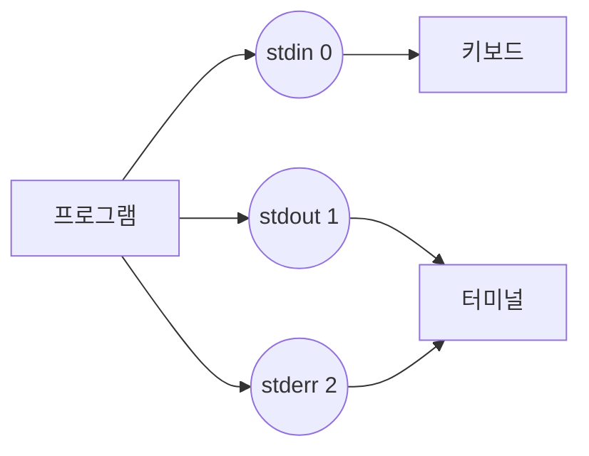

# 필요한 배경 지식
Linux 출력 리다이렉션을 이해하기 위해서는 다음 개념들을 알고 있어야 한다:
- 기본적인 Shell 명령어 사용법
- 파일 시스템 권한 개념
- 프로세스와 Shell의 관계
- [[Linux File Descriptor 이해하기|File descriptor의 기본 개념]]
- 표준 입력(stdin), 표준 출력(stdout), 표준 에러(stderr)의 개념

# 개념 설명

## 출력 리다이렉션이란?
프로그램의 출력을 원하는 목적지로 변경하는 메커니즘이다. 기본적으로 모든 출력은 터미널로 전송되지만, 리다이렉션을 통해 파일이나 다른 프로그램으로 전환할 수 있다.

## 실생활 비유: 우편물 분류 시스템
우체국의 우편물 분류 시스템을 통해 리다이렉션을 이해해보자:

1. 일반 우편물 (stdout, 1)
   - 기본 배송 경로 = 터미널 출력
   - 배송지 변경 = 파일로 리다이렉션

2. 긴급 우편물 (stderr, 2)
   - 특별 처리 경로 = 에러 메시지
   - 경로 통합 = 에러를 일반 출력으로 리다이렉션

3. 접수 창구 (stdin, 0)
   - 우편물 접수 = 프로그램 입력
   - 자동 분류기 = 파이프를 통한 데이터 전달

# 기본 동작 방식

## File Descriptor의 이해


## 리다이렉션 연산자
- `>` : 출력 리다이렉션 (덮어쓰기)
- `>>` : 출력 리다이렉션 (추가하기)
- `2>` : 에러 리다이렉션
- `&>` : 모든 출력 리다이렉션
- `|` : 파이프를 통한 리다이렉션

# 실제 사용 예시

## 1. 잘못된 사용 예시
```bash
# 안좋은 예제: 에러 메시지 순서 잘못됨
ls /없는디렉토리 2>&1 > error.log  # 에러가 터미널에 출력됨

# 안좋은 예제: 파일 권한 고려하지 않음
echo "log" > /var/log/app.log  # 권한 오류 발생
```

## 2. 올바른 사용 예시
```bash
# 좋은 예제: 올바른 순서로 리다이렉션
ls /없는디렉토리 > output.log 2>&1  # 모든 출력이 파일로 저장

# 좋은 예제: 권한 고려
sudo bash -c 'echo "log" > /var/log/app.log'
```

## 3. 실용적인 스크립트 예시
```bash
#!/bin/bash
# 로그 파일 설정
exec 1> >(logger -s -t $(basename $0)) 2>&1

# 에러 처리 함수
error_handler() {
    local line_no=$1
    local error_msg=$2
    echo "Error on line ${line_no}: ${error_msg}"
}

trap 'error_handler ${LINENO} "$BASH_COMMAND"' ERR

# 실제 작업 수행
echo "작업 시작"
some_command
echo "작업 완료"
```

# 고급 활용법

## Performance 최적화
```bash
# 버퍼링 활용
dd if=/dev/zero of=/dev/null bs=1M count=1000 2>&1 | tee performance.log

# 비동기 로깅
exec 1> >(logger -s -t "ASYNC_LOG") 2>&1
```

## Security 고려사항
```bash
# 안전한 로그 파일 생성
install -m 600 /dev/null app.log
exec 1>>app.log 2>&1

# 민감한 출력 필터링
grep -v "password" < input.log > filtered.log 2>&1
```

# 자주 발생하는 문제와 해결방안

## 1. 파일 디스크립터 누수
증상:
```bash
# 증상: 열린 파일이 너무 많음
-bash: /dev/tcp/host/port: Too many open files
```

해결:
```bash
# 현재 제한 확인
ulimit -n

# 제한 증가
ulimit -n 4096

# 파일 디스크립터 정리
exec 3>&-  # 사용하지 않는 FD 닫기
```

## 2. 로그 파일 권한 문제
증상:
```bash
-bash: app.log: Permission denied
```

해결:
```bash
# 디렉토리 권한 확인
ls -ld /var/log/

# 로그 파일 생성 및 권한 설정
sudo install -m 664 -o $USER -g syslog /dev/null /var/log/app.log
```

# 주의사항

## 시스템 리소스
- 로그 로테이션 설정 필요
- 디스크 공간 모니터링
- 파일 디스크립터 제한 고려

## 데이터 안전성
- 중요 로그 백업 구성
- 동시 접근 시 락 메커니즘 사용
- 로그 파일 권한 적절히 설정

# 결론
Linux의 출력 리다이렉션은 강력하면서도 유연한 기능이다. 올바른 사용을 위해:
1. File descriptor의 동작 원리 이해
2. 적절한 권한과 보안 설정
3. 시스템 리소스 관리
4. 에러 처리와 로깅 전략 수립

이러한 요소들을 고려하여 안정적이고 효율적인 시스템 운영이 가능하다.