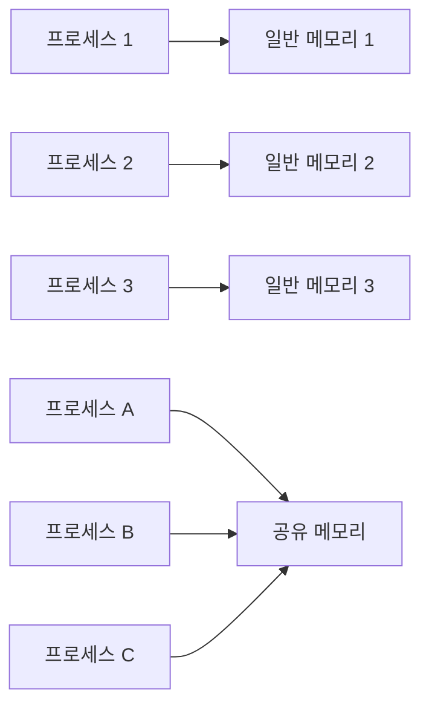
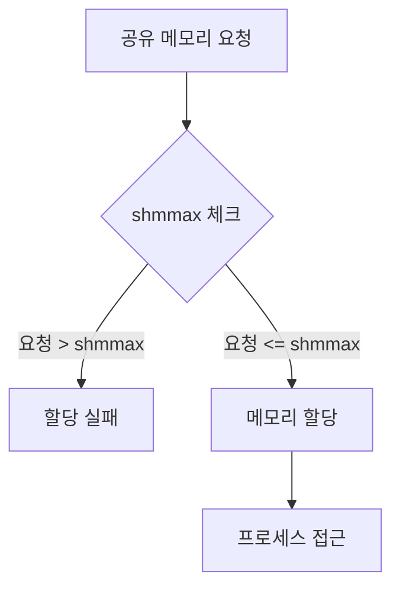
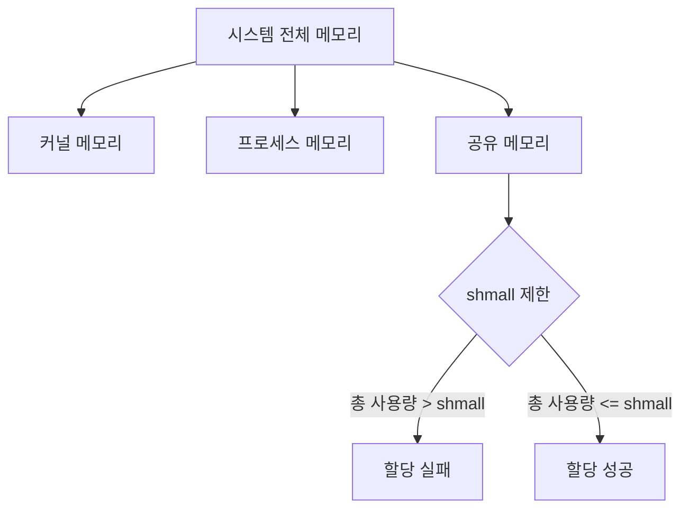
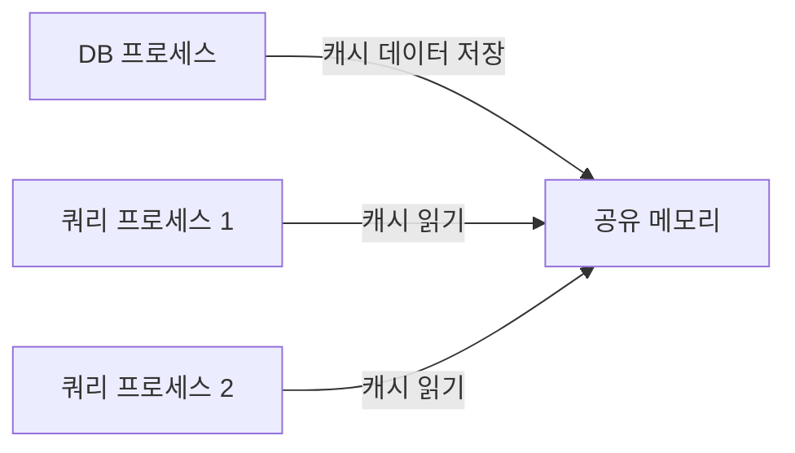
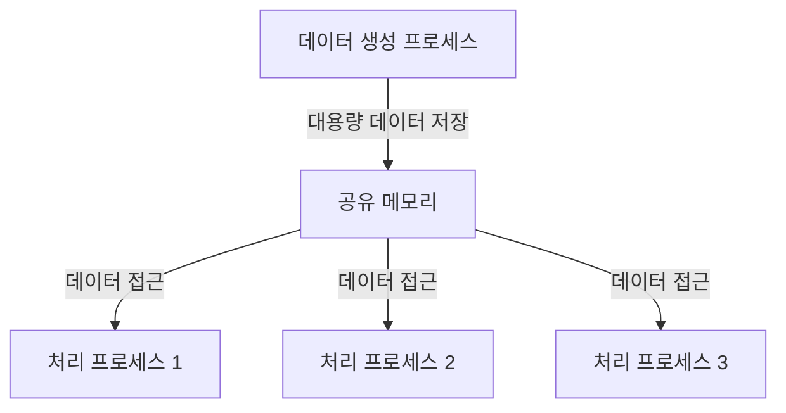

```table-of-contents
title: # 목차
style: nestedList # TOC style (nestedList|nestedOrderedList|inlineFirstLevel)
minLevel: 0 # Include headings from the specified level
maxLevel: 0 # Include headings up to the specified level
includeLinks: true # Make headings clickable
hideWhenEmpty: false # Hide TOC if no headings are found
debugInConsole: false # Print debug info in Obsidian console
```
# 공유 메모리란?

## 기본 개념
공유 메모리는 여러 프로세스가 동시에 접근할 수 있는 메모리 영역이다. 일반적으로 프로세스는 각자의 메모리 공간을 가지고 있어서 서로 독립적이지만, 공유 메모리는 이러한 경계를 허물어 직접적인 데이터 공유를 가능하게 한다.

### 일반 메모리와 공유 메모리의 차이


## 작동 방식
1. 메모리 할당
   - 시스템에 공유 메모리 세그먼트 요청
   - 커널이 물리적 메모리 할당
   - 세그먼트 ID 반환

2. 메모리 연결
   - 프로세스가 세그먼트에 연결(attach)
   - 프로세스의 주소 공간에 매핑
   - 직접 메모리 접근 가능

3. 데이터 공유
   - 한 프로세스가 데이터 쓰기
   - 다른 프로세스가 즉시 읽기 가능
   - 별도의 복사 과정 없음

# 공유 메모리 제한 설정

## kernel.shmmax의 이해


1. 의미
   - 단일 공유 메모리 세그먼트의 최대 크기
   - 바이트 단위로 지정
   - 한 번에 할당할 수 있는 최대 크기

2. 중요성
   - 메모리 남용 방지
   - 시스템 안정성 보장
   - 리소스 관리 용이

## kernel.shmall의 이해


1. 의미
   - 시스템 전체 공유 메모리의 최대 페이지 수
   - 페이지 단위로 지정 (일반적으로 4KB = 1페이지)
   - 모든 공유 메모리 세그먼트의 총합 제한

2. 중요성
   - 시스템 메모리 보호
   - 과도한 공유 메모리 사용 방지
   - 다른 프로세스를 위한 메모리 확보

# 공유 메모리 사용 예시

## 기본 사용법
```c
#include <sys/ipc.h>
#include <sys/shm.h>

// 공유 메모리 생성
int shm_id = shmget(IPC_PRIVATE, size, IPC_CREAT | 0666);

// 공유 메모리 연결
void *shm_addr = shmat(shm_id, NULL, 0);

// 데이터 쓰기
memcpy(shm_addr, data, size);

// 데이터 읽기
memcpy(data, shm_addr, size);

// 공유 메모리 분리
shmdt(shm_addr);

// 공유 메모리 제거
shmctl(shm_id, IPC_RMID, NULL);
```

## 실제 활용 사례

### 1. 데이터베이스 캐시


### 2. 프로세스 간 대용량 데이터 공유


# 제한 설정 방법

## 1. 현재 값 확인
```bash
# shmmax 확인
sysctl kernel.shmmax

# shmall 확인
sysctl kernel.shmall

# 페이지 크기 확인
getconf PAGE_SIZE
```

## 2. 값 설정
```bash
# 임시 설정
sysctl -w kernel.shmmax=68719476736
sysctl -w kernel.shmall=16777216

# 영구 설정 (/etc/sysctl.conf)
kernel.shmmax = 68719476736  # 64GB
kernel.shmall = 16777216     # 64GB/4KB
```

# 최적화 가이드

## 시스템 규모별 권장 설정

### 1. 소규모 시스템 (8GB RAM)
```bash
kernel.shmmax = 4294967296   # 4GB
kernel.shmall = 1048576      # 4GB/4KB
```

### 2. 중규모 시스템 (32GB RAM)
```bash
kernel.shmmax = 17179869184  # 16GB
kernel.shmall = 4194304      # 16GB/4KB
```

### 3. 대규모 시스템 (128GB RAM)
```bash
kernel.shmmax = 68719476736  # 64GB
kernel.shmall = 16777216     # 64GB/4KB
```

## 애플리케이션별 권장 설정

### 1. 데이터베이스 서버
```bash
# PostgreSQL 최적화
kernel.shmmax = RAM의 50%
kernel.shmall = (kernel.shmmax)/4096
```

### 2. 빅데이터 처리 시스템
```bash
# 대용량 데이터 처리
kernel.shmmax = RAM의 75%
kernel.shmall = (kernel.shmmax)/4096
```

# 모니터링과 문제 해결

## 1. 사용량 모니터링
```bash
#!/bin/bash
# 공유 메모리 모니터링 스크립트

echo "=== 공유 메모리 세그먼트 정보 ==="
ipcs -m

echo "=== 제한 설정 ==="
echo "shmmax: $(sysctl -n kernel.shmmax)"
echo "shmall: $(sysctl -n kernel.shmall)"

echo "=== 현재 사용량 ==="
USED_SEGMENTS=$(ipcs -m | wc -l)
TOTAL_BYTES=$(ipcs -m | awk 'NR>3 {sum+=$5} END {print sum}')

echo "세그먼트 수: $USED_SEGMENTS"
echo "총 사용 바이트: $TOTAL_BYTES"
```

## 2. 문제 해결
```bash
# 미사용 세그먼트 정리
ipcs -m | grep nobody | awk '{print $2}' | xargs -n1 ipcrm -m

# 강제 정리 (주의 필요)
ipcs