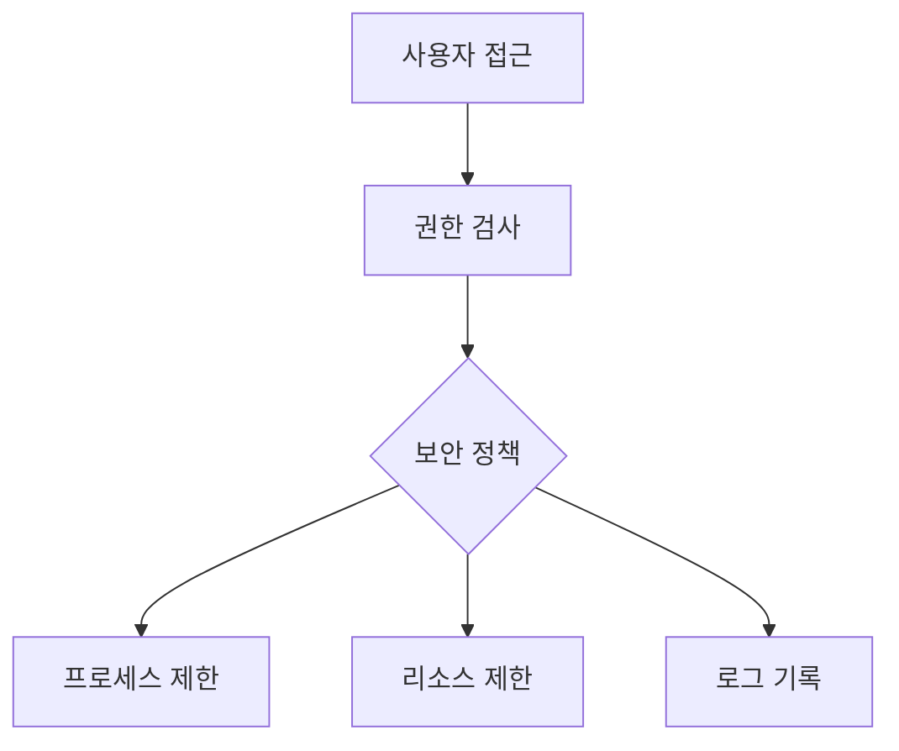
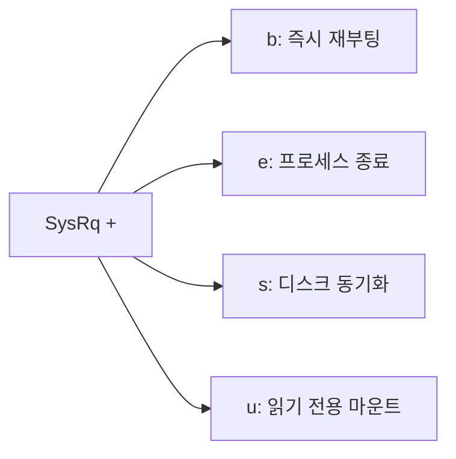

```table-of-contents
title: # 목차
style: nestedList # TOC style (nestedList|nestedOrderedList|inlineFirstLevel)
minLevel: 0 # Include headings from the specified level
maxLevel: 0 # Include headings up to the specified level
includeLinks: true # Make headings clickable
hideWhenEmpty: false # Hide TOC if no headings are found
debugInConsole: false # Print debug info in Obsidian console
```
# 시스템 보안이란?

## 기본 개념
시스템 보안은 집의 보안 시스템과 비슷하다. 현관문 잠금장치(로그인), CCTV(로깅), 방범창(방화벽)처럼 여러 계층의 보안 장치를 통해 시스템을 보호한다.

이 문서를 이해하기 위해 필요한 사전 지식:
- 기본적인 리눅스 명령어 사용법
- 프로세스와 파일 시스템의 기초 개념

# 주요 보안 메커니즘

## 시스템 구조


## 1. Core Dump
### 기본 개념
- Core Dump는 프로그램이 비정상 종료될 때 생성되는 메모리 상태 보고서다
- 마치 자동차 사고 후의 블랙박스 기록과 같다

### Core Dump 설정
```bash
# Core Dump 비활성화
kernel.core_pattern = |/bin/false

# Core Dump 활성화 (디버깅용)
kernel.core_pattern = /var/crash/core.%e.%p.%h.%t
```

#### Core Dump가 필요한 경우:
- 프로그램 디버깅
- 문제 원인 분석
- 메모리 누수 조사

#### Core Dump가 위험한 경우:
- 메모리에 민감한 정보가 있을 때
- 디스크 공간 부족 우려가 있을 때
- 보안이 중요한 프로덕션 환경

## 2. System Request Key (SysRq)

### 기본 개념
- SysRq는 리눅스의 비상 제어 키다
- 시스템이 응답하지 않을 때 사용하는 '비상 탈출구'와 같다

### SysRq 설정
```bash
# SysRq 완전 비활성화
kernel.sysrq = 0

# 안전한 SysRq만 허용
kernel.sysrq = 16

# 모든 SysRq 허용 (디버깅용)
kernel.sysrq = 1
```

### SysRq 키 기능


## 3. 커널 보안 설정

### dmesg 접근 제한
```bash
# dmesg 접근 제한 활성화
kernel.dmesg_restrict = 1
```

#### dmesg란?
- 커널이 출력하는 메시지를 보는 도구
- 시스템 문제 진단에 사용
- 보안 정보가 포함될 수 있음

# 실제 보안 설정 예시

## 1. 기본 보안 설정
```bash
# /etc/sysctl.conf 기본 보안 설정
# Core Dump 비활성화
kernel.core_pattern = |/bin/false

# SysRq 제한
kernel.sysrq = 16

# dmesg 제한
kernel.dmesg_restrict = 1

# 커널 포인터 노출 방지
kernel.kptr_restrict = 1
```

## 2. 서버 보안 강화 설정
```bash
# 네트워크 보안 강화
# IP 스푸핑 방지
net.ipv4.conf.all.rp_filter = 1
net.ipv4.conf.default.rp_filter = 1

# ICMP 리다이렉트 비활성화
net.ipv4.conf.all.accept_redirects = 0
net.ipv4.conf.default.accept_redirects = 0

# 소스 라우팅 비활성화
net.ipv4.conf.all.accept_source_route = 0
net.ipv4.conf.default.accept_source_route = 0
```

# 보안 모니터링

## 1. 시스템 로그 모니터링
```bash
# 커널 메시지 확인
dmesg | grep -i error

# 시스템 로그 확인
tail -f /var/log/syslog
```

## 2. 보안 이벤트 모니터링
```bash
# 실패한 로그인 시도 확인
grep "Failed password" /var/log/auth.log

# 비정상 프로세스 확인
ps aux | grep -i "defunct\|zombie"
```

# 일반적인 보안 문제와 해결

## 1. 리소스 남용
증상:
- 시스템 부하 증가
- 메모리 사용량 급증

해결 방법:
```bash
# 프로세스 리소스 제한 설정
kernel.pid_max = 32768
kernel.threads-max = 15000
```

## 2. 비인가 접근 시도
증상:
- 로그인 실패 기록 증가
- 네트워크 트래픽 증가

해결 방법:
```bash
# TCP SYN 쿠키 활성화
net.ipv4.tcp_syncookies = 1

# 로그인 실패 제한 설정
auth required pam_tally2.so deny=5 unlock_time=600
```

# 권장 보안 설정

## 데스크톱 시스템
```bash
# /etc/sysctl.conf 설정
kernel.core_pattern = |/bin/false
kernel.sysrq = 16
kernel.dmesg_restrict = 1
```

## 서버 시스템
```bash
# /etc/sysctl.conf 설정
kernel.core_pattern = |/bin/false
kernel.sysrq = 0
kernel.dmesg_restrict = 1
kernel.kptr_restrict = 2
kernel.yama.ptrace_scope = 1
```

# 결론
리눅스 시스템 보안은 여러 계층에서 다양한 보호 메커니즘을 제공한다. Core Dump 관리, SysRq 제어, 커널 파라미터 설정 등을 통해 시스템의 안전성을 높일 수 있다. 중요한 것은 시스템의 용도에 맞는 적절한 보안 수준을 설정하는 것이다.