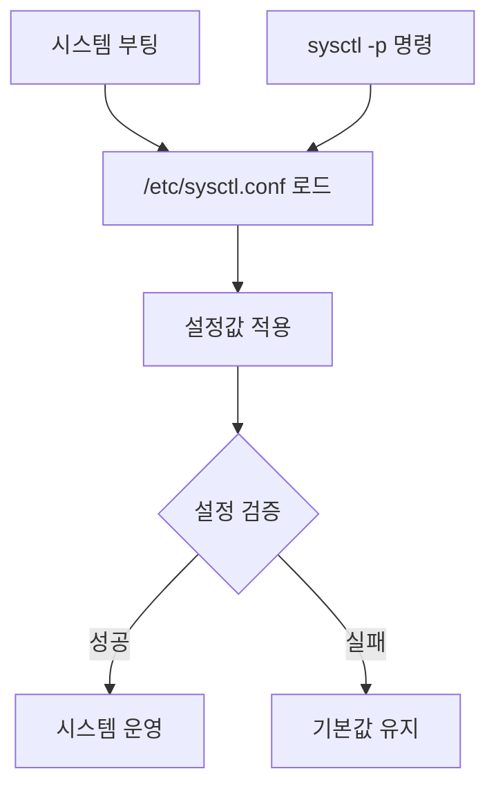
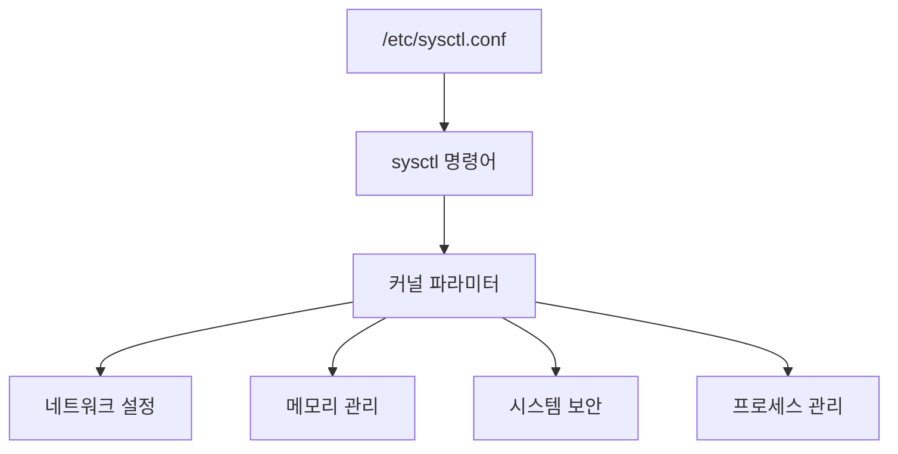

```table-of-contents
title: # 목차
style: nestedList # TOC style (nestedList|nestedOrderedList|inlineFirstLevel)
minLevel: 0 # Include headings from the specified level
maxLevel: 0 # Include headings up to the specified level
includeLinks: true # Make headings clickable
hideWhenEmpty: false # Hide TOC if no headings are found
debugInConsole: false # Print debug info in Obsidian console
```
# sysctl.conf의 이해

## 기본 개념
sysctl.conf는 마치 자동차의 조작 매뉴얼과 같은 역할을 한다. 운전자가 매뉴얼을 통해 차량의 다양한 설정을 조절할 수 있듯이, 시스템 관리자는 sysctl.conf를 통해 Linux 커널의 다양한 매개변수를 설정할 수 있다. 이 파일은 `/etc/sysctl.conf`에 위치하며, 시스템 부팅 시 자동으로 적용된다.

이 문서를 이해하기 위해서는 다음과 같은 기본 지식이 필요하다:
- Linux 기본 명령어
- 커널 작동 방식의 기본 이해
- 시스템 리소스 관리 개념

## 기본 동작 방식


# 주요 설정 항목

## 1. 네트워크 설정
[[Linux 네트워크의 기초]]
```bash
# IPv4 포워딩 활성화
net.ipv4.ip_forward = 1

# TCP SYN 쿠키 보호 활성화
net.ipv4.tcp_syncookies = 1

# TIME_WAIT 소켓 재사용
net.ipv4.tcp_tw_reuse = 1
```

## 2. 메모리 관리
[[Linux 메모리 관리 기초]]
```bash
# 스왑 사용 빈도 조절 (0-100)
vm.swappiness = 10

# 더티 페이지 최대 비율
vm.dirty_ratio = 20

# 파일시스템 캐시 크기
vm.vfs_cache_pressure = 50
```

## 3. 시스템 보안
[[Linux 시스템 보안 기초]]
```bash
# core dump 파일 비활성화
kernel.core_pattern = |/bin/false

# dmesg 접근 제한
kernel.dmesg_restrict = 1

# sysrq 키 비활성화
kernel.sysrq = 0
```

# 실제 사용 예시

## 성능 최적화 설정

### 잘못된 예시
```bash
# 잘못된 설정 - 시스템 리소스 과다 사용
vm.swappiness = 0
fs.file-max = 999999999
net.core.somaxconn = 65535
```

### 올바른 예시
```bash
# 웹 서버 최적화 설정
# 파일 디스크립터 제한 설정
fs.file-max = 2097152
# 네트워크 연결 대기열 크기
net.core.somaxconn = 4096
# TCP 연결 제한시간
net.ipv4.tcp_fin_timeout = 30
# TIME_WAIT 상태에서의 재사용 설정
net.ipv4.tcp_tw_reuse = 1
```

## 설정 적용 방법
```bash
# 설정 확인
sysctl -a | grep net.ipv4.ip_forward

# 임시 설정 적용
sysctl -w net.ipv4.ip_forward=1

# 영구 설정 적용
echo "net.ipv4.ip_forward=1" >> /etc/sysctl.conf
sysctl -p
```

# 시스템 구성도


# 고급 활용법

## 1. 컨테이너 환경 최적화
```bash
# 네트워크 네임스페이스 설정
net.ipv4.ip_forward = 1
net.bridge.bridge-nf-call-iptables = 1

# 컨테이너 제한 설정
kernel.keys.root_maxkeys = 1000000
kernel.keys.maxkeys = 1000000
```

## 2. 데이터베이스 서버 최적화
```bash
# 공유 메모리 설정
kernel.shmmax = 68719476736
kernel.shmall = 4294967296

# 페이지 캐시 설정
vm.dirty_background_ratio = 5
vm.dirty_ratio = 10
```

# 주의사항

## 보안 고려사항
1. 시스템 접근 제한
```bash
# core dump 제한
kernel.core_pattern = |/bin/false
# dmesg 접근 제한
kernel.dmesg_restrict = 1
```

## 성능 고려사항
1. 메모리 관리
```bash
# 스왑 사용 조절
vm.swappiness = 10
# 캐시 압력 조절
vm.vfs_cache_pressure = 50
```

## 문제 해결을 위한 설정 확인
```bash
# 전체 설정 확인
sysctl -a

# 특정 설정 확인
sysctl net.ipv4.ip_forward

# 설정 파일 구문 검사
sysctl -p
```

# 대표적인 문제 해결

## 1. 네트워크 성능 문제
```bash
# TCP 버퍼 크기 증가
net.core.rmem_max = 16777216
net.core.wmem_max = 16777216
```

## 2. 메모리 부족 문제
```bash
# OOM Killer 설정 조정
vm.oom_kill_allocating_task = 1
vm.panic_on_oom = 0
```

# 결론
sysctl.conf는 Linux 시스템의 핵심 설정 파일로, 시스템의 성능과 보안을 최적화하는 데 필수적인 도구이다. 설정 변경 시에는 시스템의 특성과 요구사항을 충분히 고려해야 하며, 변경 후에는 반드시 테스트와 모니터링을 수행해야 한다. 적절한 설정을 통해 시스템의 안정성과 성능을 크게 향상시킬 수 있다.