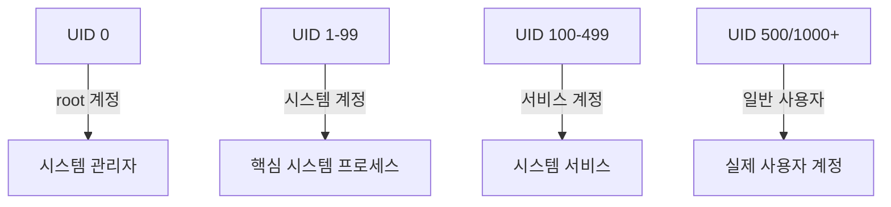

# UID(User Identifier) 개요
## 기본 개념
UID는 Linux System에서 각 사용자를 구분하는 고유 식별자이다. 숫자 형태로 관리되며, 시스템 보안과 접근 제어의 기본 단위로 사용된다.

# UID 할당 체계
## 기본 구조


## Distribution별 기본값
| Distribution | 일반 사용자 시작 UID |
|--------------|-------------------|
| RHEL/CentOS  | 500              |
| Ubuntu/Debian | 1000             |
| SUSE         | 1000             |

# 보안 정책 구현
## PAM 설정 방법
### 1. 기본 설정
```plaintext
# /etc/pam.d/service-name
auth requisite pam_succeed_if.so uid >= 500 quiet
```

### 2. 고급 설정 예시
```plaintext
# 일반 사용자만 허용
auth requisite pam_succeed_if.so uid >= 1000 quiet

# 특정 UID 범위 허용
auth requisite pam_succeed_if.so uid >= 1000 uid <= 60000 quiet

# 특정 그룹 멤버십 추가 확인
auth required pam_succeed_if.so user ingroup allowedusers quiet
```

## 시스템 계정 관리
### 1. 계정 목록 확인
```bash
# 시스템 계정 조회
awk -F: '$3 < 500 {printf "User: %-15s UID: %-5d\n",$1,$3}' /etc/passwd
```

### 2. 보안 모니터링
```bash
# UID 변경 감지
find /etc/passwd -mtime -1 -exec awk -F: '{print $1,$3}' {} \;

# 권한 있는 계정 감사
awk -F: '$3 < 500 && $7 != "/sbin/nologin" {print}' /etc/passwd
```

# 구현 사례
## VPN 접근 제어
### 1. OpenVPN 설정
```plaintext
# /etc/pam.d/openvpn
auth required pam_unix.so shadow nodelay
auth requisite pam_succeed_if.so uid >= 1000 quiet
auth required pam_succeed_if.so user ingroup vpnusers quiet
```

### 2. SSH 접근 제어
```plaintext
# /etc/pam.d/sshd
auth required pam_unix.so
auth requisite pam_succeed_if.so uid >= 1000 quiet
```

# 보안 강화 방안
## 권장 설정
1. UID 최소값 상향 조정
```bash
# /etc/login.defs
UID_MIN 2000
```

2. 시스템 계정 Shell 제한
```bash
# /etc/pam.d/system-auth
auth required pam_succeed_if.so shell != /bin/bash quiet
```

## 모니터링 및 감사
### 1. 로그 설정
```bash
# /etc/rsyslog.d/auth-uid.conf
auth.* /var/log/uid-auth.log
```

### 2. 감사 규칙
```bash
# /etc/audit/rules.d/uid.rules
-w /etc/passwd -p wa -k passwd_changes
-w /etc/shadow -p wa -k shadow_changes
```

# 문제 해결 가이드
## 일반적인 문제
1. 접근 거부
   - 원인: UID 범위 밖의 사용자
   - 해결: id 명령으로 UID 확인
   ```bash
   id username
   ```

2. 예외 처리
   - 특정 계정 허용
   ```plaintext
   auth [success=1 default=ignore] pam_succeed_if.so user = specific_user
   auth requisite pam_succeed_if.so uid >= 1000 quiet
   ```

# 모범 사례
1. UID 관리
   - 신규 사용자 UID는 1000 이상 사용
   - 시스템 계정 UID는 변경하지 않음
   - 정기적인 UID 감사 수행

2. 접근 제어
   - 최소 권한 원칙 적용
   - 그룹 기반 추가 접근 제어 구현
   - 정기적인 접근 권한 검토

# 결론
UID 기반 보안 정책은 Linux System의 기본적인 보안 메커니즘이다. 현대의 보안 요구사항을 고려할 때 UID 1000 이상으로 제한하고, 추가적인 보안 계층을 구현하는 것이 권장된다.