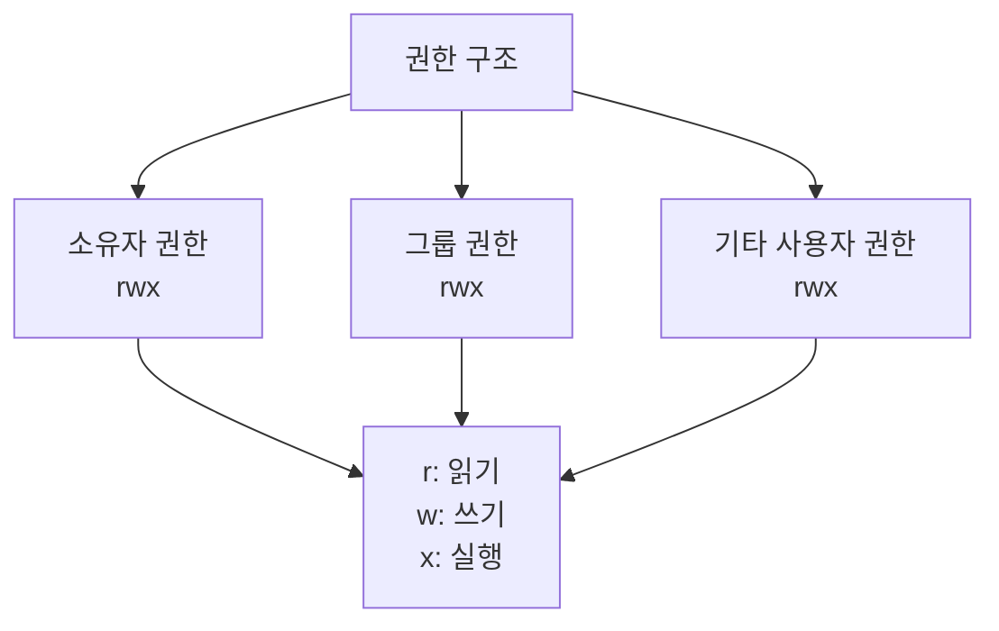
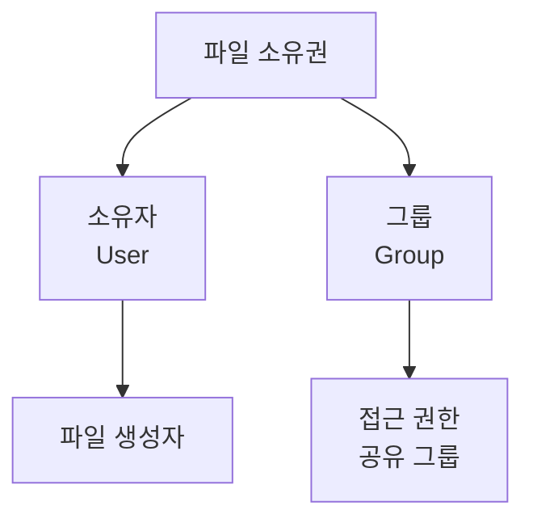
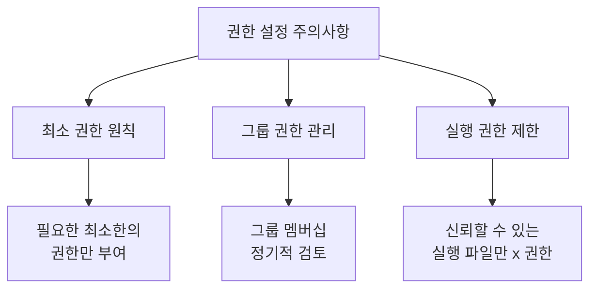

# 개요
Linux 시스템에서 `ls -l` 명령어를 실행하면 파일과 디렉토리의 상세 정보를 확인할 수 있다. 이 문서에서는 표시되는 각 정보의 의미와 활용법을 설명한다.

# 기본 출력 형식
```bash
$ ls -l
drwxr-xr-x 2 user group 4096 Nov 26 10:30 Documents
-rw-r--r-- 1 user group  123 Nov 26 10:31 file.txt
lrwxrwxrwx 1 user group   15 Nov 26 10:32 link.txt -> original.txt
```

## 출력 구조 분석


# 파일 정보 상세 설명
## 1. 파일 타입
첫 번째 문자는 파일의 종류를 나타낸다:
- `-`: 일반 파일
- `d`: 디렉토리
- `l`: 심볼릭 링크
- `b`: 블록 디바이스
- `c`: 문자 디바이스
- `p`: 파이프
- `s`: 소켓

## 2. 파일 권한
파일 타입 다음 9개 문자는 권한을 나타낸다:


### 권한 계산 예시
```python
# 권한을 숫자로 변환하는 예시 코드
def calculate_permission(permission_str):
    """
    권한 문자열을 숫자로 변환한다
    예: 'rwxr-xr--' -> 754
    """
    values = {'r': 4, 'w': 2, 'x': 1, '-': 0}
    result = []
    
    # 소유자, 그룹, 기타 사용자 권한을 각각 계산
    for i in range(0, 9, 3):
        perm = permission_str[i:i+3]
        total = sum(values[p] for p in perm)
        result.append(str(total))
    
    return ''.join(result)

# 사용 예시
perm = 'rwxr-xr--'
print(f"권한 {perm}의 숫자값: {calculate_permission(perm)}")  # 출력: 754
```

## 3. 하드링크 수
```bash
# 하드링크 생성 예시
$ echo "원본 파일" > original.txt
$ ln original.txt hardlink.txt
$ ls -l
-rw-r--r-- 2 user group 12 Nov 26 10:35 original.txt
-rw-r--r-- 2 user group 12 Nov 26 10:35 hardlink.txt
```

## 4. 소유자와 그룹


### 소유권 변경 예시
```bash
# 잘못된 방식 - 권한 없이 변경 시도
$ chown newuser file.txt

# 올바른 방식 - sudo 사용
$ sudo chown newuser:newgroup file.txt
```

## 5. 파일 크기
- 기본적으로 바이트 단위로 표시된다
- 사람이 읽기 쉬운 형식으로 보려면 `-h` 옵션을 사용한다

```bash
# 일반 출력
$ ls -l
-rw-r--r-- 1 user group 1048576 Nov 26 10:40 bigfile.txt

# 읽기 쉬운 형식
$ ls -lh
-rw-r--r-- 1 user group 1.0M Nov 26 10:40 bigfile.txt
```

## 6. 수정 시간
파일의 마지막 수정 시간을 표시한다:
```bash
# 기본 시간 표시
$ ls -l
-rw-r--r-- 1 user group 123 Nov 26 10:45 file.txt

# 전체 시간 정보 표시
$ ls -l --full-time
-rw-r--r-- 1 user group 123 2024-11-26 10:45:30.123456789 +0900 file.txt
```

# 실용적인 사용 예시
## 1. 파일 권한 분석
```python
# 파일 권한을 분석하는 스크립트
import os
import stat

def analyze_permissions(filename):
    """
    파일의 권한을 상세히 분석한다
    """
    st = os.stat(filename)
    mode = st.st_mode
    
    # 파일 타입 확인
    file_types = {
        stat.S_ISREG: "일반 파일",
        stat.S_ISDIR: "디렉토리",
        stat.S_ISLNK: "심볼릭 링크",
        stat.S_ISFIFO: "파이프",
        stat.S_ISSOCK: "소켓",
        stat.S_ISBLK: "블록 디바이스",
        stat.S_ISCHR: "문자 디바이스"
    }
    
    file_type = next((desc for check, desc in file_types.items() 
                     if check(mode)), "알 수 없음")
    
    # 권한 분석
    permissions = {
        'owner': {'r': bool(mode & stat.S_IRUSR),
                 'w': bool(mode & stat.S_IWUSR),
                 'x': bool(mode & stat.S_IXUSR)},
        'group': {'r': bool(mode & stat.S_IRGRP),
                 'w': bool(mode & stat.S_IWGRP),
                 'x': bool(mode & stat.S_IXGRP)},
        'others': {'r': bool(mode & stat.S_IROTH),
                  'w': bool(mode & stat.S_IWOTH),
                  'x': bool(mode & stat.S_IXOTH)}
    }
    
    return {
        'type': file_type,
        'permissions': permissions,
        'special_bits': {
            'setuid': bool(mode & stat.S_ISUID),
            'setgid': bool(mode & stat.S_ISGID),
            'sticky': bool(mode & stat.S_ISVTX)
        }
    }
```

## 2. 파일 정보 모니터링
```bash
# 실시간 파일 변경 감시
$ watch -n 1 'ls -l target_file.txt'

# 특정 확장자 파일만 감시
$ watch -n 1 'ls -l *.log'
```

# 보안 관련 주의사항
## 1. 권한 설정 시 주의점


## 2. 안전한 권한 설정 예시
```bash
# 민감한 설정 파일
$ chmod 600 config.ini  # 소유자만 읽기/쓰기 가능

# 공유 디렉토리
$ chmod 750 shared_dir/  # 그룹 멤버는 읽기/실행만 가능

# 실행 파일
$ chmod 755 script.sh  # 모든 사용자가 실행 가능하나 수정은 불가
```

# 결론
`ls -l` 명령어는 파일 시스템의 상세 정보를 확인할 수 있는 강력한 도구이다. 각 항목의 의미를 정확히 이해하고 활용하면:
1. 파일 시스템 보안을 효과적으로 관리할 수 있다
2. 파일 접근 권한을 정확히 제어할 수 있다
3. 시스템 리소스 사용 현황을 모니터링할 수 있다

이러한 정보를 바탕으로 시스템 관리자는 더 안전하고 효율적인 파일 시스템 관리가 가능하다.