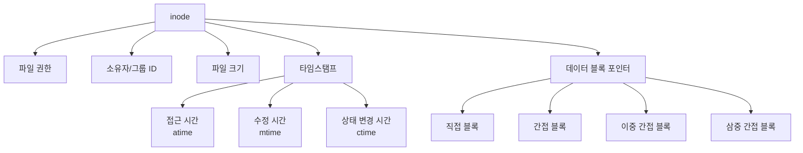
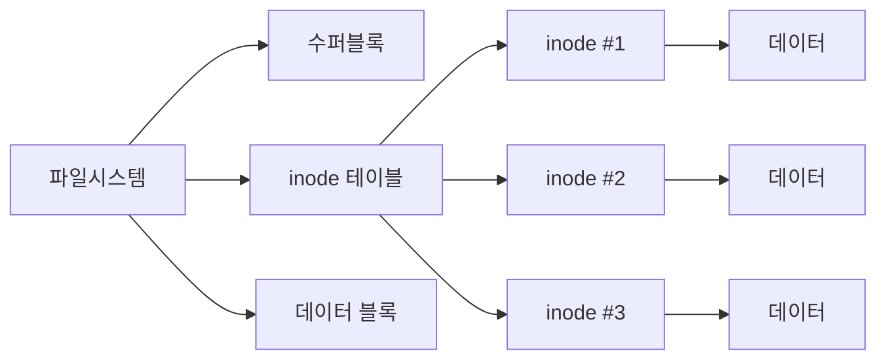
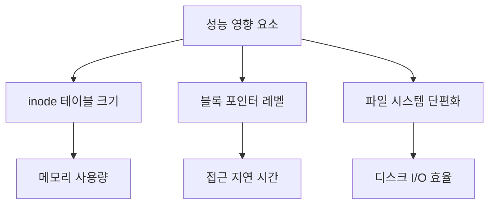
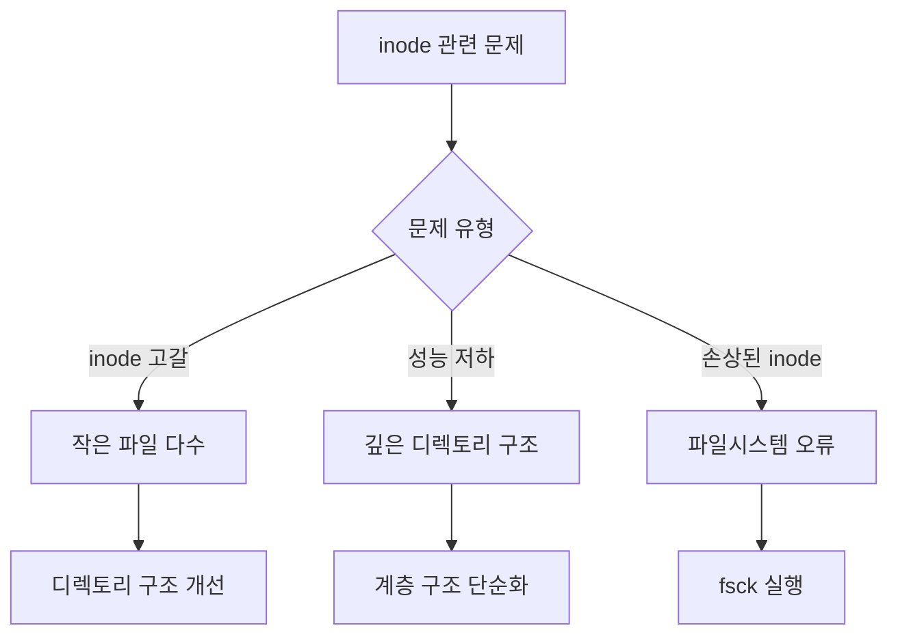

# 개요
inode (Index Node)는 Unix/Linux 파일시스템에서 파일이나 디렉토리의 메타데이터를 저장하는 데이터 구조이다. 이는 도서관의 도서 카드와 유사하다. 도서 카드가 책의 위치, 저자, 출판일 등의 정보를 담고 있는 것처럼, inode는 파일의 속성과 디스크 상의 위치 정보를 담고 있다.

# 기본 구조
## inode의 구성요소


## 파일시스템 구조


# inode 상세 정보
## 1. 메타데이터 구조
```c
// inode 구조체 예시
struct inode {
    mode_t          i_mode;      /* 파일 타입과 권한 */
    uid_t           i_uid;       /* 소유자 ID */
    gid_t           i_gid;       /* 그룹 ID */
    off_t           i_size;      /* 파일 크기 (바이트) */
    struct timespec i_atime;     /* 최근 접근 시간 */
    struct timespec i_mtime;     /* 최근 수정 시간 */
    struct timespec i_ctime;     /* 최근 상태 변경 시간 */
    blkcnt_t        i_blocks;    /* 할당된 디스크 블록 수 */
    unsigned short  i_nlink;     /* 하드링크 수 */
    union {
        struct {
            block_t i_db[12];    /* 직접 블록 포인터 */
            block_t i_ib[3];     /* 간접 블록 포인터 */
        };
        void *i_dir;            /* 디렉토리인 경우 */
    } i_data;
};
```

## 2. inode 번호 확인
```bash
# 파일의 inode 번호 확인
$ ls -i file.txt
1234567 file.txt

# 디렉토리 내 모든 파일의 inode 정보 확인
$ ls -li
total 20
1234567 -rw-r--r-- 1 user group 2048 Nov 26 10:00 file1.txt
1234568 -rw-r--r-- 1 user group 3072 Nov 26 10:01 file2.txt
```

## 3. inode 사용량 확인
```bash
# 파일시스템의 inode 사용량 확인
$ df -i
Filesystem      Inodes  IUsed   IFree IUse%
/dev/sda1      1234567 234567 1000000   19%

# 디렉토리의 inode 사용량 확인
$ find . -printf '%i\n' | sort -u | wc -l
```

# inode 관리 시스템
## 1. 데이터 블록 관리
```python
class Inode:
    def __init__(self):
        self.direct_blocks = [None] * 12  # 직접 블록
        self.indirect_block = None        # 단일 간접 블록
        self.double_indirect = None       # 이중 간접 블록
        self.triple_indirect = None       # 삼중 간접 블록
    
    def allocate_block(self, block_number, level=0):
        """블록 할당 시뮬레이션"""
        if level == 0 and len(self.direct_blocks) > block_number:
            self.direct_blocks[block_number] = Block()
        elif level == 1:
            if not self.indirect_block:
                self.indirect_block = IndirectBlock()
            self.indirect_block.allocate(block_number)
        # 이하 이중, 삼중 간접 블록 처리
```

## 2. 파일 시스템 구현
```python
class FileSystem:
    def __init__(self, total_inodes):
        self.inode_table = {}
        self.free_inodes = set(range(1, total_inodes + 1))
    
    def create_file(self, name):
        """새 파일 생성 시뮬레이션"""
        if not self.free_inodes:
            raise Exception("사용 가능한 inode가 없습니다")
            
        inode_number = self.free_inodes.pop()
        self.inode_table[inode_number] = Inode()
        return inode_number
```

# 실제 사용 사례
## 1. 파일 시스템 디버깅
```bash
# 파일시스템 검사
$ fsck -f /dev/sda1

# 특정 inode 정보 확인
$ debugfs -R 'stat <1234567>' /dev/sda1
```

## 2. 파일 복구
```bash
# 삭제된 파일의 inode가 아직 할당 해제되지 않은 경우
$ debugfs -w /dev/sda1
debugfs: logdump -i <1234567>
```

# 성능과 제한사항
## 1. 성능 고려사항


## 2. 시스템 제한
```bash
# 파일시스템 생성 시 inode 수 지정
$ mkfs.ext4 -N 2000000 /dev/sdb1

# inode 크기 확인
$ tune2fs -l /dev/sda1 | grep "Inode size"
```

# 문제 해결 가이드
## 일반적인 문제와 해결방안


## 모니터링과 유지보수
```bash
# 주기적인 inode 사용량 모니터링
$ watch -n 60 'df -i'

# 큰 디렉토리의 inode 사용량 분석
$ find /path -xdev -printf '%h\n' | sort | uniq -c | sort -n
```

# 결론
inode는 Unix/Linux 파일시스템의 핵심 구성요소로, 다음과 같은 중요한 역할을 수행한다:

1. 파일 메타데이터 관리
   - 파일 속성 저장
   - 접근 권한 제어
   - 시간 정보 추적

2. 파일 데이터 관리
   - 디스크 블록 위치 추적
   - 효율적인 파일 접근 제공
   - 파일 시스템 일관성 유지

3. 시스템 성능
   - 빠른 파일 접근 제공
   - 효율적인 저장 공간 관리
   - 파일 시스템 확장성 지원

inode의 특성과 제한사항을 이해하면 파일 시스템을 더욱 효율적으로 관리할 수 있다.