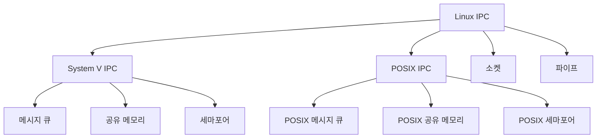
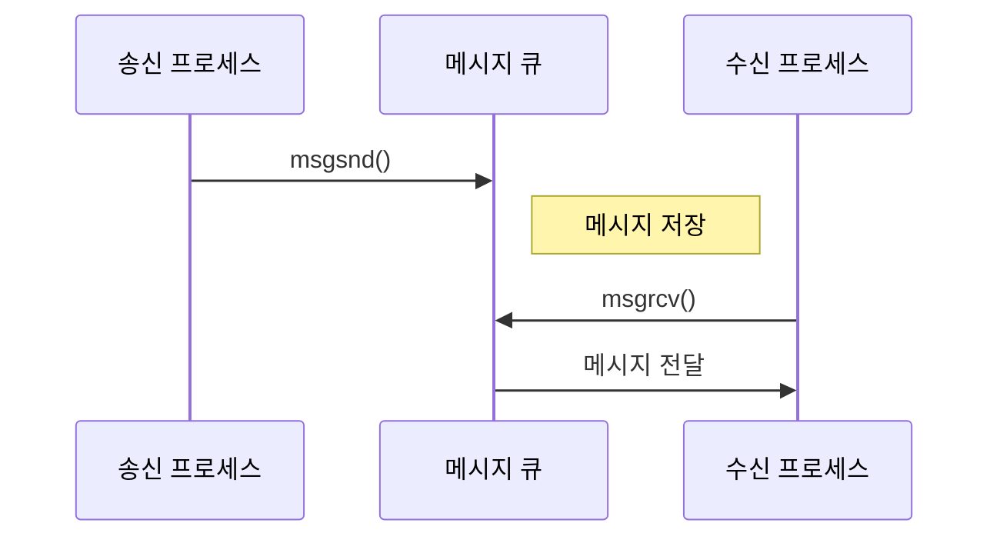
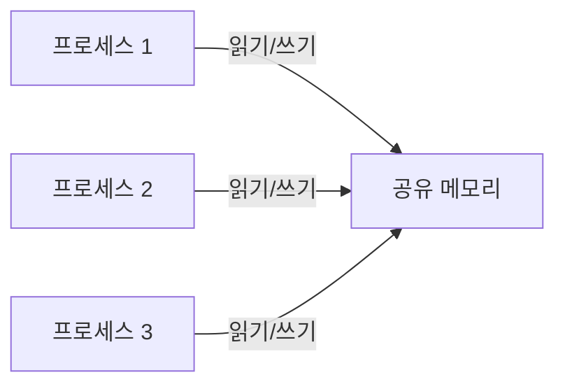
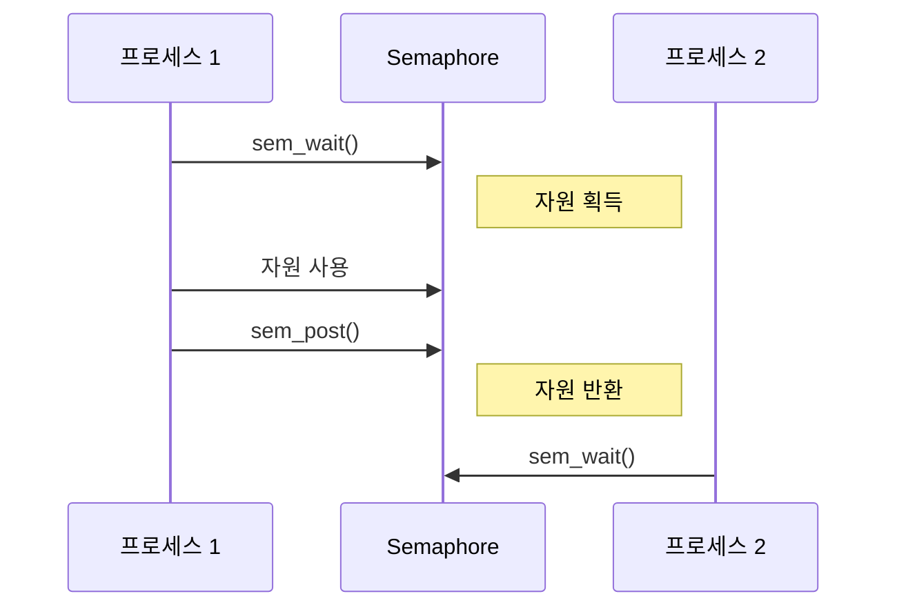
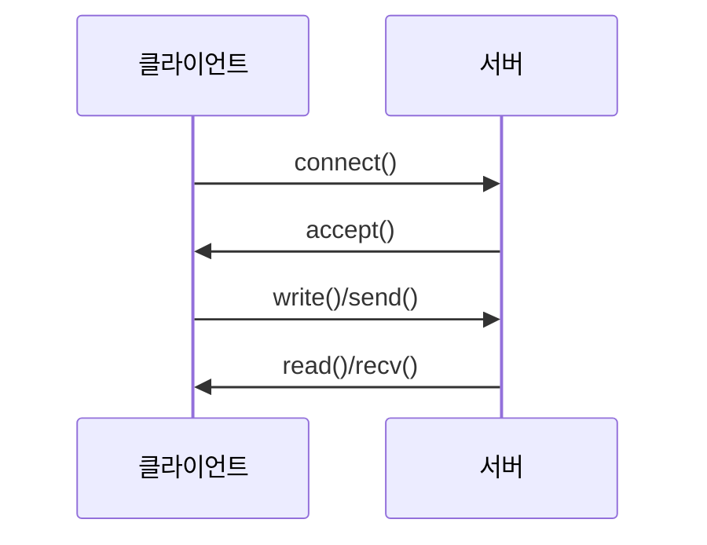
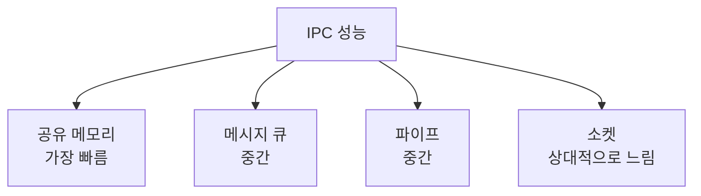

```table-of-contents
title: # 목차
style: nestedList # TOC style (nestedList|nestedOrderedList|inlineFirstLevel)
minLevel: 0 # Include headings from the specified level
maxLevel: 0 # Include headings up to the specified level
includeLinks: true # Make headings clickable
hideWhenEmpty: false # Hide TOC if no headings are found
debugInConsole: false # Print debug info in Obsidian console
```
# IPC(Inter-Process Communication)란?

## 기본 개념
IPC는 프로세스들이 서로 데이터를 주고받고 통신하는 메커니즘이다. 마치 사람들이 전화, 이메일, 대화 등 다양한 방법으로 통신하듯이, 프로세스들도 여러 방법으로 통신할 수 있다.

## IPC의 필요성
1. 데이터 공유
2. 프로세스 동기화
3. 모듈화와 유연성
4. 시스템 자원 효율성

# Linux IPC의 주요 방식

## 시스템 개요


# 1. 메시지 큐

## 기본 개념
메시지 큐는 프로세스 간에 데이터를 주고받는 통신 채널이다.



## 주요 특징
1. 비동기 통신 가능
2. 메시지 우선순위 지원
3. 다대다 통신 가능

## 구현 예시
```c
#include <sys/msg.h>

// 메시지 구조체
struct msg_buffer {
    long msg_type;
    char msg_text[100];
} message;

// 메시지 큐 생성
int msgid = msgget(ftok("/tmp", 65), 0666 | IPC_CREAT);

// 메시지 전송
msgsnd(msgid, &message, sizeof(message), 0);

// 메시지 수신
msgrcv(msgid, &message, sizeof(message), 1, 0);
```

# 2. 공유 메모리

## 기본 개념
여러 프로세스가 동일한 메모리 영역을 공유하여 데이터를 교환한다.



## 주요 특징
1. 가장 빠른 IPC 방식
2. 직접 메모리 접근
3. 동기화 필요

## 구현 예시
```c
#include <sys/shm.h>

// 공유 메모리 생성
int shmid = shmget(IPC_PRIVATE, size, IPC_CREAT | 0666);

// 공유 메모리 연결
void *shared_memory = shmat(shmid, NULL, 0);

// 데이터 접근
memcpy(shared_memory, data, size);
```

# 3. Semaphore

## 기본 개념
프로세스 간 동기화와 상호 배제를 제공하는 메커니즘이다.



## 주요 특징
1. 자원 접근 제어
2. 교착상태 방지
3. 상호 배제 보장

## 구현 예시
```c
#include <sys/sem.h>

// Semaphore 생성
int semid = semget(IPC_PRIVATE, 1, 0666 | IPC_CREAT);

// Semaphore 초기화
semctl(semid, 0, SETVAL, 1);

// Semaphore 획득
struct sembuf sb = {0, -1, 0};
semop(semid, &sb, 1);

// Semaphore 반환
sb.sem_op = 1;
semop(semid, &sb, 1);
```

# 4. 파이프

## 기본 개념
단방향 데이터 흐름을 제공하는 통신 채널이다.


## 주요 특징
1. 단방향 통신
2. 부모-자식 프로세스 간 주로 사용
3. FIFO 방식

## 구현 예시
```c
#include <unistd.h>

int pipefd[2];
pipe(pipefd);

if (fork() == 0) {
    // 자식 프로세스
    close(pipefd[1]);  // 쓰기 닫기
    read(pipefd[0], buf, sizeof(buf));
} else {
    // 부모 프로세스
    close(pipefd[0]);  // 읽기 닫기
    write(pipefd[1], data, strlen(data));
}
```

# 5. 소켓

## 기본 개념
네트워크 통신과 같은 방식으로 프로세스 간 통신을 제공한다.



## 주요 특징
1. 양방향 통신
2. 로컬/원격 통신 가능
3. 다양한 프로토콜 지원

## 구현 예시
```c
#include <sys/socket.h>

// Unix Domain Socket 생성
int sockfd = socket(AF_UNIX, SOCK_STREAM, 0);

// 연결
struct sockaddr_un addr;
connect(sockfd, (struct sockaddr*)&addr, sizeof(addr));

// 데이터 송수신
write(sockfd, data, size);
read(sockfd, buf, size);
```

# IPC 방식 비교

## 성능 비교


## 사용 시나리오
1. 공유 메모리
   - 대량 데이터 공유
   - 데이터베이스 캐시
   - 실시간 처리

2. 메시지 큐
   - 비동기 작업
   - 이벤트 처리
   - 작업 분배

3. Semaphore
   - 리소스 관리
   - 동기화
   - 상호 배제

4. 파이프
   - 명령어 파이프라인
   - 부모-자식 통신
   - 단방향 데이터 흐름

5. 소켓
   - 네트워크 통신
   - 분산 시스템
   - 서비스 간 통신

# IPC 보안 고려사항

## 1. 권한 설정
```bash
# IPC 리소스 권한 확인
ipcs -a

# 권한 변경
ipcrm -q [msgid]
ipcrm -m [shmid]
ipcrm -s [semid]
```

## 2. 리소스 관리
```bash
# 미사용 리소스 정리
ipcs -a | grep nobody | awk '{print $2}' | xargs -n1 ipcrm -m
```

# 결론
Linux IPC는 다양한 프로세스 간 통신 방식을 제공하며, 각각의 방식은 고유한 특징과 용도를 가진다. 적절한 IPC 메커니즘의 선택은 애플리케이션의 요구사항, 성능, 보안을 고려하여 이루어져야 한다.