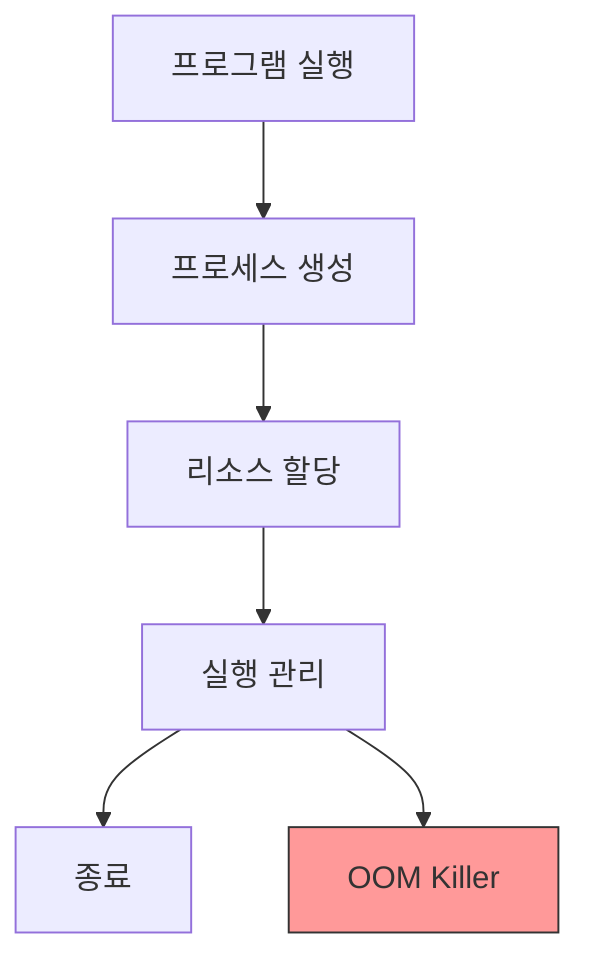

```table-of-contents
title: # 목차
style: nestedList # TOC style (nestedList|nestedOrderedList|inlineFirstLevel)
minLevel: 0 # Include headings from the specified level
maxLevel: 0 # Include headings up to the specified level
includeLinks: true # Make headings clickable
hideWhenEmpty: false # Hide TOC if no headings are found
debugInConsole: false # Print debug info in Obsidian console
```
# 프로세스란 무엇인가?

## 기본 개념
프로세스는 실행 중인 프로그램이다. 마치 주방에서 요리하는 것과 같다. 레시피(프로그램)를 실제로 요리(프로세스)하는 과정에서 재료(메모리)와 도구(시스템 자원)를 사용한다.

이 문서를 이해하기 위해 필요한 사전 지식:
- 기본적인 리눅스 명령어 사용법
- 파일 시스템에 대한 기초 이해

# 프로세스 관리 시스템

## 시스템 구조


## 주요 개념 설명

### 1. 파일 디스크립터
- 시스템이 열린 파일을 관리하는 방식
- 마치 책갈피처럼 파일의 위치를 기억
- 기본 제한: 1024개

```bash
# 파일 디스크립터 제한 확인
ulimit -n

# 시스템 전체 제한 설정
fs.file-max = 65535
```

### 2. OOM (Out Of Memory) Killer
- 메모리 부족 시 프로세스를 강제 종료하는 시스템
- 마치 과부하된 배에서 화물을 버리는 것과 같다


#### OOM Killer 설정
```bash
# OOM Killer 비활성화 (특정 프로세스)
echo -17 > /proc/<pid>/oom_adj

# 시스템 설정
vm.oom_kill_allocating_task = 1  # 문제 일으킨 프로세스 종료
vm.panic_on_oom = 0              # OOM 발생 시 커널 패닉 방지
```

### 3. 프로세스 우선순위
- nice 값으로 프로세스 우선순위 조정
- 범위: -20(최고) ~ 19(최저)
- 기본값: 0

```bash
# 프로세스 우선순위 확인
ps -el | grep [프로세스명]

# 우선순위 변경
renice -n 10 -p [PID]
```

# 실제 프로세스 관리

## 1. 프로세스 모니터링
```bash
# 기본 프로세스 확인
ps aux

# 실시간 모니터링
top

# 특정 프로세스 자원 사용량
pidstat -p [PID] 1
```

## 2. 리소스 제한 설정

### 잘못된 예시
```bash
# 문제점: 제한이 너무 높거나 낮음
fs.file-max = 999999999
kernel.pid_max = 999999
```

### 올바른 예시
```bash
# 시스템 용도에 맞는 적절한 제한 설정
# 웹 서버 최적화 설정
fs.file-max = 65535                # 파일 디스크립터 최대값
kernel.pid_max = 65535             # 프로세스 ID 최대값
kernel.threads-max = 31998         # 스레드 최대값
vm.max_map_count = 262144         # 메모리 맵 최대값
```

# 프로세스 문제 해결

## 1. 좀비 프로세스 처리
```bash
# 좀비 프로세스 확인
ps aux | grep 'Z'

# 부모 프로세스 확인
pstree -p -s [좀비 PID]

# 부모 프로세스 재시작
kill -HUP [부모 PID]
```

## 2. 높은 CPU 사용률
```bash
# CPU 사용량 높은 프로세스 확인
top -c

# 특정 프로세스 스레드 확인
ps -eLf | grep [프로세스명]

# CPU 사용량 제한
cpulimit -p [PID] -l 50  # CPU 사용률 50%로 제한
```

# 시스템 튜닝

## 1. 서버 최적화 설정
```bash
# /etc/sysctl.conf 설정
# 프로세스 관련
kernel.pid_max = 65535
kernel.threads-max = 31998

# 파일 시스템 관련
fs.file-max = 65535
fs.nr_open = 65535

# OOM Killer 설정
vm.oom_kill_allocating_task = 1
vm.panic_on_oom = 0
```

## 2. 애플리케이션 서버 설정
```bash
# 웹 서버용 설정
# 파일 디스크립터 증가
fs.file-max = 262144

# 네트워크 연결을 위한 로컬 포트 범위 확장
net.ipv4.ip_local_port_range = 1024 65535
```

# 문제 해결 가이드

## 1. 시스템 과부하
증상:
- 높은 CPU 사용률
- 느린 시스템 응답

해결 방법:
```bash
# 프로세스 우선순위 조정
renice 10 [PID]

# 리소스 제한 설정
ulimit -u 5000  # 최대 프로세스 수 제한
```

## 2. 메모리 부족
증상:
- OOM Killer 활성화
- 시스템 성능 저하

해결 방법:
```bash
# 메모리 사용량 모니터링
free -h

# 캐시 정리
sync; echo 3 > /proc/sys/vm/drop_caches
```

# 프로세스 모니터링 도구

## 1. 기본 모니터링
```bash
# 프로세스 목록
ps aux

# 실시간 모니터링
top

# 메모리 사용량
free -h
```

## 2. 고급 모니터링
```bash
# 프로세스 상세 정보
pidstat -p [PID] -u -d -r 1

# I/O 모니터링
iotop

# 시스템 전체 모니터링
htop
```

# 결론
리눅스 프로세스 관리는 시스템의 안정성과 성능에 직접적인 영향을 미친다. 파일 디스크립터, OOM Killer, 프로세스 우선순위 등의 개념을 이해하고 적절히 조정함으로써 시스템의 효율적인 운영이 가능하다. 특히 서버 환경에서는 적절한 리소스 제한과 모니터링이 매우 중요하다.