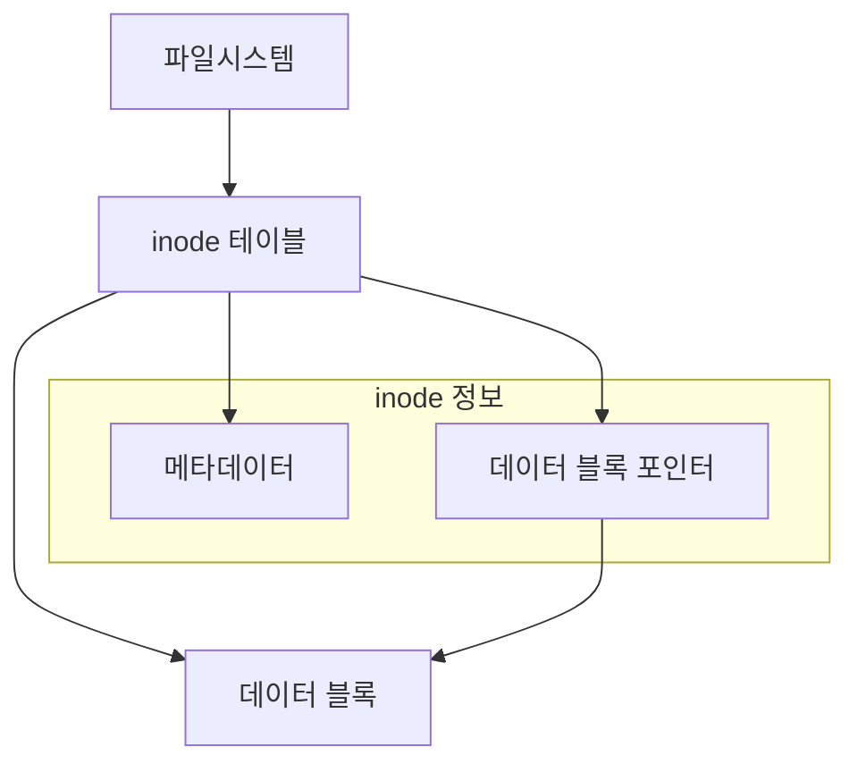

# 개요
파일 시스템에서 Link는 파일을 참조하는 두 가지 방식을 제공한다. Hardlink와 Symbolic Link(Symlink)는 각각 다른 특성과 사용 목적을 가진다. 이는 마치 책의 실제 책과 책의 참조 번호의 관계와 유사하다.

# 기본 개념
## 파일 시스템 구조


## Hardlink vs Symbolic Link


# Hardlink 상세 설명
## 특징
1. 동일한 inode를 참조한다
2. 원본 파일과 동일한 permission을 가진다
3. 파일시스템 간 생성이 불가능하다
4. 디렉토리에 대한 Hardlink는 생성할 수 없다

## 생성과 사용
```bash
# Hardlink 생성
$ echo "원본 파일 내용" > original.txt
$ ln original.txt hardlink.txt

# 파일 정보 확인
$ ls -li  # -i 옵션은 inode 번호를 표시한다
1234567 -rw-r--r-- 2 user group 18 Nov 26 10:00 original.txt
1234567 -rw-r--r-- 2 user group 18 Nov 26 10:00 hardlink.txt
```

## 동작 방식
```python
# Hardlink의 동작을 시뮬레이션하는 예제 코드
class Inode:
    def __init__(self, content):
        self.content = content
        self.link_count = 0

class FileSystem:
    def __init__(self):
        self.inodes = {}
        self.files = {}
    
    def create_file(self, name, content):
        """새로운 파일을 생성한다"""
        inode = Inode(content)
        inode.link_count = 1
        self.inodes[name] = inode
        self.files[name] = inode
    
    def create_hardlink(self, original, link_name):
        """Hardlink를 생성한다"""
        if original not in self.files:
            raise Exception("원본 파일이 존재하지 않습니다")
            
        inode = self.files[original]
        inode.link_count += 1
        self.files[link_name] = inode

# 사용 예시
fs = FileSystem()
fs.create_file("original.txt", "Hello World")
fs.create_hardlink("original.txt", "hardlink.txt")
```

# Symbolic Link 상세 설명
## 특징
1. 파일 경로를 참조한다
2. 자체 inode를 가진다
3. 파일시스템 간 생성이 가능하다
4. 디렉토리에 대한 링크 생성이 가능하다

## 생성과 사용
```bash
# Symbolic Link 생성
$ ln -s original.txt symlink.txt

# 파일 정보 확인
$ ls -li
1234567 -rw-r--r-- 1 user group 18 Nov 26 10:00 original.txt
1234568 lrwxrwxrwx 1 user group 12 Nov 26 10:00 symlink.txt -> original.txt
```

## 동작 방식
```python
# Symbolic Link의 동작을 시뮬레이션하는 예제 코드
class SymbolicLink:
    def __init__(self, target_path):
        self.target_path = target_path
        self.inode = id(self)  # 고유한 inode 번호 시뮬레이션

class FileSystem:
    def __init__(self):
        self.files = {}
        self.symlinks = {}
    
    def create_file(self, name, content):
        """새로운 파일을 생성한다"""
        self.files[name] = content
    
    def create_symlink(self, target, link_name):
        """Symbolic Link를 생성한다"""
        self.symlinks[link_name] = SymbolicLink(target)
    
    def read_file(self, name):
        """파일 또는 Symbolic Link를 통해 내용을 읽는다"""
        if name in self.files:
            return self.files[name]
        elif name in self.symlinks:
            target = self.symlinks[name].target_path
            if target in self.files:
                return self.files[target]
            else:
                raise Exception("깨진 심볼릭 링크입니다")
        else:
            raise Exception("파일을 찾을 수 없습니다")

# 사용 예시
fs = FileSystem()
fs.create_file("original.txt", "Hello World")
fs.create_symlink("original.txt", "symlink.txt")
```

# 실제 사용 사례
## 1. 시스템 설정 관리
```bash
# 설정 파일의 여러 버전 관리
$ cp httpd.conf httpd.conf.new
$ ln -s httpd.conf.new httpd.conf

# 설정 롤백이 필요한 경우
$ rm httpd.conf
$ ln -s httpd.conf.old httpd.conf
```

## 2. 공유 리소스 관리
```bash
# 여러 버전의 공유 라이브러리 관리
$ ln /usr/lib/libexample.so.2 /usr/lib/libexample.so

# 공유 데이터 디렉토리 관리
$ ln -s /data/shared /home/user/shared
```

# 문제 해결 가이드
## 일반적인 문제와 해결방안


## 안전한 링크 관리
```bash
# 잘못된 방식
$ rm symlink  # 대상 확인 없이 제거

# 올바른 방식
$ ls -l symlink  # 먼저 링크 정보 확인
$ rm symlink  # 확인 후 제거
```

# 성능과 보안 고려사항
## 1. 성능 영향
- Hardlink: 추가 디스크 공간을 사용하지 않는다
- Symbolic Link: 별도의 inode와 디스크 공간을 사용한다

## 2. 보안 관련 주의사항


# 결론
Hardlink와 Symbolic Link는 각각 다른 용도와 특성을 가진 유용한 도구이다:

1. Hardlink는:
   - 동일한 파일의 여러 참조가 필요할 때 사용한다
   - 디스크 공간을 절약할 수 있다
   - 파일시스템 내에서만 사용할 수 있다

2. Symbolic Link는:
   - 유연한 파일 참조가 필요할 때 사용한다
   - 파일시스템 간 링크가 가능하다
   - 디렉토리 링크가 가능하다

적절한 상황에서 올바른 유형의 링크를 선택하여 사용하면 시스템 관리를 더욱 효율적으로 수행할 수 있다.