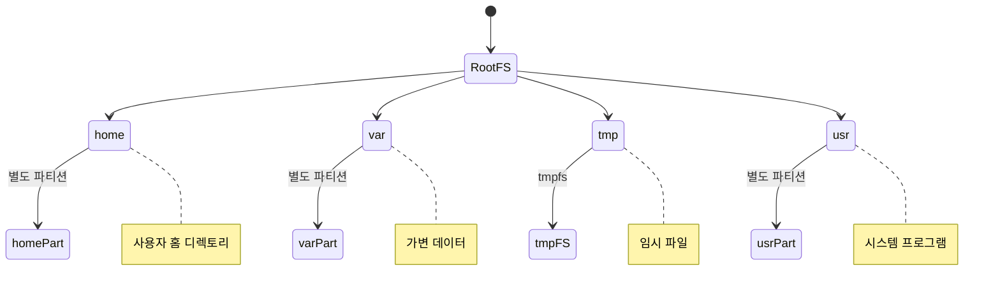
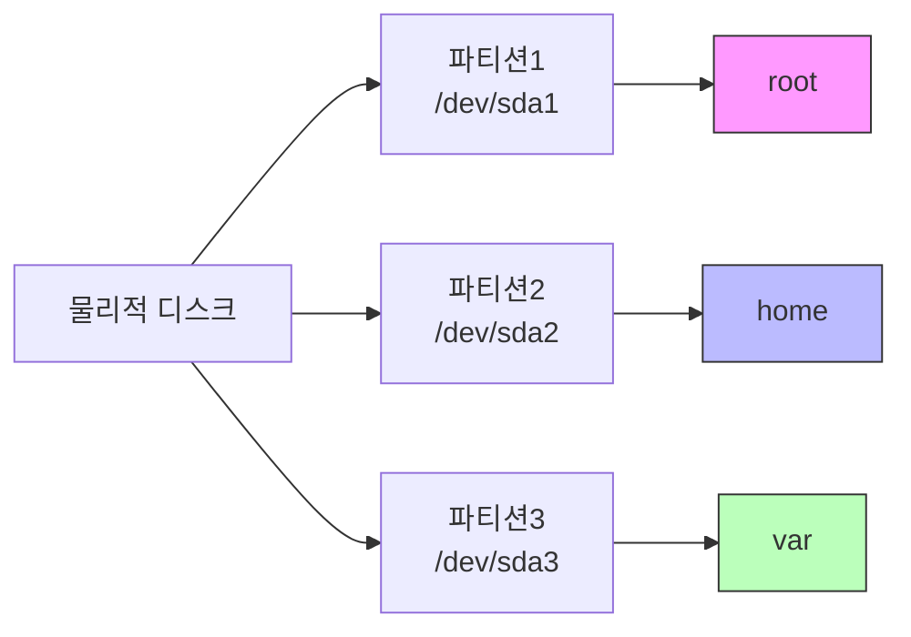
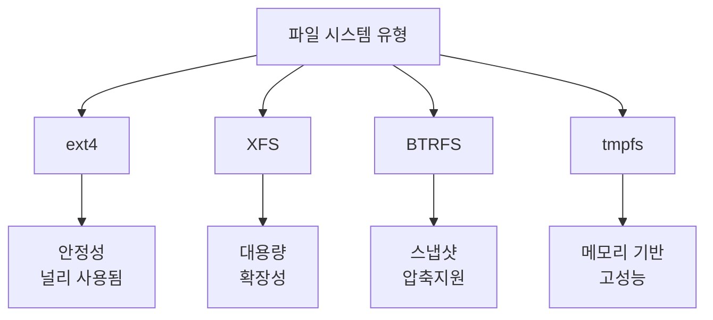
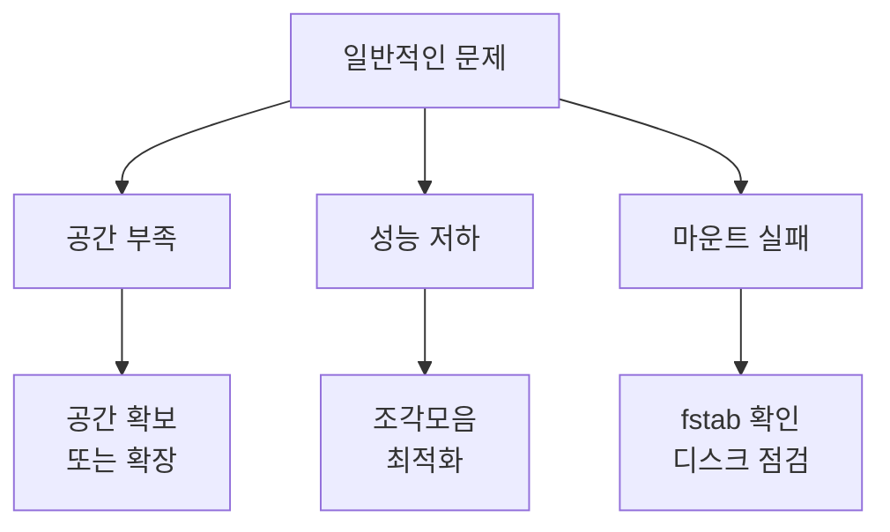
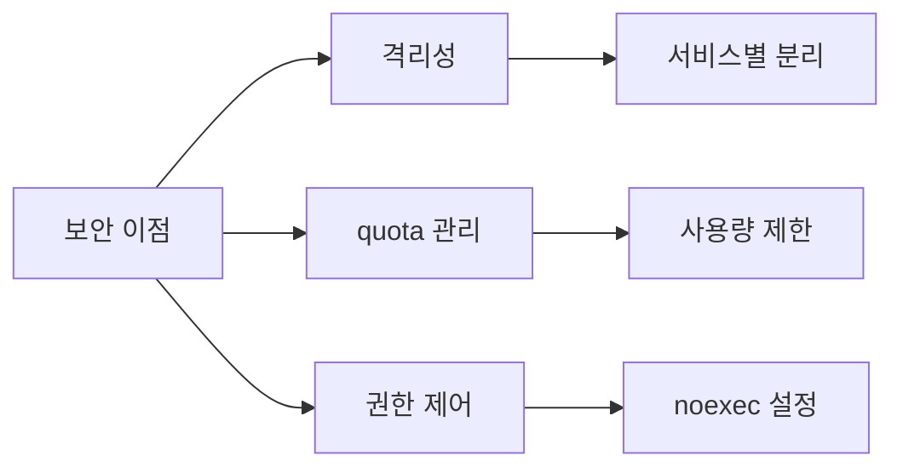

# 개요
Linux는 하나의 시스템에 여러 개의 파일 시스템을 생성하고 관리할 수 있다. 이는 마치 하나의 건물에 여러 개의 독립된 공간을 만드는 것과 유사하다. 각 파일 시스템은 자신만의 특성과 용도를 가질 수 있다.

# 파일 시스템 구조
## 기본 개념


## 마운트 구조


# 파일 시스템 생성과 관리
## 1. 파티션 생성
```bash
# 디스크 파티션 확인
$ fdisk -l

# 새로운 파티션 생성
$ fdisk /dev/sdb
Command (m for help): n
Partition type: p
Partition number: 1
First sector: [Enter]
Last sector: +20G
```

## 2. 파일 시스템 생성
```bash
# ext4 파일 시스템 생성
$ mkfs.ext4 /dev/sdb1

# XFS 파일 시스템 생성
$ mkfs.xfs /dev/sdb2

# BTRFS 파일 시스템 생성
$ mkfs.btrfs /dev/sdb3
```

## 3. 마운트 관리
```bash
# 수동 마운트
$ mount /dev/sdb1 /mnt/data1

# 영구 마운트 설정 (/etc/fstab)
$ cat /etc/fstab
/dev/sdb1   /mnt/data1   ext4    defaults    0   2
/dev/sdb2   /mnt/data2   xfs     defaults    0   2
```

# 파일 시스템 유형별 특징
## 1. 주요 파일 시스템 비교


## 2. 사용 사례별 권장 파일 시스템
```python
def recommend_filesystem(requirements):
    """파일 시스템 추천 로직"""
    if requirements.get('large_files'):
        return 'XFS'
    elif requirements.get('snapshots'):
        return 'BTRFS'
    elif requirements.get('memory_based'):
        return 'tmpfs'
    else:
        return 'ext4'  # 기본 추천
```

# 실제 구성 예시
## 1. 서버 구성 예시
```bash
# 시스템 파티션 구성
/dev/sda1   /boot       ext4    1GB
/dev/sda2   /           ext4    50GB
/dev/sda3   /var        xfs     100GB
/dev/sda4   /home       ext4    Remaining

# 데이터 파티션 구성
/dev/sdb1   /data       xfs     2TB
/dev/sdc1   /backup     btrfs   2TB
```

## 2. 특수 목적 구성
```bash
# 임시 파일용 메모리 파일 시스템
tmpfs       /tmp        tmpfs    2GB

# 로그 파일용 고성능 파일 시스템
/dev/nvme0  /var/log    xfs     50GB
```

# 성능과 관리
## 1. 성능 모니터링
```bash
# 파일 시스템 사용량 확인
$ df -h

# 파일 시스템 성능 확인
$ iostat -x 1

# 파일 시스템 상태 확인
$ tune2fs -l /dev/sda1
```

## 2. 문제 해결


# 보안 고려사항
## 1. 파티션 분리의 이점


## 2. 보안 설정 예시
```bash
# /tmp 보안 설정
tmpfs   /tmp    tmpfs   noexec,nosuid,nodev   0   0

# /home 쿼터 설정
/dev/sda4   /home   ext4    defaults,usrquota,grpquota   0   2
```

# 관리 및 유지보수
## 1. 백업 전략
```bash
# 파일 시스템 백업
$ dd if=/dev/sda1 of=/backup/sda1.img

# 증분 백업 (BTRFS)
$ btrfs subvolume snapshot -r /data /data/.snapshot
```

## 2. 정기적인 점검
```bash
# 파일 시스템 점검
$ fsck.ext4 -f /dev/sda1

# XFS 파일 시스템 점검
$ xfs_repair /dev/sdb1
```

# 결론
Linux의 다중 파일 시스템 구성은 다음과 같은 이점을 제공한다:

1. 유연성
   - 용도에 맞는 파일 시스템 선택
   - 독립적인 공간 관리
   - 효율적인 리소스 활용

2. 보안성
   - 서비스별 격리
   - 접근 권한 세분화
   - 리소스 제한 적용

3. 관리 효율
   - 독립적인 백업/복구
   - 문제 영향 최소화
   - 성능 최적화

적절한 파일 시스템 구성은 시스템의 안정성과 성능을 크게 향상시킬 수 있다.