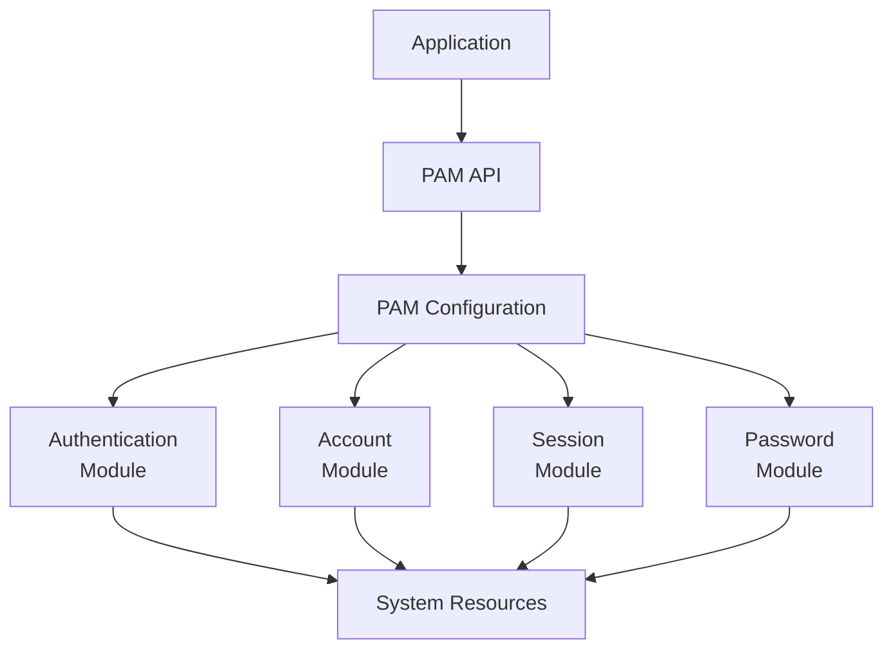

Linux PAM 인증 시스템 구현 가이드

# PAM 인증 시스템 개요
## 기본 개념
PAM(Pluggable Authentication Modules)은 Linux System에서 사용하는 인증 Framework이다. 실생활에서 아파트 출입 시 RF 카드(인증서)와 함께 비밀번호(계정)를 이중으로 확인하는 것과 유사하다.

## 발전 과정
1. 초기 Unix 시스템: 단순 Password 인증
2. Shadow Password 도입: 암호화된 Password 저장
3. PAM 도입: 모듈화된 인증 시스템 구현
4. 현대 PAM: 다양한 인증 모듈과 정책 지원

# 시스템 구성 요소
## Architecture


## 주요 Component
- PAM API: Application과 PAM Module 연결
- Configuration: `/etc/pam.d/` 디렉토리의 설정 파일
- Module: 실제 인증을 수행하는 Plugin
- System Resource: Password DB, Group 정보 등

# 구현 가이드
## 환경 설정
### 1. Module 설치
```bash
# Debian/Ubuntu 환경
sudo apt-get update
sudo apt-get install libpam-modules
```

### 2. PAM 설정
```bash
# /etc/pam.d/openvpn 파일 생성
sudo vi /etc/pam.d/openvpn
```

### 3. 인증 규칙 설정
```plaintext
# 기본 시스템 인증
auth    required        pam_unix.so    shadow    nodelay

# UID 500 이상 사용자만 허용
auth    requisite       pam_succeed_if.so uid >= 500 quiet

# developers 그룹 멤버만 허용
auth    requisite       pam_succeed_if.so user ingroup developers quiet

# 로그인 실패 제한
auth    required        pam_tally2.so deny=5 even_deny_root unlock_time=60

# 계정 상태 확인
account required        pam_tally2.so
account required        pam_unix.so
```

## 설정 상세 설명
### 인증 규칙 분석
1. `pam_unix.so`:
   - `shadow`: 암호화된 Password 사용
   - `nodelay`: 실패 시 지연 없음

2. `pam_succeed_if.so`:
   - `uid >= 500`: 일반 사용자만 허용
   - `user ingroup developers`: developers 접근 그룹 확인

3. `pam_tally2.so`:
   - `deny=5`: 5회 실패 시 잠금
   - `unlock_time=60`: 60초 후 잠금 해제

# 실제 구현 예시
## VPN Server 설정
```conf
# /etc/openvpn/server.conf
plugin /usr/lib/openvpn/openvpn-plugin-auth-pam.so openvpn
verify-client-cert require
username-as-common-name
script-security 2
```

## Client 설정
```conf
# client.ovpn
auth-user-pass
remote vpn.example.com 1194
```

# 문제 해결 가이드
## 일반적인 문제
### 1. 인증 실패
- 원인: 계정 잠금, 그룹 미소속
- 해결: `faillog -u username` 확인

### 2. Permission 오류
- 원인: PAM Module 권한 문제
- 해결: Module 권한 확인 및 수정

## 모니터링
```bash
# 로그 확인
tail -f /var/log/auth.log | grep openvpn
```

# 보안 고려사항
## 계정 보안
1. Password 정책 설정
2. 접근 제어 강화
3. 로그 모니터링

## System 설정
```bash
# /etc/security/limits.conf
* hard maxlogins 3
```

# 결론
PAM을 통한 인증 시스템은 강력한 보안을 제공하지만, 적절한 설정과 관리가 필요하다. 조직의 보안 요구사항에 맞춰 신중하게 구현해야 한다.