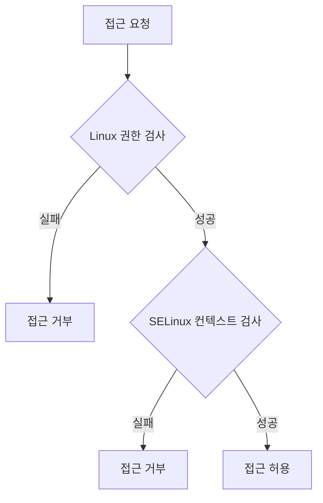

```table-of-contents
title: # 목차
style: nestedList # TOC style (nestedList|nestedOrderedList|inlineFirstLevel)
minLevel: 0 # Include headings from the specified level
maxLevel: 5 # Include headings up to the specified level
includeLinks: true # Make headings clickable
hideWhenEmpty: false # Hide TOC if no headings are found
debugInConsole: false # Print debug info in Obsidian console
```

# SELinux의 이중 보안 검사 시스템

## 기본 개념

SELinux는 기존 Linux 권한과 함께 작동하는 이중 보안 시스템이다. 파일이나 프로세스에 대한 접근을 허용받기 위해서는 두 가지 보안 계층을 모두 통과해야 한다:

1. 전통적인 Linux DAC (Discretionary Access Control)
   - 사용자/그룹 권한
   - 읽기/쓰기/실행 권한 (chmod)

2. SELinux MAC (Mandatory Access Control)
   - 보안 컨텍스트
   - 정책 규칙

## 권한 검사 프로세스



# 컨텍스트 레이블의 이해

## 구조 분석
예시: `unconfined_u:object_r:openvpn_etc_t:s0`

1. SELinux 사용자 (unconfined_u)
   - 제한되지 않은 사용자
   - 일반적인 Linux 사용자와는 다른 개념

2. 역할 (object_r)
   - 파일은 대부분 object_r
   - 프로세스는 다양한 역할 가능

3. 타입/도메인 (openvpn_etc_t)
   - 가장 중요한 보안 결정 요소
   - 프로세스와 객체 간의 접근 규칙 정의

4. 보안 레벨 (s0)
   - MLS(Multi-Level Security) 단계
   - 기본값은 s0

# 실제 적용 사례

## OpenVPN 예시

```bash
# 파일 컨텍스트 확인
ls -Z /etc/openvpn/scripts/notify.sh
unconfined_u:object_r:openvpn_etc_t:s0 /etc/openvpn/scripts/notify.sh

# Linux 권한 확인
ls -l /etc/openvpn/scripts/notify.sh
-rwxr-xr-x. 1 root root 1234 Jan 1 12:00 /etc/openvpn/scripts/notify.sh
```

이 경우:
1. OpenVPN 프로세스는 openvpn_t 도메인에서 실행
2. 파일은 openvpn_etc_t 타입으로 레이블링
3. SELinux 정책이 이 둘 사이의 접근을 허용
4. 추가로 Linux 파일 권한도 실행을 허용

## 권한 문제 해결

### 일반적인 오류 상황

1. SELinux 컨텍스트는 맞지만 Linux 권한이 잘못된 경우
```bash
# 권한 수정
chmod 755 /etc/openvpn/scripts/notify.sh
```

2. Linux 권한은 맞지만 SELinux 컨텍스트가 잘못된 경우
```bash
# 컨텍스트 수정
chcon -t openvpn_etc_t /etc/openvpn/scripts/notify.sh
```

## chcon 명령어 개요

chcon(change context)은 파일이나 디렉토리의 SELinux 보안 컨텍스트를 변경하는 핵심 도구이다. 임시적인 컨텍스트 변경에 주로 사용되며, 시스템 재부팅이나 restorecon 실행 시 기본값으로 복원될 수 있다.

## 기본 사용법

```bash
# 기본 문법
chcon [옵션] 컨텍스트 파일명

# 전체 컨텍스트 변경
chcon user_u:object_r:httpd_sys_content_t:s0 file.txt

# 특정 부분만 변경
chcon -t httpd_sys_content_t file.txt  # 타입만 변경
chcon -u user_u file.txt               # 사용자만 변경
chcon -r object_r file.txt             # 역할만 변경
```

## 주요 옵션

```bash
# 재귀적 적용 (-R)
chcon -R -t httpd_sys_content_t /var/www/html/

# 참조 복사 (--reference)
chcon --reference=reference_file target_file

# 변경사항 표시 (-v)
chcon -v -t httpd_sys_content_t file.txt
```

## 실제 활용 사례

### 웹 서버 설정

```bash
# 웹 컨텐츠 디렉토리 설정
chcon -R -t httpd_sys_content_t /var/www/custom/

# 특정 스크립트 실행 권한 부여
chcon -t httpd_sys_script_exec_t /var/www/cgi-bin/script.cgi
```

### OpenVPN 설정

```bash
# OpenVPN 스크립트 컨텍스트 설정
chcon -t openvpn_etc_t /etc/openvpn/scripts/notify.sh

# 설정 파일 디렉토리 전체 설정
chcon -R -t openvpn_etc_t /etc/openvpn/
```

## 주의사항

1. 영구적 변경
   - chcon은 임시 변경 도구
   - 영구적 변경을 위해서는 semanage fcontext와 restorecon 사용

```bash
# 영구적 변경 방법
semanage fcontext -a -t httpd_sys_content_t "/custom/path(/.*)?"
restorecon -R -v /custom/path
```

2. 문제 해결
   - 변경 전 현재 컨텍스트 백업
   - ls -Z로 변경 사항 확인
   - 실수로 잘못 변경한 경우 restorecon으로 복원

```bash
# 컨텍스트 확인
ls -Z /path/to/file

# 기본값으로 복원
restorecon -v /path/to/file
```

## 모범 사례

1. 변경 전 확인
```bash
# 현재 컨텍스트 확인
ls -Z /path/to/file

# 관련 정책 확인
sesearch --allow | grep httpd_sys_content_t
```

2. 점진적 변경
```bash
# 단일 파일 테스트
chcon -t httpd_sys_content_t test.html

# 문제없으면 전체 적용
chcon -R -t httpd_sys_content_t /var/www/html/
```

3. 로깅 활성화
```bash
# 변경사항 로깅
chcon -v -t httpd_sys_content_t /path/to/file

# audit 로그 모니터링
tail -f /var/log/audit/audit.log
```

# 보안 고려사항

1. 최소 권한 원칙
   - Linux 권한과 SELinux 컨텍스트 모두 필요한 최소한의 권한만 부여
   - 불필요한 unconfined 컨텍스트 사용 자제

2. 감사 및 모니터링
   - auditd 로그로 권한 거부 이벤트 모니터링
   - Linux 권한과 SELinux 컨텍스트 정기 검토

# 결론

SELinux의 이중 보안 모델은 보안을 강화하지만, 동시에 시스템 관리의 복잡성을 증가시킨다. 그러나 각 계층의 역할을 이해하고 적절히 관리하면, 매우 강력한 보안 체계를 구축할 수 있다.