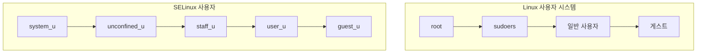

# SELinux 사용자의 이해

## 주요 SELinux 사용자 유형

1. unconfined_u
   - 최소한의 제한만 받는 사용자
   - 대부분의 작업 수행 가능
   - 일반적인 데스크톱 사용자에게 할당

2. system_u
   - 시스템 프로세스용 사용자
   - 부팅 시 시작되는 서비스들이 사용
   - 일반 사용자는 직접 사용 불가

3. staff_u
   - 관리자 권한을 가진 제한된 사용자
   - sudo를 통한 관리 작업 수행 가능
   - 특정 관리 작업만 허용

4. user_u
   - 일반적인 제한된 사용자
   - 웹 브라우징, 문서 작업 등 기본 작업만 가능
   - 시스템 관리 작업 불가

5. guest_u
   - 가장 제한된 권한의 사용자
   - 홈 디렉토리 외 접근 제한
   - 네트워크 사용 제한

# Linux 사용자 vs SELinux 사용자 비교



## 주요 차이점

1. 권한 관리 방식
   - Linux: UID/GID 기반
   - SELinux: 컨텍스트와 정책 기반

2. 매핑 관계
```bash
# Linux 사용자와 SELinux 사용자 매핑 확인
semanage login -l

# 매핑 예시
# Login Name           SELinux User         MLS/MCS Range      Service
# __default__          unconfined_u         s0-s0:c0.c1023    *
# root                 unconfined_u         s0-s0:c0.c1023    *
# system_u             system_u             s0-s0:c0.c1023    *
```

3. 접근 제어 방식
   - Linux: 임의적 접근 제어(DAC)
   - SELinux: 강제적 접근 제어(MAC)

# 실제 동작 방식

## 프로세스 실행 시

```bash
# ps 명령어로 프로세스의 SELinux 컨텍스트 확인
ps -eZ | grep httpd
system_u:system_r:httpd_t:s0    1234 ?    00:00:00 httpd
```

## 파일 시스템 접근 시

```bash
# 파일의 SELinux 컨텍스트 확인
ls -Z /var/www/html/index.html
unconfined_u:object_r:httpd_sys_content_t:s0 /var/www/html/index.html
```

# 사용자 전환과 권한 변경

## Linux 사용자 전환
```bash
# sudo를 통한 root 권한 획득
sudo -i

# 다른 사용자로 전환
su - username
```

## SELinux 사용자 전환
```bash
# SELinux 사용자 컨텍스트 변경
semanage login -a -s staff_u username
```

# 보안 정책 관리

## Linux 권한
```bash
# 파일 권한 변경
chmod 755 file.txt

# 소유자 변경
chown user:group file.txt
```

## SELinux 컨텍스트
```bash
# 사용자 컨텍스트 변경
chcon -u staff_u file.txt

# 정책 확인
sesearch --allow -s staff_u
```

# 주의사항

1. SELinux 사용자 변경
   - 시스템 보안에 직접적 영향
   - 신중한 정책 설정 필요
   - 변경 전 영향 평가 필수

2. 매핑 관리
   - 기본 매핑 변경 시 주의
   - 백업 필수
   - 문서화 권장

# 결론

SELinux 사용자와 Linux 사용자는 서로 다른 목적과 방식으로 동작하지만, 함께 작동하여 시스템 보안을 강화한다. 효과적인 시스템 관리를 위해서는 두 사용자 시스템의 특성과 차이점을 잘 이해하고 적절히 활용해야 한다.