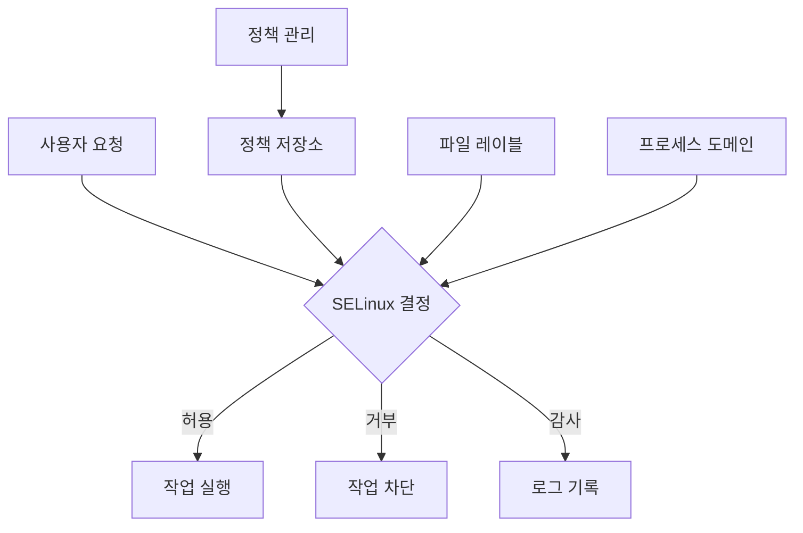

```table-of-contents
title: # 목차
style: nestedList # TOC style (nestedList|nestedOrderedList|inlineFirstLevel)
minLevel: 0 # Include headings from the specified level
maxLevel: 5 # Include headings up to the specified level
includeLinks: true # Make headings clickable
hideWhenEmpty: false # Hide TOC if no headings are found
debugInConsole: false # Print debug info in Obsidian console
```
# SELinux 개요

SELinux(Security-Enhanced Linux)는 Linux 시스템의 보안을 강화하기 위한 보안 아키텍처이다. 일반적인 리눅스 시스템이 문 잠금장치라면, SELinux는 건물의 전체 보안 시스템에 비유할 수 있다.

## 기본 개념 이해

SELinux는 MAC(Mandatory Access Control) 방식을 사용하여 시스템 보안을 강화한다. 기존의 DAC(Discretionary Access Control)과 달리, 모든 프로세스와 파일에 보안 컨텍스트를 부여하고 이를 기반으로 접근을 제어한다.

### SELinux 보안 컨텍스트

보안 컨텍스트는 다음 네 가지 요소로 구성된다:
- User
- Role
- Type
- Level

# 동작 방식

## SELinux 모드

SELinux는 세 가지 모드로 동작한다:

1. Enforcing: 모든 보안 정책을 강제로 적용
2. Permissive: 위반 사항을 기록만 하고 실제로 차단하지는 않음
3. Disabled: SELinux를 완전히 비활성화

## 정책 유형

두 가지 주요 정책 유형을 제공한다:
1. Targeted: 특정 네트워크 데몬만을 보호
2. Strict: 모든 프로세스를 보호

# SELinux 구성도



# 실제 활용 예시

## 웹 서버 보안 설정

```bash
# Apache 웹 서버의 SELinux 컨텍스트 확인
ls -Z /var/www/html/

# 웹 컨텐츠 디렉토리에 올바른 컨텍스트 설정
chcon -R -t httpd_sys_content_t /var/www/html/

# 포트 변경 시 SELinux 정책 추가
semanage port -a -t http_port_t -p tcp 8080
```

## 문제 해결 가이드

### 일반적인 문제 상황

1. 웹 서버 접근 거부
```bash
# 문제 확인
tail /var/log/audit/audit.log

# 해결 방법
setsebool -P httpd_can_network_connect on
```

2. 파일 접근 거부
```bash
# 파일 컨텍스트 복원
restorecon -R -v /var/www/html/
```

# 고급 활용

## 사용자 정의 정책 작성

```bash
# 정책 모듈 생성
audit2allow -M custom_policy -i /var/log/audit/audit.log

# 정책 적용
semodule -i custom_policy.pp
```

## 보안 컨텍스트 관리

```bash
# 파일 컨텍스트 규칙 추가
semanage fcontext -a -t httpd_sys_content_t "/custom/web/path(/.*)?"

# 프로세스 도메인 전환 규칙 설정
semanage boolean -m --on httpd_can_network_connect
```

# 주의사항

1. 시스템 보안
- SELinux를 비활성화하지 않고 문제를 해결하는 습관을 기른다
- 정책 변경 전 반드시 백업을 수행한다
- audit.log를 주기적으로 모니터링한다

2. 성능 고려사항
- 복잡한 정책은 시스템 성능에 영향을 줄 수 있다
- 필요한 정책만 최소한으로 적용한다

# 결론

SELinux는 강력한 보안 기능을 제공하지만, 적절한 이해와 구성이 필요하다. 초기 학습 곡선이 있지만, 장기적으로 시스템 보안을 크게 향상시킬 수 있는 중요한 도구이다.

# 추가 자료

- SELinux 정책 참조: https://access.redhat.com/documentation/en-us/red_hat_enterprise_linux/8/html/using_selinux/
- 문제 해결 가이드: https://access.redhat.com/documentation/en-us/red_hat_enterprise_linux/8/html/using_selinux/troubleshooting-problems-related-to-selinux_using-selinux