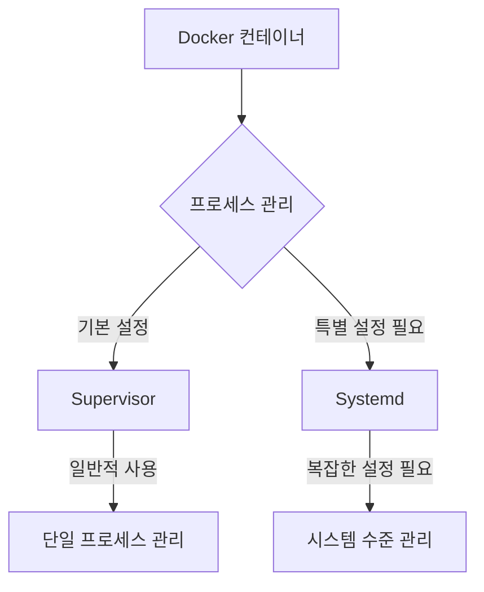

# 기본 개념

## Systemd
- Linux의 기본 Init 시스템이자 서비스 관리자
- PID 1로 실행되는 시스템 수준의 프로세스 관리자
- 시스템 부팅부터 서비스 관리까지 전반적인 시스템 관리 담당

## Supervisor
- 오픈소스 프로세스 관리 도구
- 애플리케이션 수준의 프로세스 모니터링 및 제어
- 크로스 플랫폼 지원 및 웹 인터페이스 제공

# 환경별 사용 차이

## 일반 Linux 환경

### Systemd 설정
```ini
# /etc/systemd/system/myapp.service
[Unit]
Description="My Application"
After=network.target

[Service]
User=myapp
Group=myapp
Environment=LANG=en_US.UTF-8
ExecStart=/home/myapp/bin/start_app
Restart=always

[Install]
WantedBy=multi-user.target
```

### Supervisor 설정
```ini
# /etc/supervisor/conf.d/myapp.conf
[program:myapp]
command=/home/myapp/bin/start_app
user=myapp
environment=LANG=en_US.UTF-8
autostart=true
autorestart=true
```

## Docker 환경



### Docker에서 Systemd 사용 시 필요 사항:
```bash
# Systemd 활성화를 위한 Docker 실행 명령
docker run -d \
  --cap-add SYS_ADMIN \
  -v /sys/fs/cgroup:/sys/fs/cgroup:ro \
  --name systemd_container \
  image_name:tag \
  /sbin/init
```

### Docker에서 Supervisor 사용:
```dockerfile
# Dockerfile
FROM python:3.9
RUN apt-get update && apt-get install -y supervisor
COPY supervisord.conf /etc/supervisor/conf.d/
CMD ["/usr/bin/supervisord"]
```

# 주요 차이점

## 1. 시스템 통합
- Systemd: OS 수준 통합, 시스템 전반 관리
- Supervisor: 애플리케이션 수준 관리

## 2. 기능 범위
- Systemd: 부팅, 로깅, 네트워크, 서비스 관리
- Supervisor: 프로세스 모니터링, 재시작, 로깅

## 3. 설정 복잡도
- Systemd: 복잡하지만 강력한 기능
- Supervisor: 단순하고 직관적인 설정

# 사용 사례별 비교

## 1. 웹 애플리케이션 실행

### Systemd 사용
```ini
[Unit]
Description=Web Application
After=network.target

[Service]
Type=simple
User=webuser
WorkingDirectory=/opt/webapp
ExecStart=/usr/local/bin/gunicorn app:app
Restart=always
```

### Supervisor 사용
```ini
[program:webapp]
command=/usr/local/bin/gunicorn app:app
directory=/opt/webapp
user=webuser
autostart=true
autorestart=true
```

## 2. 워커 프로세스 관리

### Systemd 사용
```ini
[Unit]
Description=Worker Processes
After=network.target

[Service]
Type=simple
ExecStart=/usr/bin/worker
Restart=always
StartLimitInterval=0
```

### Supervisor 사용
```ini
[program:worker]
command=/usr/bin/worker
numprocs=4
process_name=%(program_name)s_%(process_num)02d
autostart=true
autorestart=true
```

# 선택 가이드

## Systemd 선택 시기
1. Linux 시스템 전반적인 관리 필요
2. 시스템 서비스로 실행 필요
3. 복잡한 의존성 관리 필요

## Supervisor 선택 시기
1. 단순한 프로세스 관리만 필요
2. Docker 컨테이너 환경
3. 웹 인터페이스로 모니터링 필요
4. 크로스 플랫폼 지원 필요

# 결론

1. 환경에 따른 선택
   - 일반 Linux 서버: Systemd 권장
   - Docker 컨테이너: Supervisor 권장
   - 하이브리드 환경: 목적에 따라 혼용

2. 복잡도와 기능
   - 단순 관리: Supervisor
   - 복잡한 시스템: Systemd

3. 운영 관점
   - 시스템 수준 관리: Systemd
   - 애플리케이션 관리: Supervisor

이러한 특성을 고려하여 프로젝트의 요구사항과 운영 환경에 맞는 도구를 선택해야 합니다.