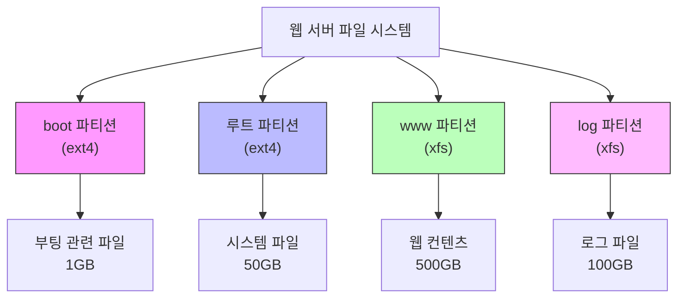
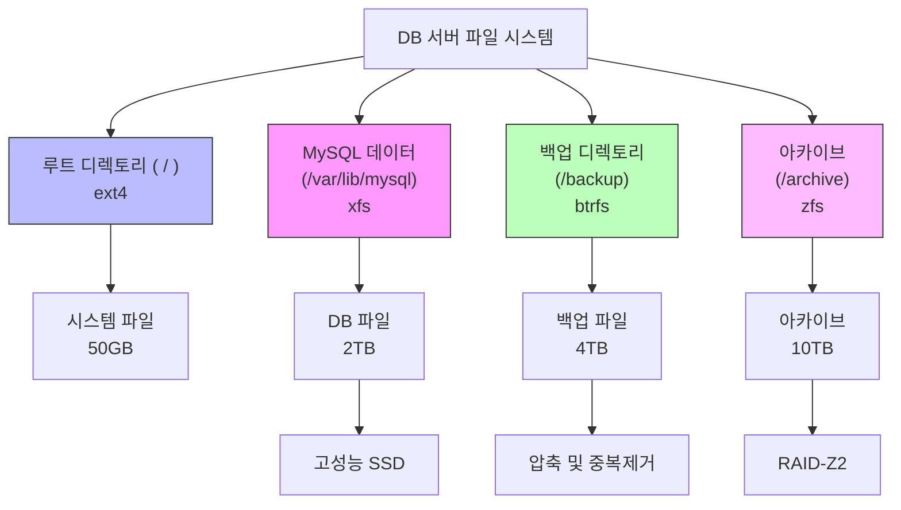
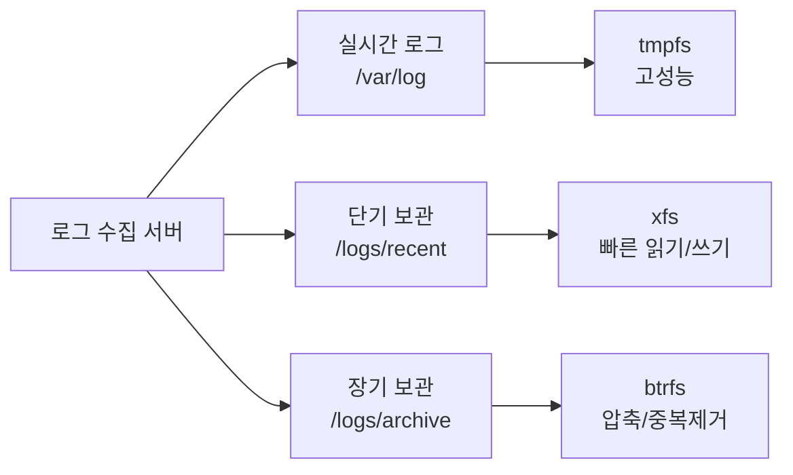
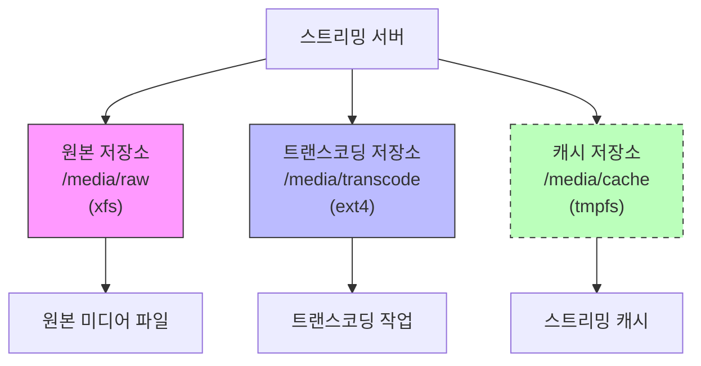
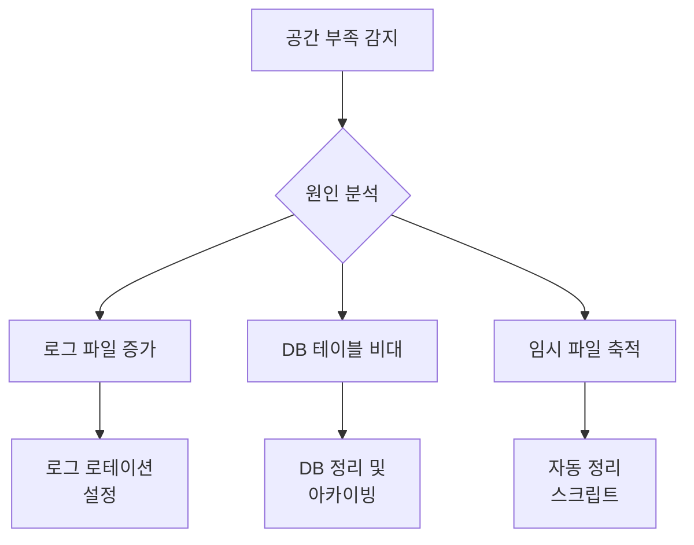

# 개요
실무 환경에서 Linux 시스템은 다양한 목적과 요구사항을 충족하기 위해 여러 파일 시스템을 필요로 한다. 이는 마치 한 회사 건물 내에 사무실, 회의실, 창고 등 각각의 용도에 맞는 공간을 분리하는 것과 유사하다.

# 실무 적용 사례
## 1. 웹 서버 구성


### 구성 이유
1. `/var/www` (XFS)
   - 대용량 파일 처리에 최적화
   - 온라인 확장 가능
   - 파일 단편화 최소화

2. `/var/log` (XFS)
   - 로그 파일의 빈번한 쓰기 작업 처리
   - 로그 순차 쓰기 성능 우수
   - 로그 파일 관리 용이

## 2. 데이터베이스 서버 구성


### 구성 이유
1. `/var/lib/mysql` (XFS)
   - 대규모 DB 파일 처리
   - 메타데이터 성능 우수
   - 장애 복구 기능

2. `/backup` (BTRFS)
   - 스냅샷 기능
   - 압축 지원
   - 증분 백업 용이

## 3. 로그 수집 서버


### 구성 설정
```bash
# /etc/fstab 설정 예시
tmpfs           /var/log        tmpfs   size=32G,noexec  0 0
/dev/nvme0n1p1  /logs/recent    xfs     defaults         0 2
/dev/sda1       /logs/archive   btrfs   compress=zstd    0 2
```

## 4. 미디어 스트리밍 서버


# 실무 최적화 사례
## 1. 성능 최적화
```bash
# XFS 성능 최적화
$ mkfs.xfs -f -d agcount=32 -l size=128m /dev/sda1

# EXT4 성능 최적화
$ mkfs.ext4 -O dir_index,has_journal /dev/sdb1

# BTRFS 압축 활성화
$ btrfs filesystem defragment -r -v -clzo /path
```

## 2. 모니터링 설정
```python
def monitor_filesystem_usage():
    """파일 시스템 사용량 모니터링"""
    thresholds = {
        '/var/log': 80,  # 80% 임계값
        '/var/lib/mysql': 90,
        '/media/raw': 85
    }
    
    for mount_point, threshold in thresholds.items():
        usage = get_usage(mount_point)
        if usage > threshold:
            send_alert(f"{mount_point} usage: {usage}%")
```

# 실무 문제 해결 사례
## 1. 디스크 공간 부족


## 2. 성능 저하 대응
```bash
# 문제 파악
$ iostat -x 1
$ iotop
$ fatrace

# 성능 개선 조치
$ tune2fs -O dir_index /dev/sda1
$ xfs_fsr /dev/sdb1
```

# 파일 시스템별 실무 활용
## 1. EXT4
### 사용 케이스
- 시스템 루트 파일 시스템
- 일반 데이터 저장
- 안정성 중시 환경

### 설정 예시
```bash
# 저널링 최적화
$ tune2fs -O has_journal /dev/sda1

# 예약 블록 조정
$ tune2fs -m 1 /dev/sda1
```

## 2. XFS
### 사용 케이스
- 대용량 파일 저장
- 데이터베이스 서버
- 미디어 스토리지

### 설정 예시
```bash
# 메타데이터 최적화
$ xfs_io -c "extsize=1m" /mount/point

# 실시간 디펙트 수정
$ xfs_repair -n /dev/sdb1
```

## 3. BTRFS
### 사용 케이스
- 백업 시스템
- 스냅샷 필요 환경
- 데이터 중복제거 필요

### 설정 예시
```bash
# 스냅샷 생성
$ btrfs subvolume snapshot /data /data/snapshot

# 압축 활성화
$ btrfs filesystem defragment -r -v -czstd /data
```

# 보안과 감사
## 1. 파일 시스템 격리
```bash
# 보안 마운트 옵션
/dev/sda1  /var/www  xfs  noexec,nosuid,nodev  0 2

# 프로세스 격리
$ chroot /var/www /bin/bash
```

## 2. 접근 제어
```bash
# ACL 설정
$ setfacl -m u:webuser:rx /var/www

# SELinux 컨텍스트
$ semanage fcontext -a -t httpd_sys_content_t "/var/www(/.*)?"
```

# 백업 전략
## 1. 파일 시스템별 백업
```bash
# LVM 스냅샷
$ lvcreate -L10G -s -n backup /dev/vg0/data

# BTRFS 스냅샷
$ btrfs subvolume snapshot -r /data /data/.snapshot

# rsync 백업
$ rsync -aAXv --delete /source/ /backup/
```

## 2. 복구 절차
```bash
# 파일 시스템 복구
$ xfs_repair /dev/sda1
$ fsck.ext4 -f /dev/sdb1

# 데이터 복구
$ restore -if /backup/backup.dump
```

# 결론
다중 파일 시스템 구성의 실무적 이점:

1. 운영 효율성
   - 용도별 최적화
   - 독립적 관리
   - 성능 최적화

2. 보안 강화
   - 서비스 격리
   - 접근 제어
   - 감사 추적

3. 유지보수 용이성
   - 문제 격리
   - 백업 효율성
   - 확장 유연성

각 환경에 맞는 적절한 파일 시스템 선택과 구성은 시스템의 안정성, 성능, 보안성을 크게 향상시킬 수 있다.