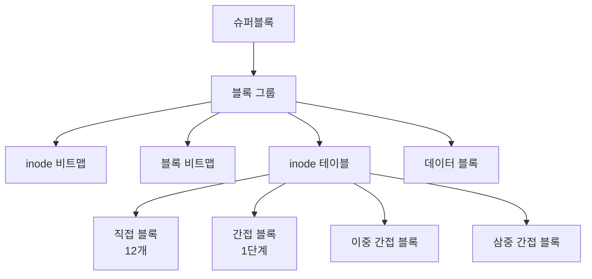
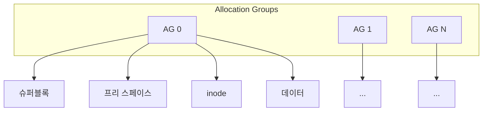
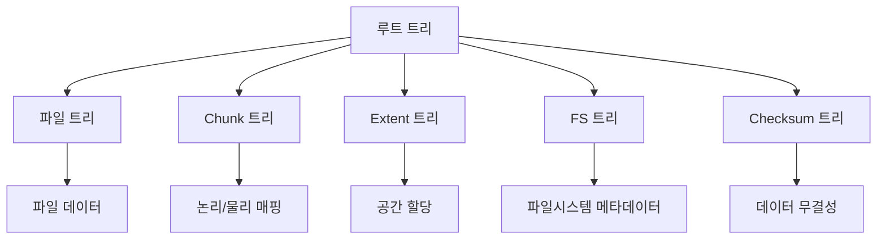
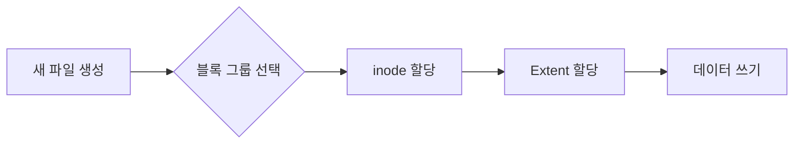
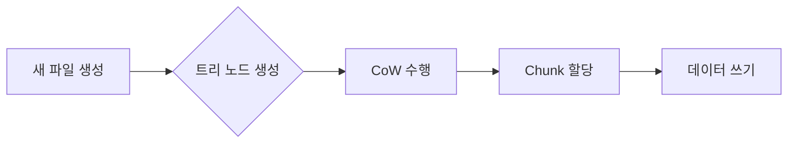
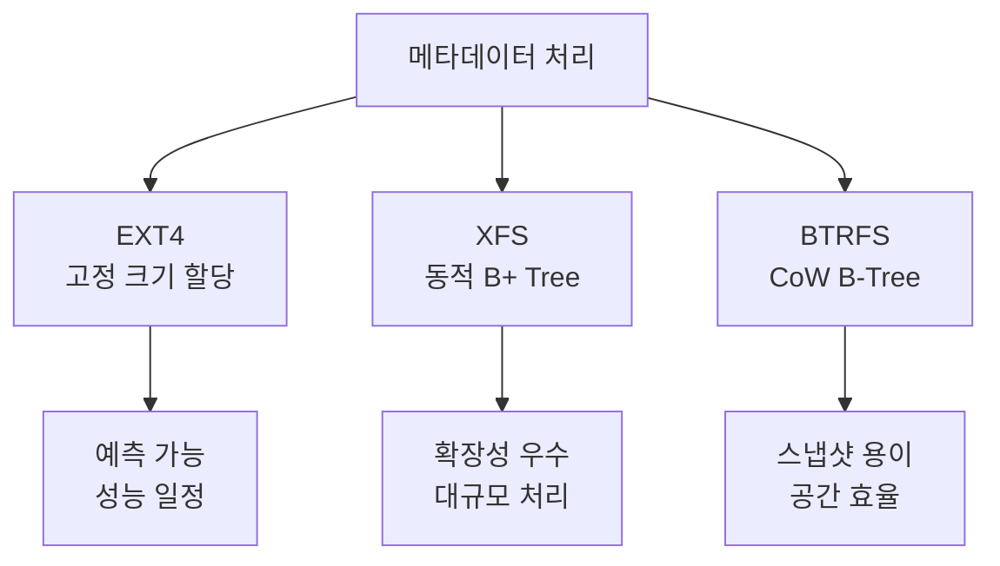
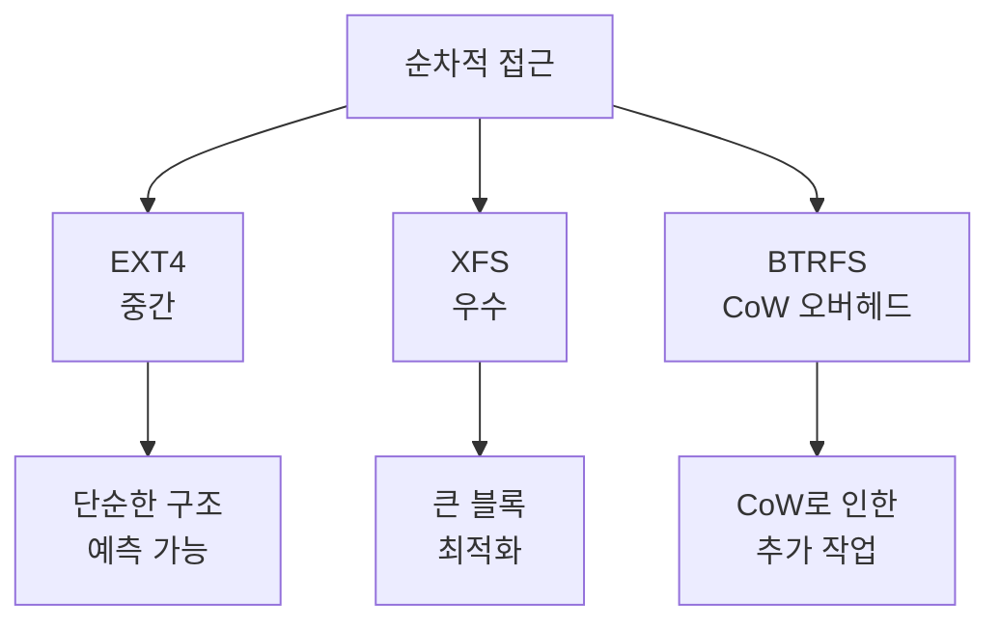
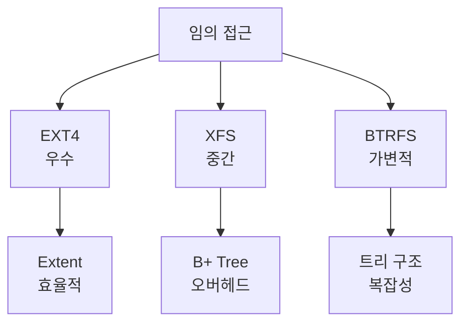

# 1. 기본 데이터 구조
## EXT4 구조


### 특징
1. 블록 그룹 기반 구조
   - 디스크를 여러 블록 그룹으로 나눔
   - 각 그룹은 독립적인 메타데이터 관리
   - 최대 파일 크기: 16TB
   - 최대 파일시스템 크기: 1EB

2. Extent Tree 구조
```python
class Extent:
    def __init__(self):
        self.block_start = 0    # 시작 블록 번호
        self.len = 0           # 연속된 블록 수
        self.flag = 0          # 플래그 (initialized, unwritten 등)

class ExtentTree:
    def __init__(self):
        self.header = None     # 트리 헤더
        self.entries = []      # extent 엔트리들
        self.depth = 0         # 트리 깊이
```

## XFS 구조


### 특징
1. B+ Tree 인덱싱
   - 모든 메타데이터가 B+ Tree로 구성
   - 빠른 검색과 갱신
   - 동적 할당 관리
   - 최대 파일 크기: 8EB
   - 최대 파일시스템 크기: 8EB

2. 공간 할당 구조
```c
typedef struct xfs_bmbt_rec {
    __be64 l0, l1;    /* 비트 필드로 구성된 extent 정보 */
} xfs_bmbt_rec_t;

typedef struct xfs_btree_block {
    __be32 magic;     /* 매직 넘버 */
    __be16 level;     /* 트리 레벨 */
    __be16 numrecs;   /* 레코드 수 */
    /* B+ Tree 노드 정보 */
} xfs_btree_block_t;
```

## BTRFS 구조


### 특징
1. Copy-on-Write (CoW)
```python
class BtrfsExtent:
    def __init__(self):
        self.logical = 0       # 논리 주소
        self.physical = 0      # 물리 주소
        self.references = []   # 참조 목록
        
    def write(self, data):
        if self.references:
            # 새로운 위치에 데이터 쓰기
            new_physical = allocate_new_space()
            write_data(new_physical, data)
            return BtrfsExtent(self.logical, new_physical)
        else:
            # 직접 쓰기
            write_data(self.physical, data)
            return self
```

# 2. 내부 처리 방식 비교
## 파일 할당 방식
### EXT4


### XFS


### BTRFS


## 성능 특성
### 1. 대용량 파일 처리
```python
def compare_large_file_handling():
    """파일 시스템별 대용량 파일 처리 특성"""
    characteristics = {
        'ext4': {
            'extent_size': '4KB-128MB',
            'allocation': 'Extent Tree',
            'fragmentation': '중간',
            'scaling': '제한적'
        },
        'xfs': {
            'extent_size': '4KB-1GB',
            'allocation': 'B+ Tree',
            'fragmentation': '낮음',
            'scaling': '우수'
        },
        'btrfs': {
            'extent_size': '4KB-128MB',
            'allocation': 'CoW Tree',
            'fragmentation': '높음(CoW)',
            'scaling': '우수'
        }
    }
    return characteristics
```

### 2. 메타데이터 처리


# 3. 사용 케이스별 최적화
## 데이터베이스 서버
### XFS 최적화
```bash
# 메타데이터 최적화
$ mkfs.xfs -d agcount=32 -l size=128m /dev/sda1

# 로깅 설정
$ mkfs.xfs -l size=128m,version=2 /dev/sda1

# 섹터 정렬
$ mkfs.xfs -d sunit=8 -d swidth=64 /dev/sda1
```

## 로그 서버
### EXT4 최적화
```bash
# 저널링 최적화
$ tune2fs -O has_journal -o journal_data_writeback /dev/sda1

# 배치 처리 최적화
$ mount -o commit=30,noatime /dev/sda1 /mnt/logs
```

## 백업 서버
### BTRFS 최적화
```bash
# 압축 활성화
$ mount -o compress=zstd /dev/sda1 /mnt/backup

# 중복제거 설정
$ btrfs filesystem defragment -r -v -czstd /mnt/backup
```

# 4. 실제 성능 차이
## 1. 순차적 읽기/쓰기


## 2. 임의 접근


# 결론
각 파일 시스템의 내부 구현 차이로 인한 최적 사용 케이스:

1. EXT4
   - 일반적인 사용
   - 작은 파일 많은 경우
   - 예측 가능한 성능 필요

2. XFS
   - 대용량 파일
   - 높은 처리량
   - 확장성 중요

3. BTRFS
   - 스냅샷 필요
   - 데이터 무결성 중요
   - 유연한 볼륨 관리

이러한 차이는 내부 구현 방식의 차이에서 기인하며, 사용 목적에 따라 적절한 파일 시스템을 선택해야 한다.