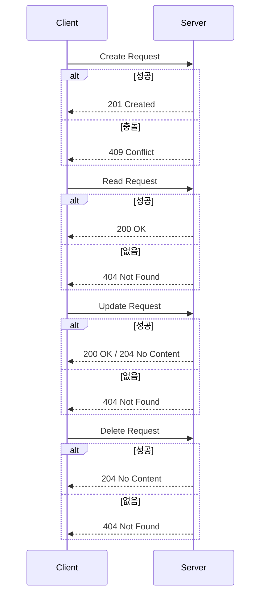

```table-of-contents
title: # 목차
style: nestedList # TOC style (nestedList|nestedOrderedList|inlineFirstLevel)
minLevel: 0 # Include headings from the specified level
maxLevel: 5 # Include headings up to the specified level
includeLinks: true # Make headings clickable
hideWhenEmpty: false # Hide TOC if no headings are found
debugInConsole: false # Print debug info in Obsidian console
```
HTTP Status Code in CRUD Operations

# HTTP Status Code 개념
HTTP Status Code는 웹 서버가 클라이언트의 요청에 대한 처리 결과를 전달하는 표준화된 응답 코드이다. 실생활에서 택배 배송 상태(배송준비중, 배송중, 배송완료, 배송실패 등)와 유사하다.

# CRUD 작업별 Status Code
## Create 작업의 Status Code
새로운 리소스를 생성하는 작업에서 사용하는 상태 코드는 다음과 같다:
- 201 (Created): 리소스 생성 성공
- 202 (Accepted): 비동기 작업으로 생성 요청 접수
- 409 (Conflict): 동일한 리소스가 이미 존재하여 생성 불가

## Read 작업의 Status Code
리소스를 조회하는 작업에서 사용하는 상태 코드는 다음과 같다:
- 200 (OK): 리소스 조회 성공
- 206 (Partial Content): 부분 데이터 조회 성공
- 404 (Not Found): 요청한 리소스가 존재하지 않음

## Update 작업의 Status Code
기존 리소스를 수정하는 작업에서 사용하는 상태 코드는 다음과 같다:
- 200 (OK): 수정 성공 및 수정된 리소스 반환
- 204 (No Content): 수정 성공 및 반환 데이터 없음
- 404 (Not Found): 수정할 리소스가 존재하지 않음
- 409 (Conflict): 현재 리소스 상태와 충돌 발생

## Delete 작업의 Status Code
리소스를 삭제하는 작업에서 사용하는 상태 코드는 다음과 같다:
- 204 (No Content): 삭제 성공
- 202 (Accepted): 비동기 작업으로 삭제 요청 접수
- 404 (Not Found): 삭제할 리소스가 존재하지 않음

# 기본 동작 방식



# 실제 사용 예시

```python
from flask import Flask, jsonify
from http import HTTPStatus

app = Flask(__name__)

# 데이터 저장소
users = {}

@app.route('/users/<user_id>', methods=['POST'])
def create_user(user_id):
    # 이미 존재하는 사용자인 경우
    if user_id in users:
        return jsonify({'error': 'User already exists'}), HTTPStatus.CONFLICT
    
    # 새로운 사용자 생성
    users[user_id] = {'name': 'John Doe'}
    return jsonify(users[user_id]), HTTPStatus.CREATED

@app.route('/users/<user_id>', methods=['GET'])
def get_user(user_id):
    # 사용자가 존재하지 않는 경우
    if user_id not in users:
        return jsonify({'error': 'User not found'}), HTTPStatus.NOT_FOUND
    
    # 사용자 정보 반환
    return jsonify(users[user_id]), HTTPStatus.OK

@app.route('/users/<user_id>', methods=['PUT'])
def update_user(user_id):
    # 사용자가 존재하지 않는 경우
    if user_id not in users:
        return jsonify({'error': 'User not found'}), HTTPStatus.NOT_FOUND
    
    # 사용자 정보 업데이트
    users[user_id]['name'] = 'Jane Doe'
    return '', HTTPStatus.NO_CONTENT

@app.route('/users/<user_id>', methods=['DELETE'])
def delete_user(user_id):
    # 사용자가 존재하지 않는 경우
    if user_id not in users:
        return jsonify({'error': 'User not found'}), HTTPStatus.NOT_FOUND
    
    # 사용자 삭제
    del users[user_id]
    return '', HTTPStatus.NO_CONTENT

if __name__ == '__main__':
    app.run(debug=True)
```

# 고급 활용법
## 비동기 작업 처리
대용량 데이터나 시간이 오래 걸리는 작업의 경우 비동기로 처리한다:
1. 클라이언트의 요청 접수 시 202 (Accepted) 반환
2. 작업 진행 상태 확인을 위한 endpoint 제공
3. 작업 완료 후 콜백 URL로 결과 전달

## 부분 응답 처리
대량의 데이터를 조회할 때 pagination을 활용한다:
4. Range 헤더를 통해 요청 범위 지정
5. 206 (Partial Content) 상태 코드로 응답
6. Content-Range 헤더로 전체 데이터 범위 표시

# 주의사항
7. 상태 코드는 의미에 맞게 정확히 사용한다
8. 에러 상황에서 적절한 에러 메시지를 포함한다
9. 보안 관련 상태 코드(401, 403)는 정보 노출에 주의한다
10. 커스텀 상태 코드 사용은 피한다

# 결론
올바른 HTTP Status Code 사용은 RESTful API의 가독성과 유지보수성을 향상시킨다. 표준화된 상태 코드를 통해 클라이언트와 서버 간의 명확한 커뮤니케이션이 가능하다.

# 심화 학습을 위한 질문들
11. 비동기 작업에서 202 대신 201을 사용하면 어떤 문제가 발생할 수 있는가?
12. 대량 데이터 처리 시 성능과 상태 코드는 어떤 관계가 있는가?
13. GraphQL과 같은 새로운 API 방식에서는 상태 코드를 어떻게 활용해야 하는가?
14. 마이크로서비스 아키텍처에서 상태 코드 처리는 어떻게 달라져야 하는가?