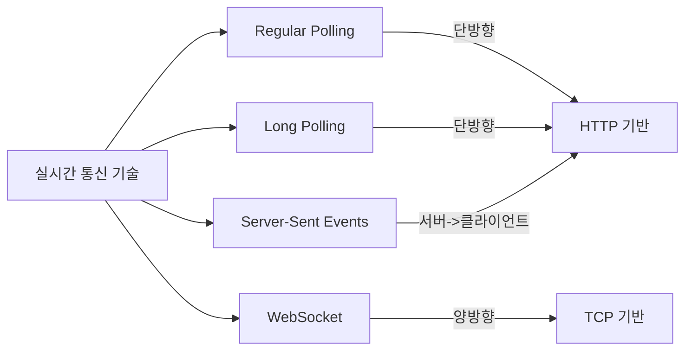
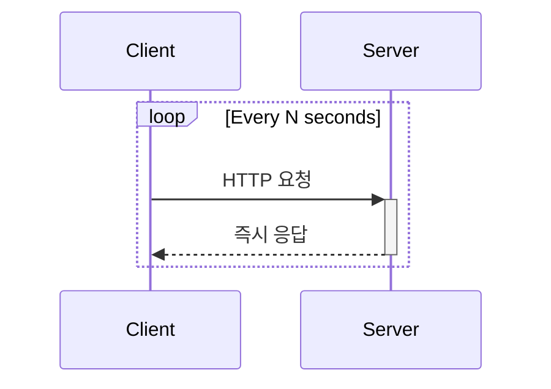
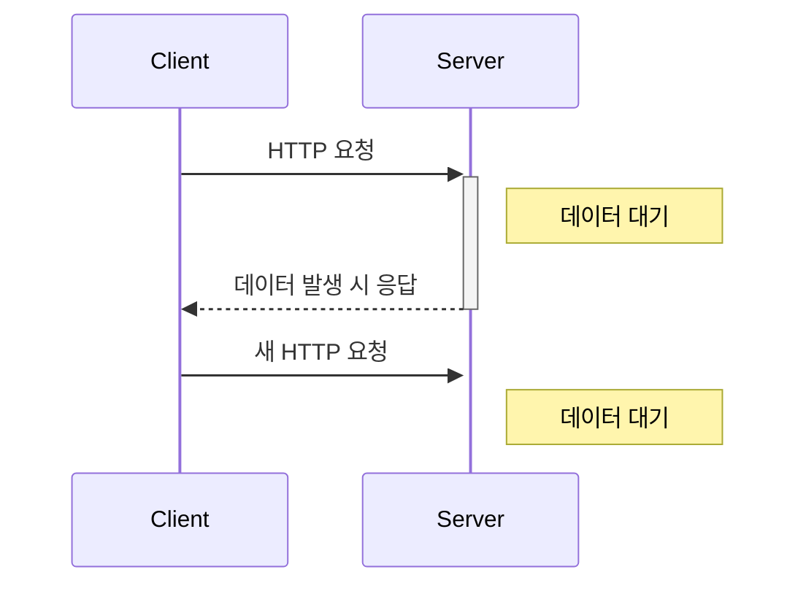
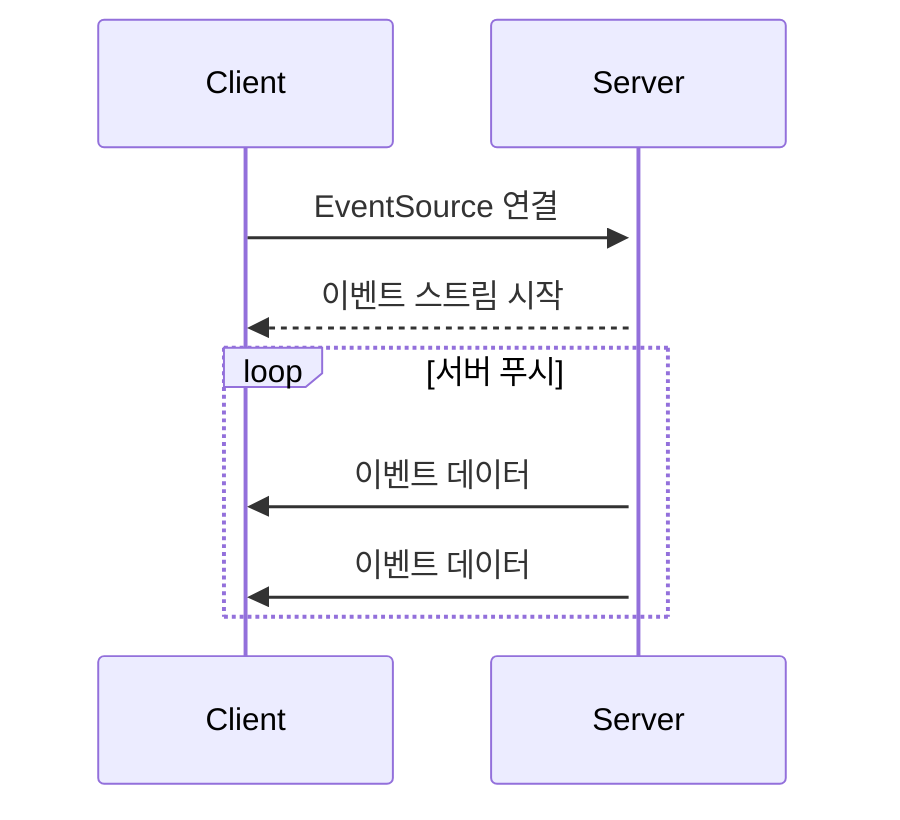
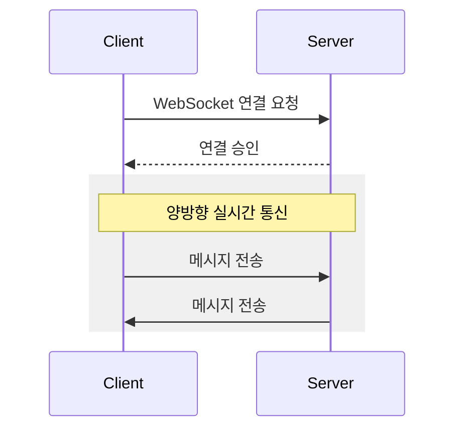

# 1. 개요

현대 웹 애플리케이션에서 실시간 통신은 필수적인 요소가 되었다. 각 기술의 특징과 적절한 사용 시나리오를 이해하는 것이 중요하다.



# 2. 각 기술별 특징

## 2.1 Regular Polling

### 작동 방식


### 특징
- 가장 단순한 구현
- 주기적인 HTTP 요청
- 불필요한 요청 발생
- 서버 부하 높음

### 코드 예시
```javascript
function startPolling() {
    setInterval(async () => {
        try {
            const response = await fetch('/api/data');
            const data = await response.json();
            processData(data);
        } catch (error) {
            console.error('Polling error:', error);
        }
    }, 3000);
}
```

## 2.2 Long Polling

### 작동 방식


### 특징
- 서버가 응답을 지연
- 실시간에 가까운 응답
- 연결 유지 비용
- HTTP 호환성 좋음

### 코드 예시
```javascript
async function startLongPolling() {
    try {
        const response = await fetch('/api/updates', {
            timeout: 30000
        });
        const data = await response.json();
        processData(data);
        startLongPolling(); // 즉시 다음 요청
    } catch (error) {
        setTimeout(startLongPolling, 5000); // 에러 시 재시도
    }
}
```

## 2.3 Server-Sent Events (SSE)

### 작동 방식


### 특징
- 서버에서 클라이언트로 단방향 통신
- 자동 재연결 지원
- 표준 HTML5 기술
- 텍스트 기반 메시지

### 코드 예시
```javascript
// 클라이언트
const eventSource = new EventSource('/api/events');

eventSource.onmessage = (event) => {
    const data = JSON.parse(event.data);
    console.log('새로운 데이터:', data);
};

eventSource.onerror = (error) => {
    console.error('SSE 에러:', error);
};

// 서버 (Node.js/Express)
app.get('/api/events', (req, res) => {
    res.setHeader('Content-Type', 'text/event-stream');
    res.setHeader('Cache-Control', 'no-cache');
    res.setHeader('Connection', 'keep-alive');

    const sendEvent = (data) => {
        res.write(`data: ${JSON.stringify(data)}\n\n`);
    };

    // 이벤트 전송 예시
    setInterval(() => {
        sendEvent({ time: new Date() });
    }, 1000);
});
```

## 2.4 WebSocket

### 작동 방식


### 특징
- 완전한 양방향 통신
- 낮은 지연 시간
- 이진 데이터 지원
- 별도의 프로토콜 사용

### 코드 예시
```javascript
// 클라이언트
const socket = new WebSocket('ws://example.com/socket');

socket.onopen = () => {
    console.log('연결됨');
    socket.send('Hello Server!');
};

socket.onmessage = (event) => {
    console.log('메시지 수신:', event.data);
};

socket.onerror = (error) => {
    console.error('WebSocket 에러:', error);
};

// 서버 (Node.js/ws)
const WebSocket = require('ws');
const wss = new WebSocket.Server({ port: 8080 });

wss.on('connection', (ws) => {
    ws.on('message', (message) => {
        console.log('수신:', message);
        ws.send('서버 응답');
    });
});
```

# 3. 기술 비교 및 선택 기준

| 기술 | 양방향 통신 | 실시간성 | 리소스 사용 | 구현 복잡도 | 브라우저 지원 |
|------|------------|----------|-------------|-------------|--------------|
| Regular Polling | ❌ | 낮음 | 높음 | 낮음 | 매우 좋음 |
| Long Polling | ❌ | 중간 | 중간 | 중간 | 매우 좋음 |
| SSE | 단방향 | 높음 | 낮음 | 낮음 | 좋음 |
| WebSocket | ✅ | 매우 높음 | 낮음 | 높음 | 좋음 |

# 4. 사용 시나리오별 추천 기술

## 4.1 실시간 채팅
- 1순위: WebSocket
- 2순위: Long Polling
- 이유: 양방향 통신, 낮은 지연 시간 필요

## 4.2 알림 시스템
- 1순위: SSE
- 2순위: Long Polling
- 이유: 서버에서 클라이언트로의 단방향 통신만 필요

## 4.3 실시간 대시보드
- 1순위: Regular Polling
- 2순위: SSE
- 이유: 주기적 업데이트만 필요, 구현 단순성

## 4.4 실시간 게임
- 1순위: WebSocket
- 이유: 빠른 양방향 통신 필수

# 5. 주의사항 및 고려사항

## 5.1 확장성 (Scalability)
- Regular Polling: 서버 부하 증가 빠름
- Long Polling: 많은 연결 유지로 서버 부하
- SSE: 연결 수 제한 있음
- WebSocket: 연결 상태 관리 필요

## 5.2 보안
- Regular/Long Polling: 표준 HTTP 보안
- SSE: CORS 정책 적용
- WebSocket: 별도의 보안 설정 필요

## 5.3 안정성
- 모든 기술: 네트워크 불안정성 대비 필요
- WebSocket/SSE: 재연결 메커니즘 구현 중요
- Long Polling: 타임아웃 설정 중요

# 6. 결론

각 기술은 고유한 장단점을 가지고 있으며, 애플리케이션의 요구사항에 따라 적절한 기술을 선택해야 한다:

1. 단순한 주기적 업데이트 → Regular Polling
2. 서버에서 클라이언트로의 실시간 알림 → SSE
3. 완전한 실시간 양방향 통신 → WebSocket
4. 실시간성 필요 + 레거시 시스템 → Long Polling

가장 중요한 것은 애플리케이션의 요구사항을 정확히 파악하고, 그에 맞는 기술을 선택하는 것이다.