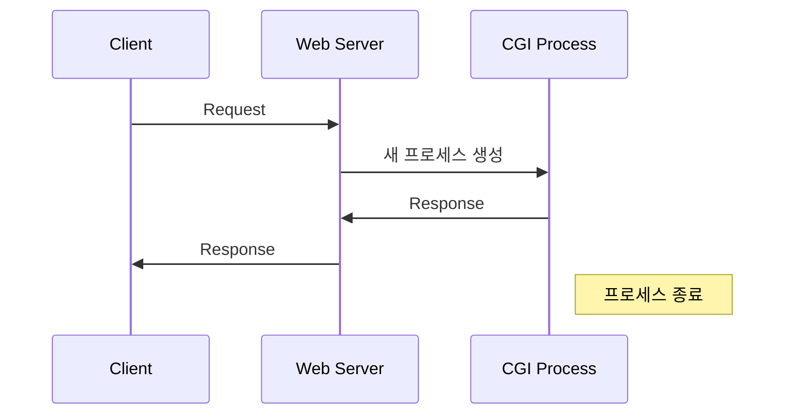
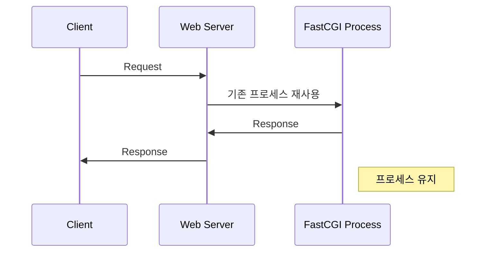
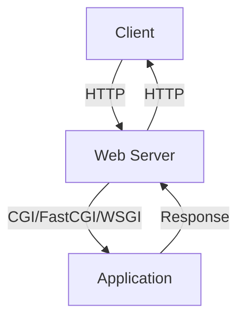

Web Server Interface와 Protocol 가이드

# Interface와 Protocol의 이해

Web server와 application이 서로 통신하는 방법을 정의한 약속이다. 쉽게 비유하면:
- Protocol은 대화의 규칙이다 (예: 한국어로 대화할지, 영어로 대화할지)
- Interface는 대화의 방식이다 (예: 전화로 할지, 편지로 할지)

# Interface의 진화 과정

## 1. CGI (Common Gateway Interface)
가장 기본적인 interface로, 매 request마다 새로운 process를 생성한다.

### 동작 방식


### 장단점
- 장점: 구현이 단순하고 이해하기 쉽다
- 단점: 매 요청마다 새로운 process를 생성하여 server에 부하가 크다

### 예시 코드
```python
#!/usr/bin/python
# CGI script 예시
print("Content-Type: text/html\n")
print("<html><body>")
print("<h1>Hello, CGI!</h1>")
print("</body></html>")
```

## 2. FastCGI
CGI의 성능 문제를 해결하기 위해 만들어진 protocol이다.

### 동작 방식


### Configuration 예시
```nginx
# Nginx에서의 FastCGI 설정
location ~ \.php$ {
    # FastCGI server와 통신
    fastcgi_pass unix:/var/run/php-fpm.sock;
    # Script filename 설정
    fastcgi_param SCRIPT_FILENAME $document_root$fastcgi_script_name;
    # 기본 FastCGI parameters 포함
    include fastcgi_params;
}
```

# Modern Interface의 이해

## 1. WSGI (Python)
Python web application을 위한 표준 interface다.

### 기본 구조
```python
# 가장 단순한 WSGI application
def simple_app(environ, start_response):
    # Response header 설정
    start_response('200 OK', [('Content-Type', 'text/plain')])
    # Response body 반환
    return [b'Hello, WSGI!']

# 실제 사용 예시 (Flask)
from flask import Flask
app = Flask(__name__)

@app.route('/')
def hello():
    return 'Hello, Flask!'
```

## 2. Rack (Ruby)
Ruby를 위한 web server interface다.

```ruby
# 기본 Rack application
app = lambda do |env|
    [
        200,
        {'Content-Type' => 'text/plain'},
        ['Hello, Rack!']
    ]
end
```

# Protocol 동작 이해하기

## HTTP Protocol과의 관계



## Request Flow 예시
```python
# WSGI application에서의 request 처리
def application(environ, start_response):
    # Request method 확인
    method = environ['REQUEST_METHOD']
    # Path 확인
    path = environ['PATH_INFO']
    
    if method == 'GET' and path == '/':
        start_response('200 OK', [('Content-Type', 'text/plain')])
        return [b'Hello, World!']
    else:
        start_response('404 Not Found', [('Content-Type', 'text/plain')])
        return [b'Not Found']
```

# 실전 응용

## 1. Development Server
```python
# Python 개발용 서버
from wsgiref.simple_server import make_server

def my_app(environ, start_response):
    response_body = b'Hello, Development!'
    status = '200 OK'
    headers = [('Content-Type', 'text/plain')]
    
    start_response(status, headers)
    return [response_body]

# Server 실행
server = make_server('localhost', 8000, my_app)
server.serve_forever()
```

## 2. Production 환경 설정

### Gunicorn (WSGI Server)
```bash
# Gunicorn 실행
gunicorn --workers 4 --bind 0.0.0.0:8000 myapp:app
```

### uWSGI 설정
```ini
[uwsgi]
module = myapp:app
master = true
processes = 4
socket = app.sock
chmod-socket = 660
vacuum = true
die-on-term = true
```

# Performance 최적화

## 1. Process 관리
```python
# Gunicorn config
bind = '0.0.0.0:8000'
workers = 4
threads = 2
worker_class = 'sync'
```

## 2. Connection 관리
```nginx
# Nginx proxy 설정
location / {
    proxy_pass http://unix:/path/to/app.sock;
    proxy_set_header Host $host;
    proxy_set_header X-Real-IP $remote_addr;
}
```

# 주의사항

## Security 관련
1. Process 권한 관리
   ```bash
   # Worker process 권한 설정
   user www-data;
   group www-data;
   ```

2. Socket 권한 관리
   ```bash
   # Socket file 권한 설정
   chmod 660 app.sock
   chown www-data:www-data app.sock
   ```

# 결론

Web server interface와 protocol의 선택은 다음 요소들을 고려해야 한다:
- Application의 요구사항
- 개발 언어와 framework
- Server 환경
- Performance 요구사항

적절한 interface 선택과 configuration으로 안정적이고 효율적인 web application을 구축할 수 있다.