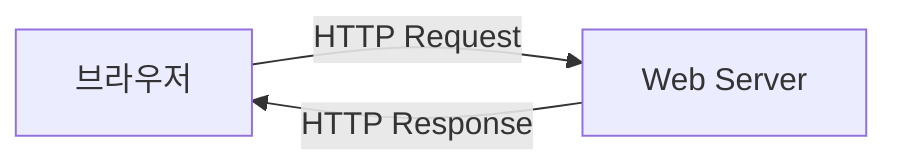
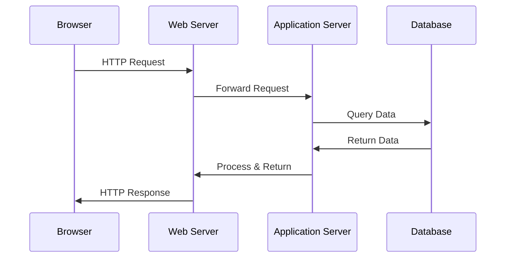

# Server의 기본 개념

웹 애플리케이션을 만들고 운영하기 위해서는 Web Server와 Application Server의 차이를 이해하는 것이 중요하다. 쉽게 비유하자면:

- Web Server는 음식점의 홀 서버와 같다 (주문 접수, 음식 서빙)
- Application Server는 주방 셰프와 같다 (실제 음식 조리)

# Web Server 이해하기

## 기본 역할
Web server는 client(웹 브라우저)의 요청을 가장 먼저 받아들이는 관문이다.



### Static content 처리
```bash
# Nginx static file 설정 예시
location /images/ {
    root   /var/www/static;  # 실제 파일 위치
    expires 30d;             # 브라우저 캐싱 설정
}
```

### 잘못된 예시와 올바른 예시

잘못된 구성:
```nginx
# 잘못된 예시 - 모든 요청을 Application Server로 전달
location / {
    proxy_pass http://app_server;
}
```

올바른 구성:
```nginx
# 올바른 예시 - static file은 Web Server가 직접 처리
location /static/ {
    root /var/www;
}
location / {
    proxy_pass http://app_server;
}
```

# Application Server 이해하기

## 기본 역할
Application server는 business logic을 실행하고 동적 데이터를 처리한다.

### Database 연동 예시
```python
# Application Server에서의 동적 처리 예시
@app.route('/users')
def get_users():
    users = database.query("SELECT * FROM users")
    return generate_response(users)
```

## Server 간 통신


# 실제 사용 사례

## 1. Blog 서비스 구성
- Web Server (Nginx)
  - 이미지, CSS, JS 파일 서빙
  - SSL/TLS 처리
  - Caching 설정

- Application Server (Django)
  - 게시글 CRUD 처리
  - 사용자 인증
  - 댓글 시스템

## 2. E-commerce 시스템
- Web Server (Apache)
  - Product 이미지 서빙
  - Security header 설정
  - Load balancing

- Application Server (Spring Boot)
  - 상품 검색/필터링
  - 장바구니 관리
  - 결제 처리

# Performance 고려사항

## 1. Caching 전략
```nginx
# Web Server caching 설정
location /static/ {
    expires 1h;
    add_header Cache-Control "public";
}
```

## 2. Load Balancing
```nginx
# Load balancing 설정
upstream app_servers {
    server app1:8000;
    server app2:8000;
    server app3:8000;
}
```

# 주의사항

## Security 관련
1. Web Server
   - 외부 접근 제한
   - SSL/TLS 설정
   - Security header 설정

2. Application Server
   - 내부 네트워크에만 노출
   - 접근 권한 최소화
   - 민감 정보 암호화

# 개발 환경 설정

## 기본 개발 환경
```bash
# 개발용 Web Server 설정
python -m http.server 8000  # 간단한 static file 서버

# 개발용 Application Server 실행
python manage.py runserver  # Django 개발 서버
```

# 배포 시 고려사항

## Checklist
1. Security
   - SSL/TLS 설정 확인
   - 방화벽 규칙 검토
   - 접근 권한 설정

2. Performance
   - Caching 설정
   - Resource limit 설정
   - Monitoring 구성

# 결론

Web Server와 Application Server는 각각의 역할이 명확하다:
- Web Server: Front-end 요청 처리, 보안, static content 관리
- Application Server: Business logic 처리, 데이터 관리, 동적 컨텐츠 생성

효율적인 웹 서비스를 위해서는 두 서버의 특성을 이해하고 적절히 구성하는 것이 중요하다.