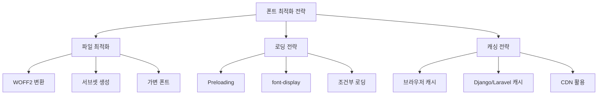

```table-of-contents
title: # 목차
style: nestedList # TOC style (nestedList|nestedOrderedList|inlineFirstLevel)
minLevel: 0 # Include headings from the specified level
maxLevel: 5 # Include headings up to the specified level
includeLinks: true # Make headings clickable
hideWhenEmpty: false # Hide TOC if no headings are found
debugInConsole: false # Print debug info in Obsidian console
```
# 개념 소개
WOFF는 Web Open Font Format의 약자로, 웹에서 사용하기 위해 특별히 설계된 폰트 파일 형식이다. 실생활에서 옷을 압축해서 진공 포장하는 것처럼, WOFF는 기존의 폰트 파일을 웹에서 효율적으로 전송할 수 있도록 압축한 형태이다.

# 기본 동작 방식
## 압축 메커니즘
WOFF는 다음과 같은 과정으로 동작한다:
1. 기존 폰트 파일(TTF/OTF)을 WOFF 형식으로 변환
2. 메타데이터 추가 및 압축 적용
3. 웹 브라우저에서 압축 해제 후 렌더링


# Nginx 보안 설정
## CSP(Content Security Policy) 설정
```nginx
# nginx.conf 또는 site configuration
server {
    # Font 관련 CSP 설정
    add_header Content-Security-Policy "
        default-src 'self';
        font-src 'self' https://fonts.gstatic.com;  # Google Fonts 사용 시
        style-src 'self' 'unsafe-inline' https://fonts.googleapis.com;
    ";

    # CORS 설정
    location /fonts/ {
        add_header Access-Control-Allow-Origin "*";
        add_header Access-Control-Allow-Methods "GET, OPTIONS";
        add_header Access-Control-Allow-Headers "Origin, X-Requested-With, Content-Type, Accept";
    }

    # 폰트 파일 캐싱 최적화
    location ~* \.(woff|woff2)$ {
        expires 1y;
        add_header Cache-Control "public";
        add_header Access-Control-Allow-Origin "*";
        try_files $uri =404;
    }
}
```

# Tailwind CSS 환경에서의 활용
## 기본 설정
```javascript
// tailwind.config.js
module.exports = {
  theme: {
    extend: {
      fontFamily: {
        'custom': ['MyCustomFont', 'system-ui', '-apple-system', 'sans-serif'], // 폴백 폰트 상세 지정
      },
    },
  },
  content: [
    './resources/**/*.blade.php',  // Laravel
    './resources/**/*.vue',        // Vue.js
    './templates/**/*.html',       // Django
  ],
}
```

## HTML 설정
```html
<!-- HTML head 섹션 -->
<head>
    <!-- 커스텀 폰트 프리로딩 -->
    <link 
        rel="preload" 
        href="/fonts/custom-font.woff2" 
        as="font" 
        type="font/woff2" 
        crossorigin="anonymous"
    >
    
    <!-- Tailwind CSS -->
    <link href="/css/tailwind.css" rel="stylesheet">
</head>

<!-- 컴포넌트에서 사용 -->
<div class="font-custom">
  커스텀 폰트가 적용된 텍스트입니다.
</div>
```

# 성능 최적화
## Best Practice
1. 서브셋 최적화
   ```bash
   # pyftsubset 사용 예시
   pyftsubset "original.ttf" --unicodes="U+0020-007E,U+AC00-D7A3" --flavor="woff2"
   ```

2. Django/Laravel에서의 캐시 설정
   ```python
   # Django settings.py
   STATICFILES_STORAGE = 'django.contrib.staticfiles.storage.ManifestStaticFilesStorage'
   ```

   ```php
   // Laravel - config/filesystems.php
   'fonts' => [
       'driver' => 'local',
       'root' => public_path('fonts'),
       'url' => env('APP_URL').'/fonts',
       'visibility' => 'public',
       'headers' => [
           'Cache-Control' => 'public, max-age=31536000, immutable',
       ],
   ],
   ```

3. Vue.js에서의 조건부 폰트 로딩
   ```vue
   <!-- FontLoader.vue -->
   <script>
   export default {
     mounted() {
       if (document.documentElement.classList.contains('fonts-enabled')) {
         const fontLink = document.createElement('link');
         fontLink.href = '/fonts/custom-font.woff2';
         fontLink.rel = 'preload';
         fontLink.as = 'font';
         fontLink.type = 'font/woff2';
         fontLink.crossOrigin = 'anonymous';
         document.head.appendChild(fontLink);
       }
     }
   }
   </script>
   ```

## 성능 모니터링
```javascript
// 웹 폰트 로딩 성능 측정
performance.getEntriesByType('resource').filter(entry => {
  return entry.name.indexOf('.woff') > -1 || entry.name.indexOf('.woff2') > -1;
}).forEach(entry => {
  console.log(`Font ${entry.name} loaded in ${entry.duration}ms`);
});
```



# 주의사항
1. 보안 관련 주의점
   - CSP 설정 시 신뢰할 수 있는 도메인만 허용
   - 폰트 파일에 대한 적절한 CORS 설정
   - 캐시 관련 보안 헤더 설정

2. 성능 관련 주의점
   - FOUT(Flash of Unstyled Text) 현상 대응
   - FOIT(Flash of Invisible Text) 현상 대응
   - 모바일 환경에서의 로딩 최적화

3. 라이선스 확인
   - 웹폰트 사용 권한 검증 필수
   - 상업용/비상업용 구분 확인

# 문제 해결 가이드
1. 폰트가 적용되지 않는 경우
   - Tailwind 설정 확인
   - CSP 설정 검증
   - CORS 설정 확인

2. 성능 저하 발생 시
   - 서브셋 폰트 적용
   - 압축 알고리즘 최적화
   - 캐싱 전략 수립

# 결론
WOFF는 현대 웹에서 필수적인 웹폰트 포맷으로, 효율적인 압축과 브라우저 호환성을 제공한다. Tailwind CSS와 함께 사용할 때는 설정이 더욱 간단해지며, 적절한 Nginx 보안 설정과 성능 최적화를 통해 안전하고 효율적으로 서비스할 수 있다.