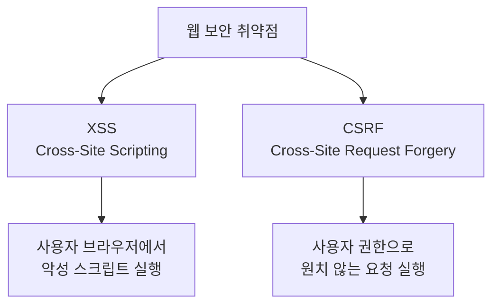

# 개요



# XSS (Cross-Site Scripting)

## 기본 개념
- 웹사이트에 악성 스크립트를 삽입하여 실행하는 공격
- 사용자의 브라우저에서 실행되어 정보를 탈취하거나 조작

## 공격 유형

### 1. Reflected XSS
```javascript
// 취약한 코드 예시
app.get('/search', (req, res) => {
    const query = req.query.q;
    // 위험: 사용자 입력을 직접 출력
    res.send(`검색 결과: ${query}`);
});

// 공격 URL 예시
http://example.com/search?q=<script>alert('XSS')</script>
```

### 2. Stored XSS
```javascript
// 취약한 코드 예시
app.post('/comments', (req, res) => {
    const comment = req.body.comment;
    // 위험: 사용자 입력을 데이터베이스에 저장
    db.save(comment);
});
```

### 3. DOM-based XSS
```javascript
// 취약한 코드 예시
const name = document.location.hash.substring(1);
document.write('환영합니다, ' + name);
```

## 방어 방법

### 1. 입력 검증
```javascript
// 안전한 코드 예시
const sanitizeHtml = require('sanitize-html');

app.post('/comment', (req, res) => {
    const cleanComment = sanitizeHtml(req.body.comment, {
        allowedTags: [ 'b', 'i', 'em', 'strong' ]
    });
    db.save(cleanComment);
});
```

### 2. 출력 인코딩
```javascript
const escapeHtml = (unsafe) => {
    return unsafe
        .replace(/&/g, "&amp;")
        .replace(/</g, "&lt;")
        .replace(/>/g, "&gt;")
        .replace(/"/g, "&quot;")
        .replace(/'/g, "&#039;");
}
```

### 3. Content Security Policy (CSP)
```http
Content-Security-Policy: default-src 'self'; script-src 'self' 'nonce-random123'
```

# CSRF (Cross-Site Request Forgery)

## 기본 개념
- 사용자의 권한을 도용하여 원치 않는 동작을 수행하게 하는 공격
- 사용자가 로그인된 상태를 이용

## 공격 예시

### 1. GET 요청을 통한 공격
```html
<!-- 악성 사이트의 이미지 태그 -->

```

### 2. POST 요청을 통한 공격
```html
<!-- 자동 제출되는 폼 -->
<form id="hack" action="http://bank.example.com/transfer" method="POST">
    <input type="hidden" name="amount" value="1000000" />
    <input type="hidden" name="to" value="attacker" />
</form>
<script>document.getElementById('hack').submit();</script>
```

## 방어 방법

### 1. CSRF 토큰 사용
```python
# Django 예시
@csrf_protect
def transfer_money(request):
    if request.method == "POST":
        # CSRF 토큰 자동 검증
        amount = request.POST.get('amount')
        process_transfer(amount)
```

```html
<!-- 템플릿의 폼에 CSRF 토큰 포함 -->
<form method="POST">
    
    <input type="text" name="amount" />
    <button type="submit">전송</button>
</form>
```

### 2. SameSite 쿠키 설정
```http
Set-Cookie: session=123; SameSite=Strict
```

### 3. Custom Request Headers
```javascript
// API 요청 시 커스텀 헤더 추가
fetch('/api/transfer', {
    method: 'POST',
    headers: {
        'X-Requested-With': 'XMLHttpRequest'
    }
});
```

# 주요 차이점

## 1. 공격 목적
- XSS: 사용자의 브라우저에서 스크립트 실행
- CSRF: 사용자의 권한으로 요청 실행

## 2. 공격 방식
- XSS: 악성 스크립트 삽입 및 실행
- CSRF: 위조된 요청 전송

## 3. 영향 범위
- XSS: 쿠키 탈취, 세션 하이재킹 등 광범위
- CSRF: 특정 동작 실행으로 제한

# 보안 체크리스트

## XSS 방지
1. 입력 데이터 검증 및 정화
2. 출력 데이터 인코딩
3. CSP 헤더 설정
4. HttpOnly 쿠키 사용

## CSRF 방지
1. CSRF 토큰 구현
2. SameSite 쿠키 설정
3. 중요 동작에 재인증 요구
4. Referrer 검증

# 모니터링 및 감사

## 1. 로깅
```javascript
// 보안 이벤트 로깅
const logSecurityEvent = (type, details) => {
    logger.warn({
        type: type,
        timestamp: new Date(),
        details: details,
        ip: req.ip
    });
}
```

## 2. 주기적 점검
- 취약점 스캔 실행
- 로그 분석
- 의심스러운 패턴 모니터링

# 결론

효과적인 보안을 위해서는:
1. XSS와 CSRF 모두 대응
2. 다층적 방어 전략 수립
3. 지속적인 모니터링
4. 정기적인 보안 검토

이러한 보안 조치들을 통해 웹 애플리케이션의 안전성을 높일 수 있습니다.