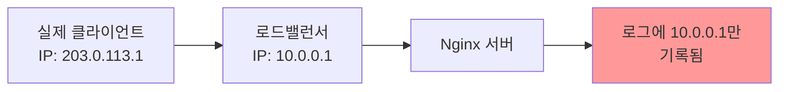
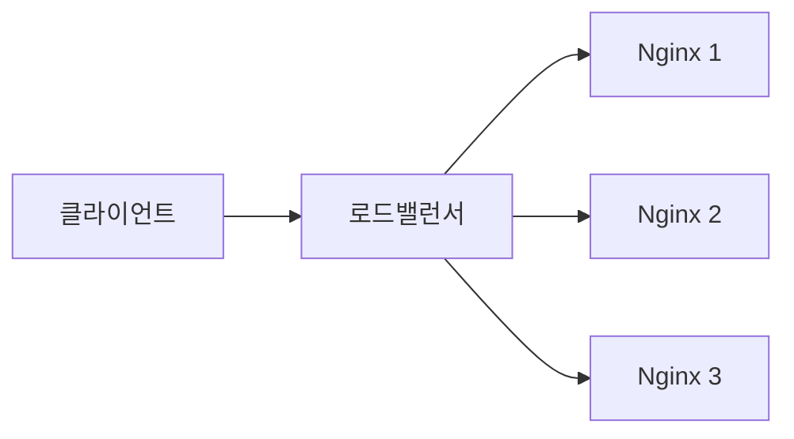

# Real IP가 필요한 이유

## 기본 문제 상황


## 주요 필요성
1. 보안 목적
   - 접근 제어 및 차단
   - DDoS 공격 대응
   - 악성 사용자 추적

2. 로깅과 분석
   - 정확한 트래픽 소스 파악
   - 방문자 통계 수집
   - 문제 해결 및 디버깅

3. 지역 기반 서비스
   - 컨텐츠 지역화
   - 지역 기반 접근 제어
   - CDN 최적화

4. 규정 준수
   - 감사 기록 유지
   - 법적 요구사항 충족
   - 보안 정책 이행

# 기본 설정

## realip.conf 기본 구조
```nginx
# /etc/nginx/conf.d/realip.conf

# 신뢰할 수 있는 프록시 IP 설정
set_real_ip_from 10.0.0.0/8;
set_real_ip_from 172.16.0.0/12;
set_real_ip_from 192.168.0.0/16;

# Real IP 헤더 설정
real_ip_header X-Forwarded-For;

# Real IP 처리 방식
real_ip_recursive on;
```

# 실제 사용 사례

## 1. 로드밸런서 환경


### 설정 예시
```nginx
# AWS ELB 환경 설정
set_real_ip_from 10.0.0.0/8;  # VPC 내부 IP 범위
real_ip_header X-Forwarded-For;
real_ip_recursive on;

# 로깅 설정
log_format detailed '$remote_addr - $remote_user [$time_local] '
                    '"$request" $status $body_bytes_sent '
                    '"$http_referer" "$http_user_agent" '
                    '"$http_x_forwarded_for"';
```

## 2. CDN 환경


### 설정 예시
```nginx
# CloudFlare 설정
set_real_ip_from 103.21.244.0/22;
set_real_ip_from 103.22.200.0/22;
real_ip_header CF-Connecting-IP;

# 지역 기반 접근 제어
geo $allowed_country {
    default no;
    KR yes;
    US yes;
}

server {
    if ($allowed_country = no) {
        return 403 "Access denied by country.";
    }
}
```

## 3. 보안 적용 사례
```nginx
# 악성 IP 차단
map $remote_addr $is_blacklisted {
    default 0;
    ~^192\.168\.1\. 1;  # 특정 IP 범위 차단
}

# 속도 제한 설정
limit_req_zone $binary_remote_addr zone=one:10m rate=1r/s;

server {
    if ($is_blacklisted) {
        return 403 "IP blocked";
    }
    
    location / {
        limit_req zone=one burst=5;
        proxy_pass http://backend;
    }
}
```

# 문제 해결과 검증

## 1. IP 확인 엔드포인트
```nginx
location /ip-check {
    default_type text/plain;
    return 200 "
    Remote Address: $remote_addr\n
    X-Forwarded-For: $http_x_forwarded_for\n
    X-Real-IP: $http_x_real_ip\n
    ";
}
```

## 2. 로그 분석
```bash
# 접속 IP 통계
awk '{print $1}' /var/log/nginx/access.log | sort | uniq -c | sort -nr

# X-Forwarded-For 헤더 확인
grep "X-Forwarded-For" /var/log/nginx/access.log
```

# 보안 고려사항

1. 신뢰할 수 있는 프록시
   - 알려진 프록시 IP만 허용
   - 정기적인 IP 범위 업데이트
   - 프록시 체인 검증

2. 헤더 보안
   - 신뢰할 수 없는 헤더 제거
   - 헤더 스푸핑 방지
   - SSL/TLS 사용

# 모니터링과 유지보수

## 1. 로그 모니터링
```nginx
# 상세 로그 포맷
log_format detailed escape=json
    '{'
    '"time":"$time_iso8601",'
    '"remote_addr":"$remote_addr",'
    '"x_forwarded_for":"$http_x_forwarded_for",'
    '"request":"$request",'
    '"status":"$status"'
    '}';
```

## 2. 정기 점검 항목
- IP 범위 최신성 확인
- 로그 분석 및 패턴 확인
- 보안 규칙 업데이트

# 결론

Real IP 설정의 중요성:
1. 정확한 방문자 추적 가능
2. 보안 강화
3. 규정 준수
4. 서비스 품질 향상

효과적인 Real IP 관리를 통해:
- 보안 위협 대응
- 사용자 경험 개선
- 정확한 분석 데이터 확보
- 시스템 안정성 향상

이러한 이점들을 고려할 때, Real IP 설정은 현대 웹 서비스에서 필수적인 요소입니다.