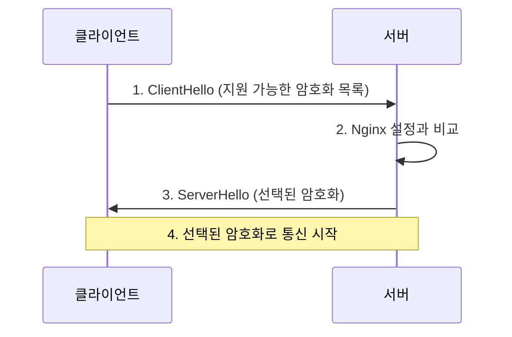
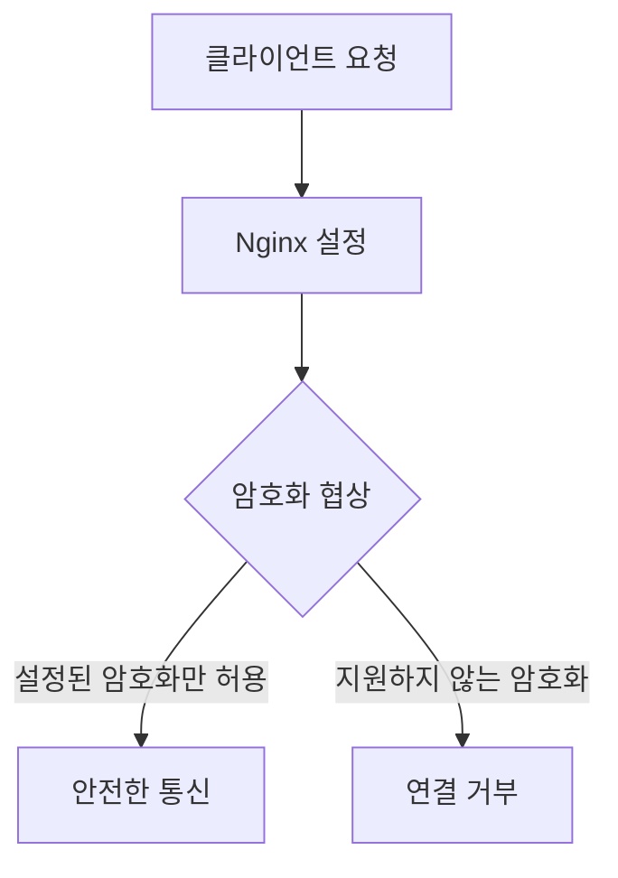
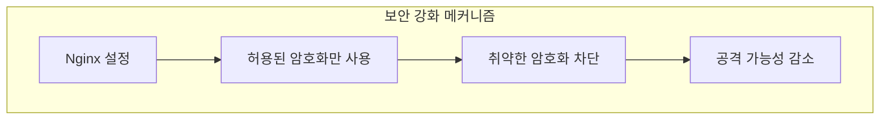
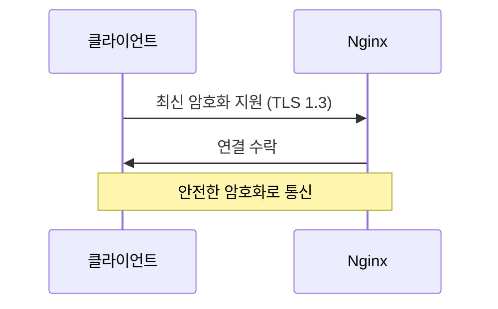
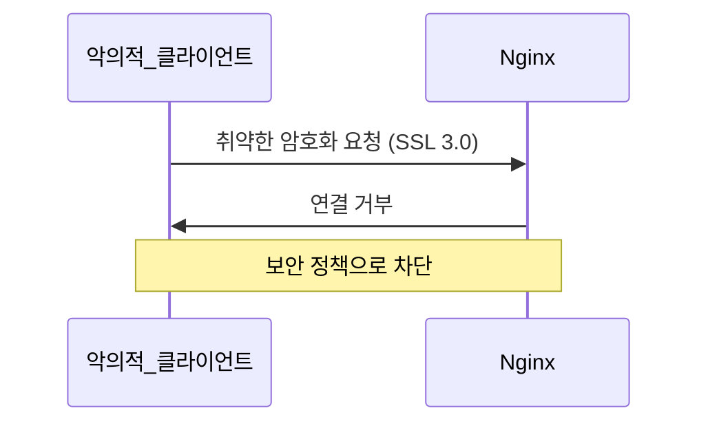
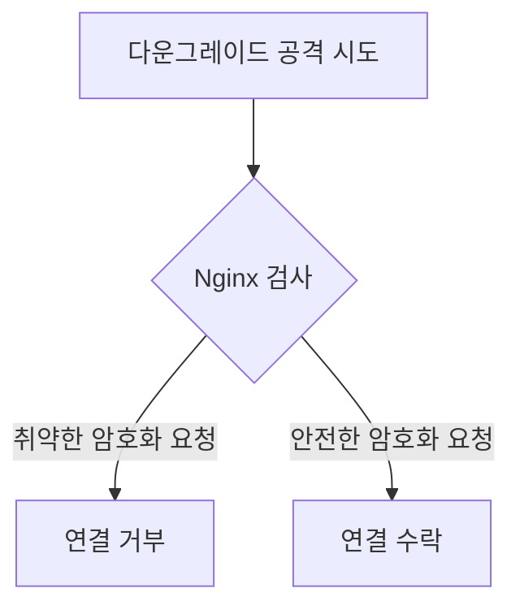

# Nmap의 이해

## Nmap이란?
Nmap(Network Mapper)은 네트워크 보안 스캐닝 도구이다. 서버의 열린 포트, 실행 중인 서비스, 보안 설정 등을 분석할 수 있다.

## 명령어 분석
```bash
nmap --script ssl-enum-ciphers -p 443 example.com
```

각 옵션의 의미:
- `--script ssl-enum-ciphers`: SSL/TLS 암호화 설정 검사
- `-p 443`: HTTPS 포트 검사
- `example.com`: 검사할 도메인

# SSL/TLS 협상 과정

## 기본 동작 원리


## Nginx 설정의 역할


# Nginx 보안 설정

## 기본 SSL 설정
```nginx
# Nginx 설정 파일
server {
    listen 443 ssl;
    server_name example.com;

    # SSL 설정
    ssl_protocols TLSv1.2 TLSv1.3;
    ssl_ciphers ECDHE-ECDSA-AES128-GCM-SHA256:ECDHE-RSA-AES128-GCM-SHA256;
    ssl_prefer_server_ciphers off;
    
    # HSTS 설정
    add_header Strict-Transport-Security "max-age=63072000" always;
}
```
[[SSL Cipher Preference]]
## 설정이 보안을 강화하는 원리


# 실제 동작 예시

## 1. 안전한 연결 시나리오


## 2. 취약한 연결 시도 차단


# 보안 강화 효과

## 1. 다운그레이드 공격 방지


## 2. 알려진 취약점 보호
- POODLE 공격 방지
- BEAST 공격 방지
- SWEET32 공격 방지

# 설정 검증 방법

## Nmap으로 설정 확인
```bash
# 암호화 설정 검사
nmap --script ssl-enum-ciphers -p 443 example.com

# 결과 해석
- A등급: 안전한 암호화
- B등급: 충분히 안전
- C등급 이하: 취약한 암호화
```

## SSL Labs 테스트
```bash
# https://www.ssllabs.com/ssltest/
# 종합적인 SSL/TLS 보안 검사 제공
```

# 모니터링과 유지보수

## 정기적인 검사
1. 암호화 설정 검토
2. 새로운 취약점 확인
3. 설정 업데이트

## 보안 모니터링
```bash
# 접속 로그 모니터링
tail -f /var/log/nginx/access.log | grep "SSL"

# 오류 로그 확인
tail -f /var/log/nginx/error.log
```

# 결론
Nginx의 SSL/TLS 설정은 서버의 첫 번째 보안 방어선이다. 적절한 설정과 정기적인 모니터링을 통해 많은 보안 위협을 예방할 수 있다.

## 핵심 포인트
1. Nmap으로 현재 보안 상태 분석
2. 안전한 암호화 설정 적용
3. 정기적인 설정 검토와 업데이트
4. 모니터링을 통한 보안 유지
