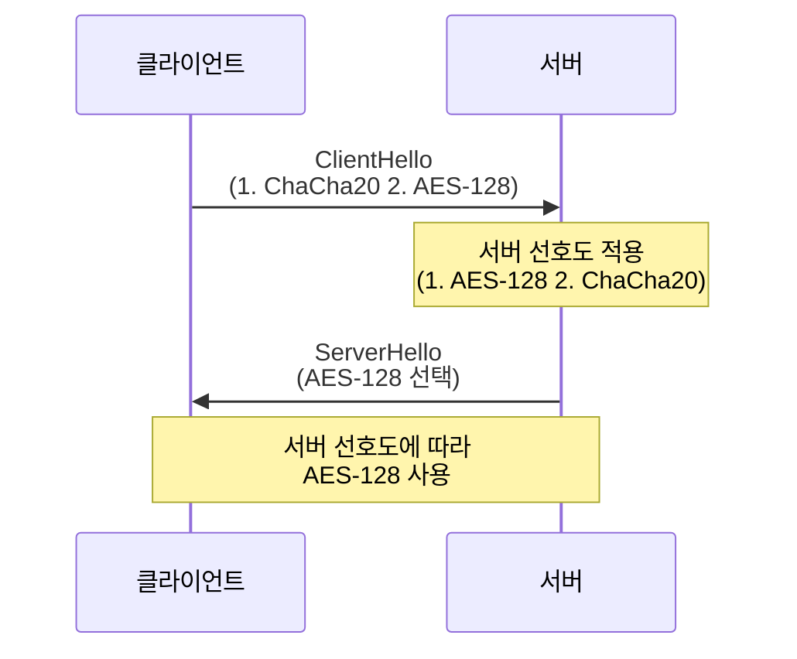
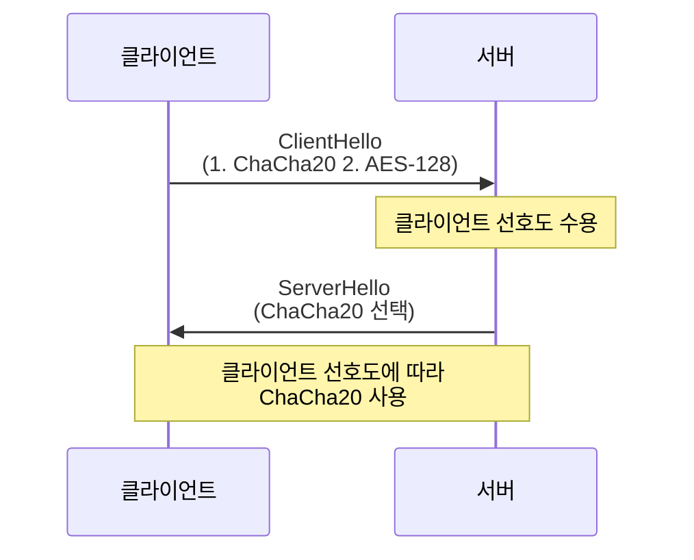
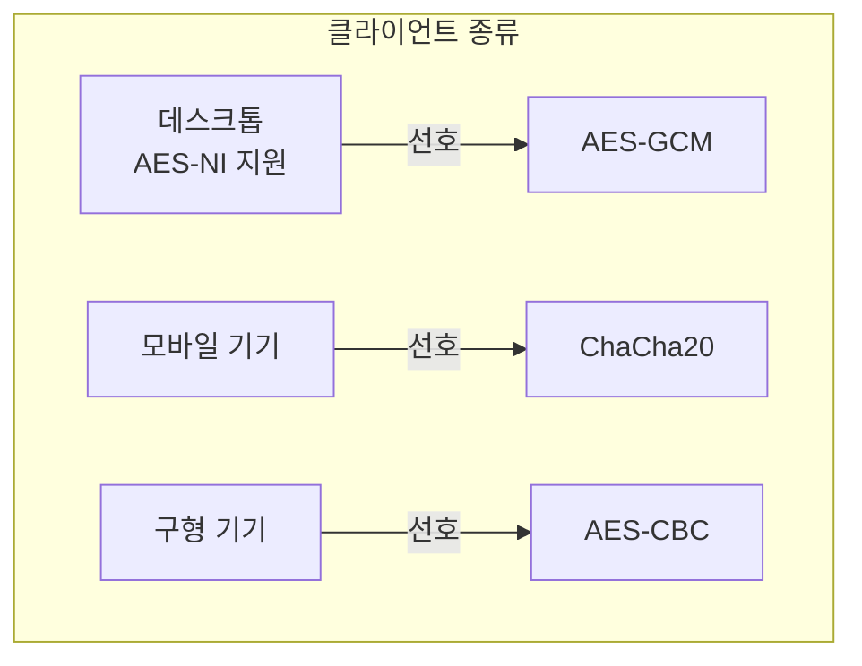
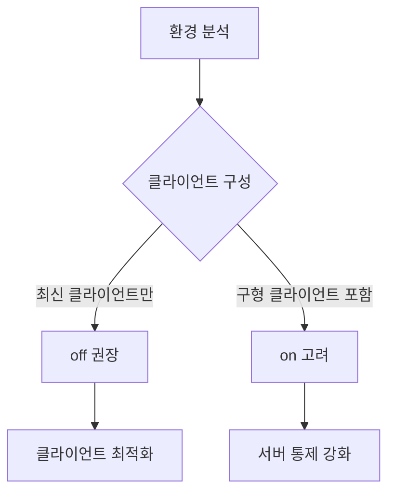

# 개념 이해

## SSL Cipher Preference란?
SSL/TLS 통신에서 사용할 암호화 방식을 선택할 때, 서버와 클라이언트 중 누구의 선호도를 우선할지 결정하는 설정이다.

## 실생활 비유
식당에서의 주문과 유사하다:
- 손님(클라이언트)이 선호하는 조리법 제안
- 주방(서버)이 가능한 조리법 제시
- 최종 조리법 결정 (누구의 선호도를 따를지)

# 동작 방식

## ssl_prefer_server_ciphers on


## ssl_prefer_server_ciphers off


# 구현 예시

## Nginx 설정
```nginx
# 클라이언트 선호도 우선
server {
    listen 443 ssl;
    ssl_prefer_server_ciphers off;
    ssl_ciphers ECDHE-ECDSA-AES128-GCM-SHA256:ECDHE-RSA-AES128-GCM-SHA256:ECDHE-ECDSA-CHACHA20-POLY1305:ECDHE-RSA-CHACHA20-POLY1305;
}

# 서버 선호도 우선
server {
    listen 443 ssl;
    ssl_prefer_server_ciphers on;
    ssl_ciphers ECDHE-ECDSA-AES128-GCM-SHA256:ECDHE-RSA-AES128-GCM-SHA256:ECDHE-ECDSA-CHACHA20-POLY1305:ECDHE-RSA-CHACHA20-POLY1305;
}
```

# 장치별 최적화

## 하드웨어 특성에 따른 선호도


## 성능 비교
1. AES-NI 지원 CPU:
   - AES-GCM이 더 빠름
   - 하드웨어 가속 활용

2. 모바일/임베디드:
   - ChaCha20이 더 효율적
   - 배터리 소모 감소

# 보안 고려사항

## 설정 선택 기준


## 권장 설정

### 현대적 환경
```nginx
# 최신 환경 권장 설정
ssl_protocols TLSv1.2 TLSv1.3;
ssl_prefer_server_ciphers off;
ssl_ciphers ECDHE-ECDSA-AES128-GCM-SHA256:ECDHE-RSA-AES128-GCM-SHA256:ECDHE-ECDSA-CHACHA20-POLY1305:ECDHE-RSA-CHACHA20-POLY1305;
```

### 레거시 지원 환경
```nginx
# 구형 클라이언트 지원 설정
ssl_protocols TLSv1 TLSv1.1 TLSv1.2;
ssl_prefer_server_ciphers on;
ssl_ciphers HIGH:!aNULL:!MD5;
```

# 성능 모니터링

## 암호화 사용 현황 분석
```bash
# 현재 사용 중인 암호화 확인
openssl s_client -connect example.com:443 -cipher "ECDHE-RSA-AES128-GCM-SHA256"

# 연결 통계 확인
nginx -V 2>&1 | grep -o with-http_ssl_module
```

## 성능 측정
```bash
# 암호화 성능 테스트
openssl speed aes-128-gcm chacha20-poly1305
```

# 문제 해결 가이드

## 일반적인 문제

### 1. 연결 실패
```bash
# 지원되는 암호화 확인
openssl ciphers -v 'HIGH:!aNULL:!MD5'

# 클라이언트 지원 확인
nmap --script ssl-enum-ciphers -p 443 example.com
```

### 2. 성능 저하
```bash
# CPU 사용량 모니터링
top -p `pidof nginx`

# 연결 상태 확인
ss -nlt '( sport = :443 )'
```

# 결론

## 최신 권장사항
1. `ssl_prefer_server_ciphers off` 사용
2. TLS 1.2/1.3만 지원
3. 강력한 암호화 스위트 설정
4. 정기적인 성능 모니터링

## 주의사항
1. 클라이언트 환경 파악
2. 성능 영향 고려
3. 보안 요구사항 준수
4. 정기적인 설정 검토