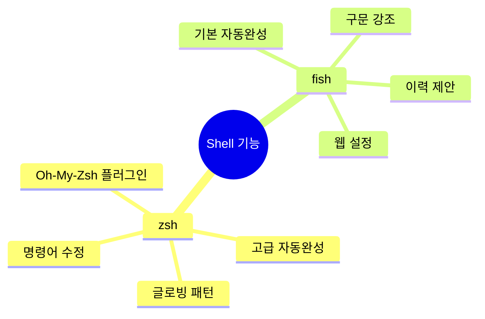
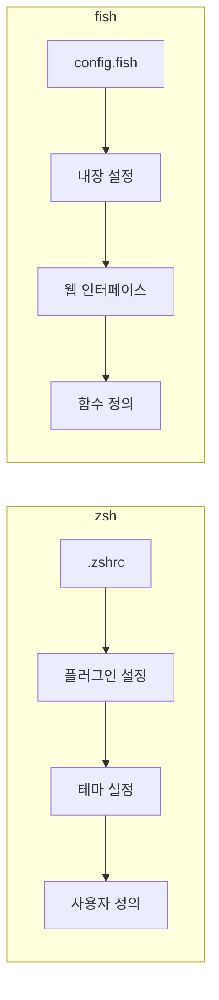
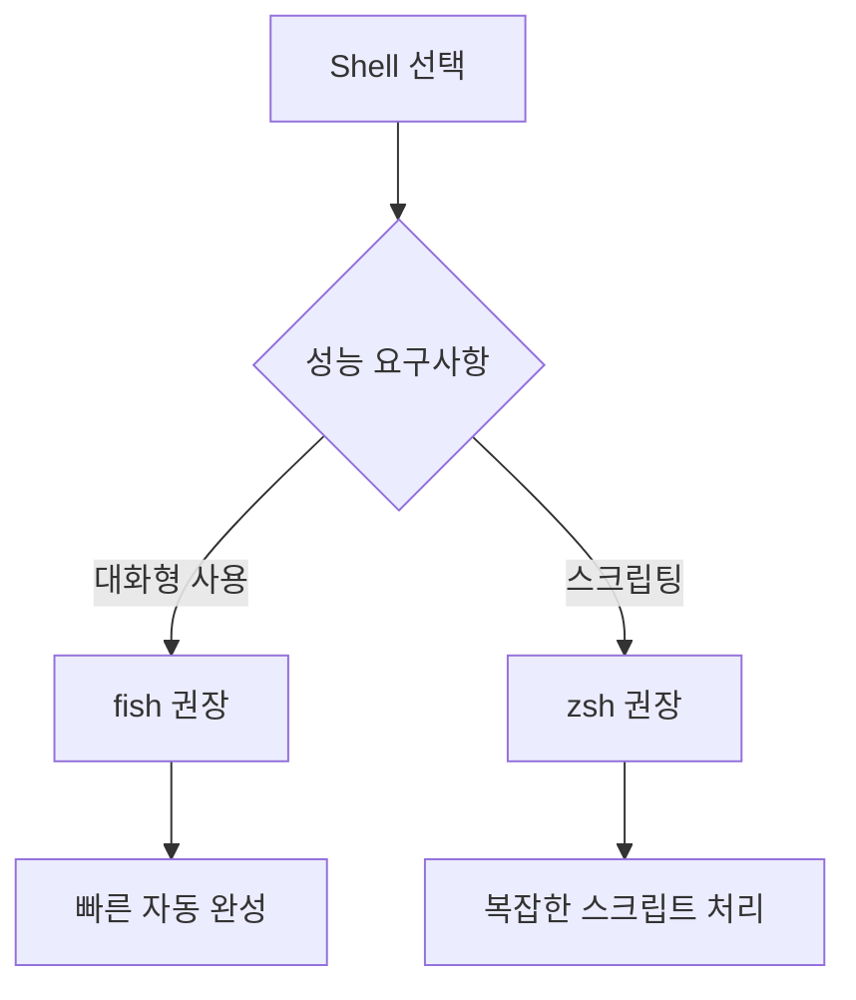

# Shell의 이해

Shell은 마치 레스토랑의 주방장과 같다. 주방장(Shell)은 손님(사용자)의 주문(명령어)을 받아 요리사(시스템)에게 전달하고, 완성된 요리(결과)를 손님에게 제공한다. zsh와 fish는 각각 다른 레시피북(문법)을 가진 주방장과 같다.

# 기본 문법 비교

```mermaid
graph TB
    subgraph zsh[zsh 문법]
        A1[변수 선언] --> B1[var='value']
        A2[배열] --> B2[array=(one two)]
        A3[조건문] --> B3[if [[ condition ]]]
    end
    
    subgraph fish[fish 문법]
        C1[변수 선언] --> D1[set var 'value']
        C2[배열] --> D2[set array one two]
        C3[조건문] --> D3[if test condition]
    end
```

## 변수 선언과 사용

zsh:
```zsh
# 변수 선언
name="홍길동"
echo $name
echo ${name}

# 배열
fruits=(apple banana orange)
echo $fruits[1]  # 1부터 시작
```

fish:
```fish
# 변수 선언
set name "홍길동"
echo $name

# 배열
set fruits apple banana orange
echo $fruits[1]  # 1부터 시작
```

## 조건문 비교

zsh:
```zsh
if [[ $age -gt 18 ]]; then
    echo "성인입니다"
else
    echo "미성년자입니다"
fi
```

fish:
```fish
if test $age -gt 18
    echo "성인입니다"
else
    echo "미성년자입니다"
end
```

# 주요 기능 차이



## 자동 완성 시스템

### zsh의 자동 완성
```zsh
# 플러그인 기반 자동 완성
source ~/.oh-my-zsh/custom/plugins/zsh-autosuggestions/zsh-autosuggestions.zsh

# 자동 완성 설정
autoload -Uz compinit
compinit
```

### fish의 자동 완성
```fish
# 기본적으로 활성화되어 있음
# 설정이 필요 없음
```

## 함수 정의

zsh:
```zsh
function 인사_하기() {
    echo "안녕하세요, $1님"
}

# 또는
인사_하기() {
    echo "안녕하세요, $1님"
}
```

fish:
```fish
function 인사_하기
    echo "안녕하세요, $argv[1]님"
end
```

# 실제 사용 시 차이점

## 1. 환경 설정



## 2. 스크립트 작성 예시

### 파일 검색 스크립트

zsh:
```zsh
#!/bin/zsh

# 재귀적 파일 검색
function 파일_찾기() {
    local 검색어=$1
    find . -type f -name "*${검색어}*" 2>/dev/null
}

파일_찾기 "test"
```

fish:
```fish
#!/usr/bin/env fish

# 재귀적 파일 검색
function 파일_찾기
    set 검색어 $argv[1]
    find . -type f -name "*$검색어*" 2>/dev/null
end

파일_찾기 "test"
```

# 장단점 비교

## zsh의 특징
- 장점:
  - POSIX 호환성이 높다
  - 풍부한 플러그인 생태계가 있다
  - 고급 글로빙 패턴을 지원한다
  - 기존 bash 스크립트와 호환성이 좋다

- 단점:
  - 초기 설정이 복잡하다
  - 플러그인 관리가 필요하다
  - 기본 상태의 기능이 제한적이다

## fish의 특징
- 장점:
  - 기본 설정이 사용하기 좋다
  - 구문 강조가 기본으로 제공된다
  - 설정이 간편하다
  - 웹 기반 설정 도구가 있다

- 단점:
  - POSIX 호환성이 낮다
  - 기존 bash/zsh 스크립트 실행이 어렵다
  - 플러그인 생태계가 상대적으로 작다

# 성능 고려사항



# 결론

Shell 선택은 사용 목적에 따라 달라진다:
- 스크립트 작성이 주 목적이라면 zsh가 적합하다
- 대화형 사용이 주 목적이라면 fish가 적합하다
- 두 Shell 모두 현대적인 기능을 제공하지만, 각각의 장단점이 있다

초보자는 fish로 시작하여 Shell의 개념을 익히고, 이후 더 복잡한 스크립팅이 필요할 때 zsh로 전환하는 것을 고려할 수 있다.