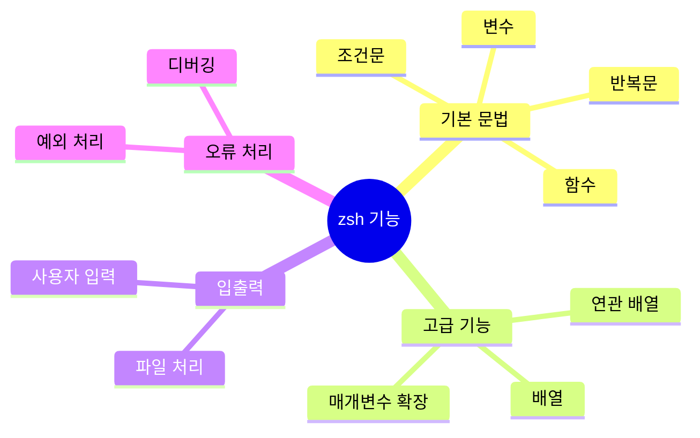
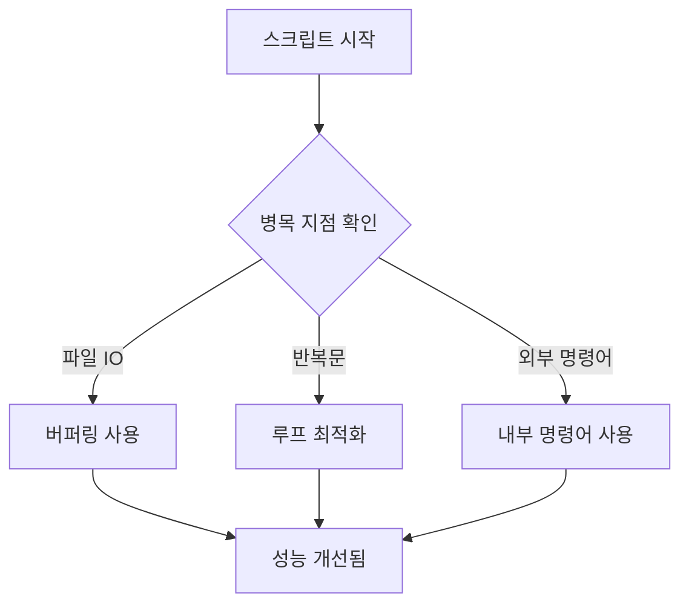
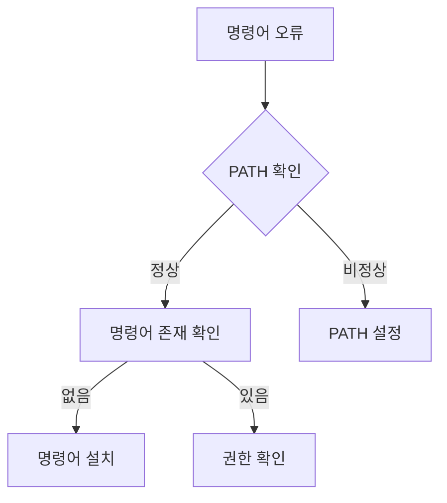

> [!info]
> [[zsh vs fish]]
> [[zsh 문법]]
# 개요

Shell script는 주방에서 요리 레시피와 같다. 여러 재료(명령어)를 순서대로 조합하여 원하는 결과물을 만들어내는 과정을 자동화한다. zsh는 이러한 Shell script 중에서도 현대적이고 강력한 기능을 제공하는 도구이다.

# 기본 개념


Shell script의 실행 과정은 다음과 같다:
1. 사용자가 명령어를 입력한다
2. Shell이 입력을 해석한다
3. 해당하는 명령어를 실행한다
4. 결과를 출력한다

# 기본 문법 구조

## 올바른 스크립트 구조
```zsh
#!/bin/zsh

# 스크립트 설명을 작성한다
# 작성자: 
# 작성일: 

# 변수는 의미 있는 이름으로 작성한다
사용자_이름="홍길동"

# 함수는 동사로 시작하는 이름을 사용한다
function 인사_출력() {
    echo "안녕하세요, ${사용자_이름}님"
}

# 메인 로직을 작성한다
인사_출력
```

## 잘못된 구조
```zsh
#!/bin/zsh
name="홍길동"
function hi() {
    echo "hi, $name"   # 변수명이 의미를 전달하지 못함
}
hi                    # 주석이 없어 코드의 목적을 알기 어려움
```

# 주요 기능 설명



# 단계별 학습 과정

## 1단계: 기본 명령어
```zsh
# 기본 출력
echo "Hello, World"

# 변수 사용
이름="홍길동"
echo "안녕하세요, ${이름}님"
```

## 2단계: 조건문과 반복문
```zsh
# if 문 사용
if [[ ${나이} -gt 18 ]]; then
    echo "성인입니다"
else
    echo "미성년자입니다"
fi

# for 반복문
for 숫자 in {1..5}; do
    echo "현재 숫자: ${숫자}"
done
```

## 3단계: 함수 작성
```zsh
function 합계_계산() {
    local 첫번째_숫자=$1
    local 두번째_숫자=$2
    echo $((첫번째_숫자 + 두번째_숫자))
}

결과=$(합계_계산 5 3)
```

# 성능 최적화



# 보안 고려사항

1. 입력 검증
```zsh
# 잘못된 방식
rm -rf $사용자_입력   # 검증되지 않은 입력 사용

# 올바른 방식
if [[ ${사용자_입력} =~ ^[a-zA-Z0-9_-]+$ ]]; then
    rm -rf "${사용자_입력}"
else
    echo "잘못된 입력입니다"
fi
```

2. 권한 관리
```zsh
# 실행 권한 설정
chmod 700 스크립트.sh  # 소유자만 실행 가능
```

# 실전 예제: 로그 분석기

```zsh
#!/bin/zsh

# 로그 파일에서 특정 패턴을 검색하고 결과를 정리하는 스크립트
function 로그_분석() {
    local 로그_파일=$1
    local 검색어=$2
    
    # 파일 존재 여부 확인
    if [[ ! -f ${로그_파일} ]]; then
        echo "로그 파일이 존재하지 않습니다"
        return 1
    }
    
    # 로그 분석 수행
    echo "=== 분석 결과 ==="
    grep -i "${검색어}" "${로그_파일}" | \
        awk '{print $1, $4}' | \
        sort | uniq -c | \
        sort -rn | head -n 10
}

# 스크립트 실행
로그_분석 "access.log" "error"
```

# 문제 해결 가이드

## 일반적인 문제점

1. 명령어를 찾을 수 없음


2. 권한 문제
```zsh
# 문제 확인
ls -l 스크립트.sh

# 권한 수정
chmod +x 스크립트.sh
```

# 결론

zsh 쉘 스크립트는 시스템 관리와 자동화에 강력한 도구이다. 기본 문법부터 시작하여 점진적으로 고급 기능을 학습하면서, 실제 업무에 적용할 수 있는 스크립트를 작성하는 것이 중요하다. 보안과 성능을 고려한 스크립트 작성은 필수적이며, 지속적인 개선과 문서화를 통해 유지보수가 용이한 스크립트를 만들어야 한다.