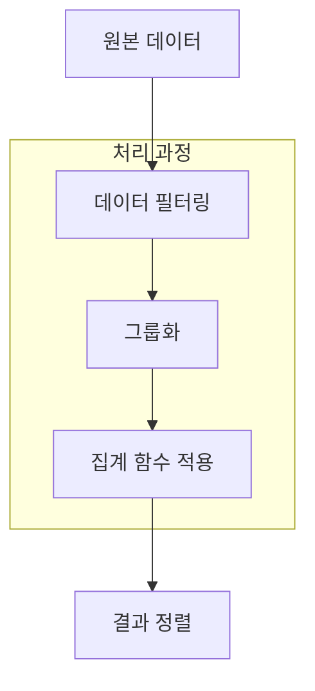

```table-of-contents
title: # 목차
style: nestedList # TOC style (nestedList|nestedOrderedList|inlineFirstLevel)
minLevel: 0 # Include headings from the specified level
maxLevel: 5 # Include headings up to the specified level
includeLinks: true # Make headings clickable
hideWhenEmpty: false # Hide TOC if no headings are found
debugInConsole: false # Print debug info in Obsidian console
```
SQL GROUP BY: 데이터를 의미 있게 묶어내는 기술

# 개념 이해하기

GROUP BY는 마치 카드게임에서 같은 무늬의 카드를 모으는 것과 같다. 예를 들어, 수많은 거래 데이터가 있을 때 고객별로 구매금액을 합산하거나, 월별로 매출을 집계하는 등의 작업을 할 수 있다. 실생활에서는 도서관에서 책을 장르별로 분류하거나, 학교에서 학년별로 학생들을 나누는 것과 비슷하다.

## 필요한 배경 지식
- SQL SELECT 문의 기본 구문 이해
- 집계 함수(SUM, COUNT, AVG 등)의 개념
- WHERE 절을 통한 조건 필터링

# 기본 동작 방식



## GROUP BY의 기본 구조
```sql
-- 기본적인 GROUP BY 구문
SELECT 
    category,              -- 그룹화 기준 컬럼
    COUNT(*) as count,     -- 레코드 수 집계
    SUM(amount) as total,  -- 금액 합계
    AVG(amount) as avg     -- 평균 금액
FROM 
    transactions
WHERE 
    transaction_date >= '2024-01-01'  -- 필터링 조건
GROUP BY 
    category              -- 그룹화 기준
HAVING 
    COUNT(*) > 10         -- 그룹 필터링 조건
ORDER BY 
    total DESC;           -- 정렬
```

# 실제 활용 사례

## 시간별 데이터 분석
```sql
-- 월별 매출 분석
SELECT 
    DATE_TRUNC('month', sale_date) as sales_month,
    COUNT(DISTINCT customer_id) as unique_customers,
    SUM(sale_amount) as total_sales,
    ROUND(AVG(sale_amount), 2) as avg_sale,
    COUNT(*) as transaction_count
FROM 
    sales
GROUP BY 
    DATE_TRUNC('month', sale_date)
ORDER BY 
    sales_month;
```

## 다중 컬럼 그룹화
```sql
-- 지역과 상품 카테고리별 매출 분석
SELECT 
    region,
    product_category,
    SUM(sale_amount) as total_sales,
    COUNT(*) as sale_count,
    ROUND(AVG(sale_amount), 2) as avg_sale
FROM 
    sales s
    JOIN products p ON s.product_id = p.id
    JOIN stores st ON s.store_id = st.id
GROUP BY 
    region,
    product_category
HAVING 
    COUNT(*) >= 100  -- 100건 이상 거래가 있는 그룹만 선택
ORDER BY 
    region,
    total_sales DESC;
```

# 고급 활용 기법

## ROLLUP을 활용한 소계 계산
```sql
-- 부서별, 직급별 급여 분석
SELECT 
    COALESCE(department, '전체') as department,
    COALESCE(position, '전체') as position,
    COUNT(*) as employee_count,
    SUM(salary) as total_salary,
    ROUND(AVG(salary), 2) as avg_salary
FROM 
    employees
GROUP BY 
    ROLLUP(department, position)
ORDER BY 
    department,
    position;
```

## CUBE를 활용한 다차원 분석
```sql
-- 지역, 제품, 시간별 매출 분석
SELECT 
    COALESCE(region, '전체') as region,
    COALESCE(product_type, '전체') as product_type,
    COALESCE(TO_CHAR(sale_date, 'YYYY'), '전체') as year,
    SUM(amount) as total_sales
FROM 
    sales
GROUP BY 
    CUBE(region, product_type, TO_CHAR(sale_date, 'YYYY'))
ORDER BY 
    region,
    product_type,
    year;
```

# 성능 최적화

## 인덱스 전략
```sql
-- 그룹화 컬럼에 대한 인덱스 생성
CREATE INDEX idx_sales_group ON sales(
    region,
    product_category,
    sale_date
);
```

## 실행 계획 분석
```sql
-- 실행 계획 확인
EXPLAIN ANALYZE
SELECT 
    product_category,
    COUNT(*) as sales_count
FROM 
    sales
GROUP BY 
    product_category;
```

# 주의사항과 제한사항

1. GROUP BY 규칙
- SELECT 절에 있는 모든 일반 컬럼은 GROUP BY 절에 포함되어야 한다
- 집계 함수를 사용하지 않은 컬럼은 그룹화 기준이 되어야 한다
- HAVING 절은 그룹화된 결과에 대한 필터링에만 사용한다

2. 성능 고려사항
- 대용량 데이터의 그룹화는 메모리 사용량이 많다
- 적절한 인덱스 설정이 중요하다
- 그룹화 컬럼 수가 많아질수록 성능이 저하될 수 있다

# GROUP BY와 윈도우 함수의 조합

```sql
-- 카테고리별 매출과 전체 대비 비율 계산
SELECT 
    category,
    SUM(amount) as category_sales,
    COUNT(*) as transaction_count,
    ROUND(
        SUM(amount) * 100.0 / 
        SUM(SUM(amount)) OVER (), 
        2
    ) as sales_percentage
FROM 
    sales
GROUP BY 
    category
ORDER BY 
    category_sales DESC;
```

# 실무 활용 예제

## 시계열 데이터 분석
```sql
-- 일별 매출 추이와 이동평균 계산
SELECT 
    sale_date,
    SUM(amount) as daily_sales,
    ROUND(
        AVG(SUM(amount)) OVER (
            ORDER BY sale_date
            ROWS BETWEEN 6 PRECEDING AND CURRENT ROW
        ),
        2
    ) as moving_avg_7days
FROM 
    sales
GROUP BY 
    sale_date
ORDER BY 
    sale_date;
```

## 구간별 분석
```sql
-- 가격대별 제품 분포 분석
SELECT 
    CASE 
        WHEN price < 1000 THEN '1000 미만'
        WHEN price < 5000 THEN '1000-5000'
        WHEN price < 10000 THEN '5000-10000'
        ELSE '10000 이상'
    END as price_range,
    COUNT(*) as product_count,
    ROUND(AVG(price), 2) as avg_price
FROM 
    products
GROUP BY 
    CASE 
        WHEN price < 1000 THEN '1000 미만'
        WHEN price < 5000 THEN '1000-5000'
        WHEN price < 10000 THEN '5000-10000'
        ELSE '10000 이상'
    END
ORDER BY 
    price_range;
```

# 결론

GROUP BY는 데이터 분석에서 필수적인 도구이며, 다음과 같은 점들을 기억해야 한다:

1. 명확한 그룹화 기준 설정이 중요하다
2. 적절한 집계 함수를 선택해야 한다
3. 성능을 고려한 인덱스 설계가 필요하다
4. HAVING 절을 통한 그룹 필터링을 적절히 활용해야 한다

올바른 GROUP BY 사용은 데이터에서 의미 있는 인사이트를 도출하는 핵심 기술이다. 기본 개념을 잘 이해하고 다양한 활용 방법을 익힌다면, 더욱 효과적인 데이터 분석이 가능할 것이다.