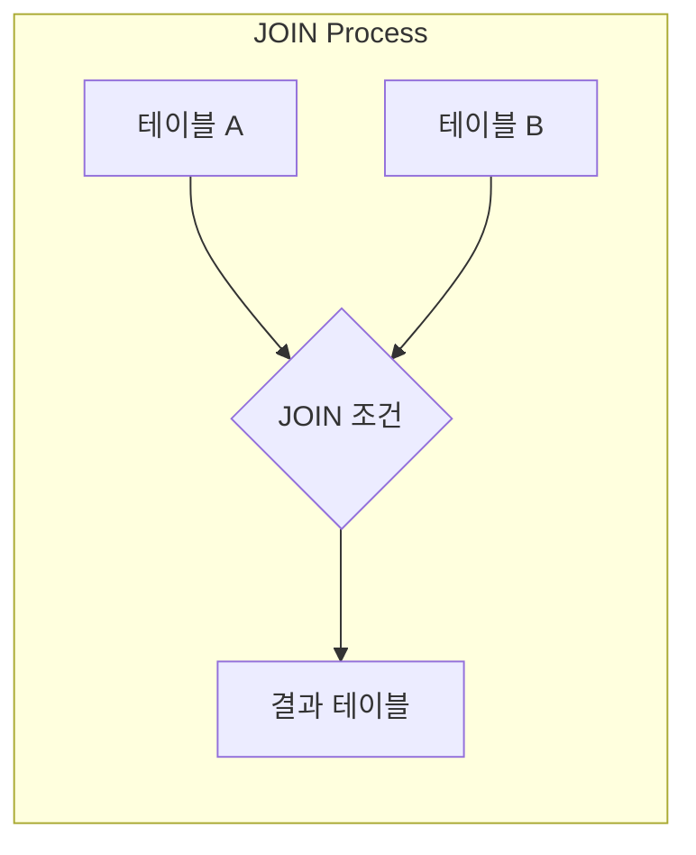
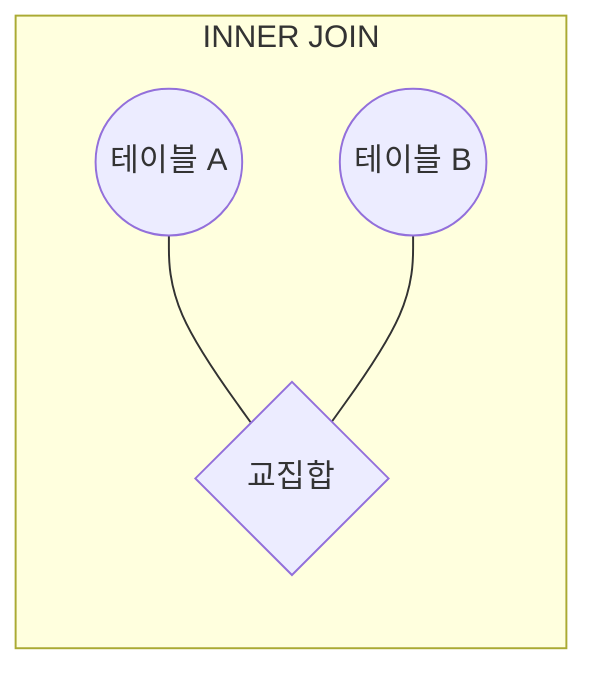
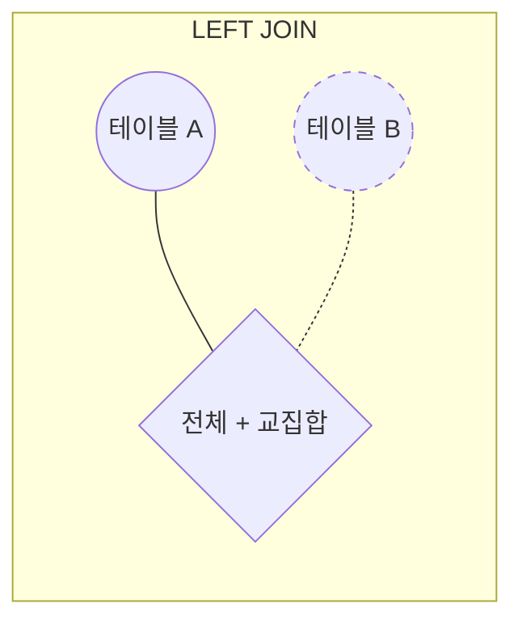
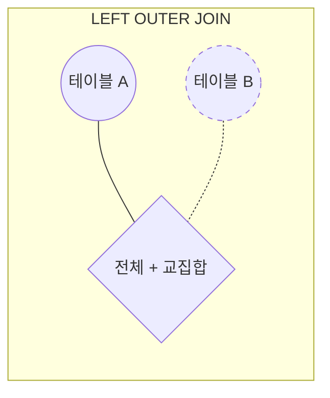
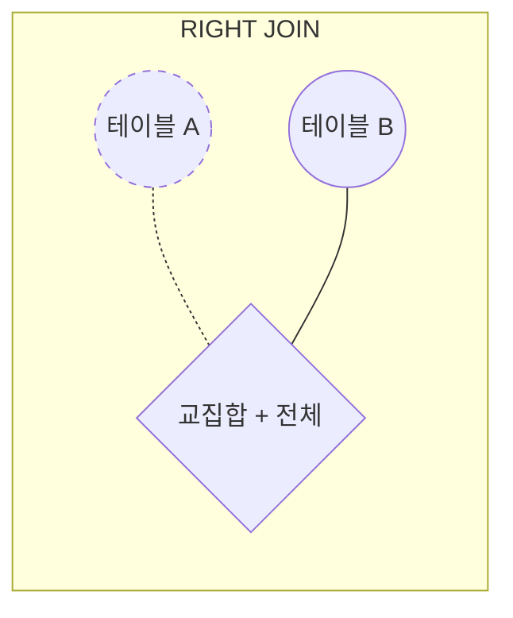
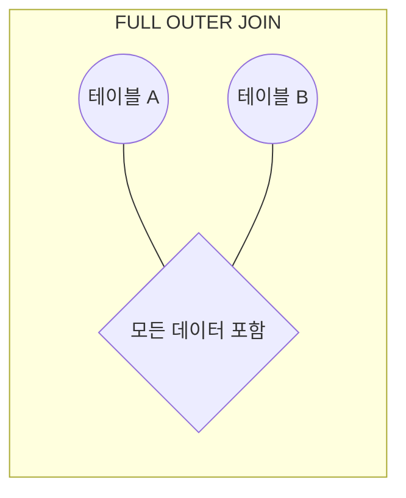

```table-of-contents
title: # 목차
style: nestedList # TOC style (nestedList|nestedOrderedList|inlineFirstLevel)
minLevel: 0 # Include headings from the specified level
maxLevel: 5 # Include headings up to the specified level
includeLinks: true # Make headings clickable
hideWhenEmpty: false # Hide TOC if no headings are found
debugInConsole: false # Print debug info in Obsidian console
```
# 개념 이해하기

데이터베이스에서 JOIN은 마치 퍼즐 조각을 맞추는 것과 같다. 서로 다른 테이블에 흩어져 있는 정보를 하나로 합쳐서 의미 있는 정보를 만들어내는 과정이다. 실생활에서 예를 들면, 학교 행정실에서 학생들의 성적표를 만들 때 학생 기본정보(학생 테이블)와 시험 점수(성적 테이블)를 결합하는 것과 같다.

# 필요한 배경 지식

JOIN을 제대로 이해하고 활용하기 위해서는 다음과 같은 기본 지식이 필요하다:

1. 관계형 데이터베이스의 기본 개념
   - 테이블 구조와 관계
   - 데이터 타입과 제약조건
   - 정규화의 개념

2. PRIMARY KEY와 FOREIGN KEY
   - 각 테이블의 고유 식별자
   - 테이블 간의 관계 설정
   - 참조 무결성

3. 기본적인 SELECT 문
   - WHERE 절을 통한 필터링
   - ORDER BY를 통한 정렬
   - GROUP BY를 통한 집계

# JOIN의 기본 동작 방식

JOIN은 다음과 같은 프로세스로 동작한다:



# 테이블 구조와 데이터 이해

## students 테이블 (학생 기본 정보)

```sql
CREATE TABLE students (
    student_id INT PRIMARY KEY,    -- 학생 고유 번호
    student_name VARCHAR(50),      -- 학생 이름
    grade_level INT,              -- 학년
    class_id INT                  -- 반 번호
);
```

### students 테이블의 실제 데이터
| student_id | student_name | grade_level | class_id |
|------------|--------------|-------------|----------|
| 1          | 김철수       | 1           | 101      |
| 2          | 이영희       | 1           | 101      |
| 3          | 박민수       | 2           | 201      |
| 4          | 정미경       | 2           | 201      |
| 5          | 홍길동       | 1           | 102      |

## grades 테이블 (학생 성적 정보)

```sql
CREATE TABLE grades (
    grade_id INT PRIMARY KEY,     -- 성적 고유 번호
    student_id INT,              -- 학생 번호 (students 테이블 연결)
    subject VARCHAR(50),         -- 과목명
    score INT,                   -- 점수
    FOREIGN KEY (student_id) REFERENCES students(student_id)
);
```

### grades 테이블의 실제 데이터
| grade_id | student_id | subject | score |
|----------|------------|---------|--------|
| 1        | 1          | 수학    | 85     |
| 2        | 1          | 영어    | 92     |
| 3        | 2          | 수학    | 78     |
| 4        | 3          | 영어    | 95     |
| 5        | 3          | 수학    | 88     |
| 6        | 5          | 영어    | 82     |

# JOIN의 종류와 특징

## INNER JOIN
두 테이블에서 매칭되는 데이터만 가져온다. 마치 두 원이 겹치는 부분만 선택하는 것과 같다.



```sql
-- 학생과 성적 정보를 결합하는 INNER JOIN
SELECT 
    s.student_id,
    s.student_name,
    g.subject,
    g.score
FROM 
    students s
    INNER JOIN grades g ON s.student_id = g.student_id
WHERE 
    g.score >= 80  -- 80점 이상인 성적만 조회
ORDER BY 
    s.student_id,
    g.subject;
```

### INNER JOIN 실행 결과
| student_name | subject | score |
|--------------|---------|--------|
| 김철수       | 수학    | 85     |
| 김철수       | 영어    | 92     |
| 박민수       | 수학    | 88     |
| 박민수       | 영어    | 95     |
| 홍길동       | 영어    | 82     |

## LEFT JOIN
왼쪽 테이블의 모든 데이터를 가져오고, 오른쪽 테이블은 매칭되는 데이터만 가져온다.



```sql
-- 모든 학생의 성적 정보 조회 (성적이 없는 학생도 포함)
SELECT 
    s.student_name, 
    COALESCE(g.subject, '미응시') as subject,
    COALESCE(g.score, 0) as score
FROM 
    students s
    LEFT JOIN grades g ON s.student_id = g.student_id
ORDER BY 
    s.student_id,
    g.subject;
```

### LEFT JOIN 실행 결과
| student_name | subject | score |
|--------------|---------|--------|
| 김철수       | 수학    | 85     |
| 김철수       | 영어    | 92     |
| 이영희       | 수학    | 78     |
| 박민수       | 수학    | 88     |
| 박민수       | 영어    | 95     |
| 정미경       | 미응시  | 0      |
| 홍길동       | 영어    | 82     |

# JOIN의 종류와 특징

## OUTER JOIN 개요
OUTER JOIN은 두 테이블을 결합할 때 매칭되지 않는 데이터도 결과에 포함시키고자 할 때 사용한다. LEFT OUTER JOIN, RIGHT OUTER JOIN, FULL OUTER JOIN의 세 가지 유형이 있으며, 각각의 특성에 따라 적절히 선택하여 사용할 수 있다.

## LEFT OUTER JOIN
LEFT OUTER JOIN은 왼쪽 테이블의 모든 데이터를 포함하고, 오른쪽 테이블은 매칭되는 데이터만 가져온다. 보통 'LEFT JOIN'으로 줄여서 표현한다.



```sql
-- 모든 학생의 성적 정보 조회 (성적이 없는 학생도 포함)
SELECT 
    s.student_name, 
    COALESCE(g.subject, '미응시') as subject,
    COALESCE(g.score, 0) as score
FROM 
    students s
    LEFT OUTER JOIN grades g ON s.student_id = g.student_id
ORDER BY 
    s.student_id,
    g.subject;
```

### LEFT OUTER JOIN 실행 결과
| student_name | subject | score |
|--------------|---------|--------|
| 김철수       | 수학    | 85     |
| 김철수       | 영어    | 92     |
| 이영희       | 수학    | 78     |
| 박민수       | 수학    | 88     |
| 박민수       | 영어    | 95     |
| 정미경       | 미응시  | 0      |
| 홍길동       | 영어    | 82     |

## RIGHT JOIN
오른쪽 테이블의 모든 데이터를 가져오고, 왼쪽 테이블은 매칭되는 데이터만 가져온다.



```sql
-- 모든 성적 데이터를 기준으로 학생 정보 조회
SELECT 
    COALESCE(s.student_name, '미등록 학생') as student_name,
    g.subject,
    g.score
FROM 
    students s
    RIGHT JOIN grades g ON s.student_id = g.student_id
ORDER BY 
    g.grade_id;
```

### RIGHT JOIN 실행 결과
| student_name | subject | score |
|--------------|---------|--------|
| 김철수       | 수학    | 85     |
| 김철수       | 영어    | 92     |
| 이영희       | 수학    | 78     |
| 박민수       | 영어    | 95     |
| 박민수       | 수학    | 88     |
| 홍길동       | 영어    | 82     |

## RIGHT OUTER JOIN
RIGHT OUTER JOIN은 오른쪽 테이블의 모든 데이터를 포함하고, 왼쪽 테이블은 매칭되는 데이터만 가져온다. 보통 'RIGHT JOIN'으로 줄여서 표현한다.

```sql
-- 모든 성적 데이터를 기준으로 학생 정보 조회 (성적은 있으나 학생 정보가 없는 경우도 포함)
SELECT 
    COALESCE(s.student_name, '미등록 학생') as student_name,
    g.subject,
    g.score
FROM 
    students s
    RIGHT OUTER JOIN grades g ON s.student_id = g.student_id
ORDER BY 
    g.grade_id;
```

## FULL OUTER JOIN
FULL OUTER JOIN은 양쪽 테이블의 모든 데이터를 포함한다. 매칭되는 데이터가 없는 경우에도 결과에 포함된다.



```sql
-- 모든 학생과 모든 성적 데이터를 조회 (매칭되지 않는 데이터도 모두 포함)
SELECT 
    COALESCE(s.student_name, '미등록 학생') as student_name,
    COALESCE(g.subject, '미응시') as subject,
    COALESCE(g.score, 0) as score
FROM 
    students s
    FULL OUTER JOIN grades g ON s.student_id = g.student_id
ORDER BY 
    s.student_id,
    g.subject;
```

### FULL OUTER JOIN의 특별한 활용
FULL OUTER JOIN은 데이터 불일치를 찾는 데 특히 유용하다. 예를 들어, 학생 정보는 있으나 성적이 없는 경우나, 성적은 있으나 학생 정보가 없는 비정상적인 케이스를 찾을 수 있다.

```sql
-- 데이터 불일치 케이스 찾기
SELECT 
    COALESCE(s.student_name, '미등록 학생') as student_name,
    COALESCE(g.subject, '성적 없음') as subject,
    COALESCE(g.score, 0) as score
FROM 
    students s
    FULL OUTER JOIN grades g ON s.student_id = g.student_id
WHERE 
    s.student_id IS NULL OR g.student_id IS NULL;
```

## OUTER JOIN 사용 시 주의사항

1. NULL 값 처리
   - OUTER JOIN 사용 시에는 NULL 값이 발생할 수 있으므로, COALESCE나 CASE 문을 활용하여 적절히 처리한다.
   - NULL 값의 의미를 업무 로직에 맞게 해석해야 한다.

2. 성능 고려사항
   - OUTER JOIN은 INNER JOIN보다 일반적으로 더 많은 리소스를 사용한다.
   - 불필요한 OUTER JOIN은 피하고, 꼭 필요한 경우에만 사용한다.

3. 데이터 정합성
   - OUTER JOIN 결과의 레코드 수가 예상과 일치하는지 확인한다.
   - 중복 데이터가 발생하지 않도록 주의한다.

# 고급 활용법

## 다중 테이블 JOIN
세 개 이상의 테이블을 결합하여 복잡한 정보를 조회할 수 있다.

```sql
-- 학생, 성적, 교사 정보를 결합하는 복합 JOIN
SELECT 
    s.student_name,
    c.class_name,
    t.teacher_name,
    g.subject,
    g.score
FROM 
    students s
    INNER JOIN classes c ON s.class_id = c.class_id
    INNER JOIN teachers t ON c.teacher_id = t.teacher_id
    LEFT JOIN grades g ON s.student_id = g.student_id
WHERE 
    c.academic_year = '2024'
ORDER BY 
    s.student_name,
    g.subject;
```

## 서브쿼리를 활용한 JOIN

```sql
-- 성적이 과목별 평균 이상인 학생만 조회
SELECT 
    s.student_name,
    g.subject,
    g.score,
    avg_scores.avg_score
FROM 
    students s
    INNER JOIN grades g ON s.student_id = g.student_id
    INNER JOIN (
        SELECT 
            subject,
            AVG(score) as avg_score
        FROM grades
        GROUP BY subject
    ) avg_scores ON g.subject = avg_scores.subject
WHERE 
    g.score >= avg_scores.avg_score
ORDER BY 
    s.student_name,
    g.subject;
```

# 성능 최적화

## JOIN 최적화를 위한 인덱스 설정

```sql
-- JOIN 컬럼에 대한 인덱스 생성
CREATE INDEX idx_student_id ON grades(student_id);
CREATE INDEX idx_class_id ON students(class_id);
```

## 실행 계획 분석

```sql
-- 실행 계획 확인
EXPLAIN ANALYZE
SELECT 
    s.student_name,
    g.score
FROM 
    students s
    INNER JOIN grades g ON s.student_id = g.student_id;
```

# 주의사항

## 데이터 정합성
1. JOIN 전후의 데이터 건수를 반드시 확인한다.
2. NULL 값 처리에 특별한 주의가 필요하다.
3. 중복 데이터 발생 가능성을 고려한다.

## 성능 관련 주의사항
1. 불필요한 JOIN은 피한다.
2. 적절한 인덱스를 사용한다.
3. 대용량 데이터 JOIN 시 성능 테스트를 수행한다.

# Security 고려사항

1. JOIN 시 민감한 데이터 노출 방지
   - 불필요한 컬럼은 SELECT 하지 않는다
   - 권한이 있는 사용자만 접근 가능하도록 설정한다

2. SQL Injection 방지
   - 파라미터 바인딩을 사용한다
   - 동적 SQL 생성을 피한다

# 결론

SQL JOIN은 데이터베이스에서 가장 강력하고 중요한 기능 중 하나이다. 올바른 JOIN 사용을 위해서는:

1. 각 JOIN 유형의 특성을 정확히 이해해야 한다
2. 데이터 모델을 충분히 파악해야 한다
3. 성능과 데이터 정합성을 항상 고려해야 한다
4. 실행 계획과 인덱스 활용을 최적화해야 한다

이러한 원칙들을 잘 지키면서 실제 업무에 적용한다면, 더욱 효율적이고 안정적인 데이터베이스 운영이 가능할 것이다.