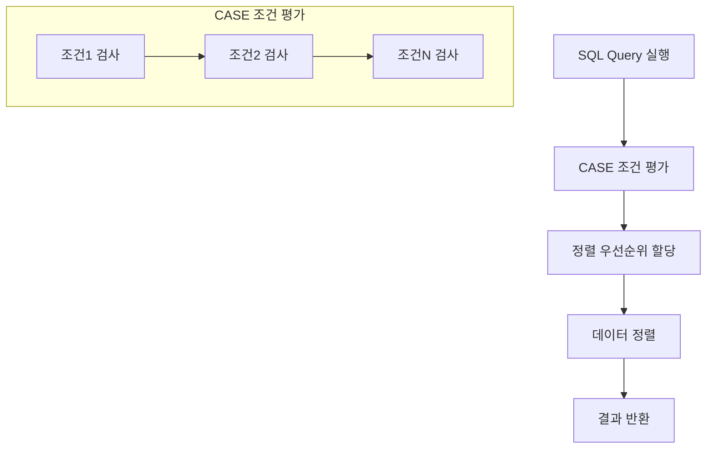
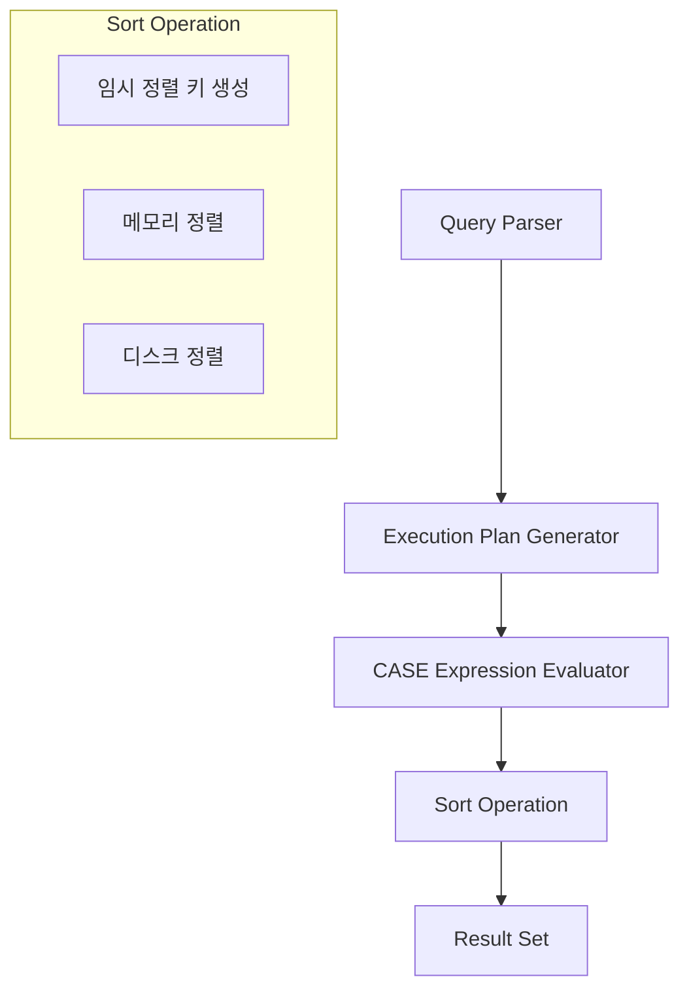

ORDER BY CASE는 SQL Query에서 복잡한 정렬 로직을 구현하기 위한 기능이다. 마치 도서관에서 책을 1) 대출 빈도 2) 출판일자 3) 저자 이름 순으로 정렬하는 것처럼, 여러 조건에 따른 우선순위 기반 정렬을 구현할 수 있다.

## 기본 동작 방식


## 구현
```sql
-- 예제를 위한 테이블 생성
CREATE TABLE orders (
    id INT PRIMARY KEY,
    status VARCHAR(20),
    priority INT,
    created_at TIMESTAMP
);

-- 인덱스 생성 (성능 최적화)
CREATE INDEX idx_status_priority ON orders(status, priority);
```

## 단계별 구현

### 1. 기본 구현
```sql
-- 기본적인 ORDER BY CASE 구현
-- 주문 상태에 따른 우선순위 정렬
SELECT 
    id,
    status,
    priority
FROM orders
ORDER BY
    CASE status
        WHEN 'URGENT' THEN 1    -- 긴급 주문 최우선
        WHEN 'PENDING' THEN 2   -- 대기 주문 다음
        WHEN 'PROCESSING' THEN 3 -- 처리중 주문
        ELSE 4                  -- 기타 상태
    END;
```

### 2. 복합 조건 구현
```sql
-- 상태와 우선순위를 결합한 정렬
SELECT 
    id,
    status,
    priority,
    created_at
FROM orders
ORDER BY
    CASE 
        WHEN status = 'URGENT' AND priority > 5 THEN 1
        WHEN status = 'URGENT' THEN 2
        WHEN status = 'PENDING' AND priority > 5 THEN 3
        WHEN status = 'PENDING' THEN 4
        ELSE 5
    END,
    created_at DESC;  -- 동일 우선순위 내에서는 최신 순
```

## Best Practices

### 성능 최적화
```sql
-- 잘못된 예시: 함수 호출을 포함한 CASE
SELECT *
FROM orders
ORDER BY
    CASE 
        WHEN DATEDIFF(NOW(), created_at) > 30 THEN 1
        ELSE 2
    END;

-- 올바른 예시: 계산을 미리 수행
WITH order_ages AS (
    SELECT 
        *,
        DATEDIFF(NOW(), created_at) as age_days
    FROM orders
)
SELECT *
FROM order_ages
ORDER BY
    CASE 
        WHEN age_days > 30 THEN 1
        ELSE 2
    END;
```

## 시스템 아키텍처


## 성능 고려사항
1. 인덱스 활용
   - CASE 문 내부 조건이 인덱스를 활용할 수 있도록 설계한다
   - 복합 인덱스 생성 시 자주 사용되는 정렬 조건을 우선한다

5. 메모리 사용
   - 대용량 데이터 정렬 시 임시 테이블 사용을 고려한다
   - ORDER BY 절의 복잡도가 높을수록 메모리 사용량이 증가한다
