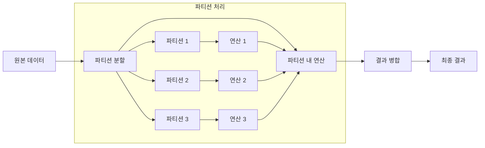

```table-of-contents
title: # 목차
style: nestedList # TOC style (nestedList|nestedOrderedList|inlineFirstLevel)
minLevel: 0 # Include headings from the specified level
maxLevel: 5 # Include headings up to the specified level
includeLinks: true # Make headings clickable
hideWhenEmpty: false # Hide TOC if no headings are found
debugInConsole: false # Print debug info in Obsidian console
```
# 개념 이해하기

PARTITION BY는 마치 학교에서 학년별로 학생들을 나누고, 각 학년 내에서 성적 순위를 매기는 것과 같다. 전체 학교 차원에서의 순위가 아닌, 학년이라는 그룹 내에서의 순위를 구할 수 있는 것이다. 실생활에서는 백화점의 각 층별 매출 분석이나, 지역별 날씨 통계를 계산하는 것과 유사하다.

# 기본 동작 방식



# PARTITION BY vs GROUP BY 비교

PARTITION BY와 GROUP BY는 비슷해 보이지만 중요한 차이가 있다. 택시 회사를 예로 들어보자:

```sql
-- GROUP BY: 지역별 총 매출만 보여줌
SELECT 
    region,
    SUM(fare_amount) as total_fares
FROM taxi_trips
GROUP BY region;

-- PARTITION BY: 각 운행의 매출과 지역별 총 매출을 함께 보여줌
SELECT 
    trip_id,
    region,
    fare_amount,
    SUM(fare_amount) OVER (PARTITION BY region) as region_total
FROM taxi_trips;
```

# 실제 활용 사례

## 부서별 급여 분석
```sql
-- 각 직원의 급여와 부서 내 통계를 함께 분석
SELECT 
    employee_name,
    department,
    salary,
    -- 부서별 평균 급여
    ROUND(AVG(salary) OVER (PARTITION BY department), 2) as dept_avg,
    -- 부서 내 급여 순위
    RANK() OVER (PARTITION BY department ORDER BY salary DESC) as salary_rank,
    -- 부서 내 급여 비율
    ROUND(salary * 100.0 / SUM(salary) OVER (PARTITION BY department), 2) as salary_ratio
FROM employees
ORDER BY 
    department,
    salary DESC;
```

## 시계열 데이터 분석
```sql
-- 제품별 월간 매출 추이 분석
SELECT 
    sale_date,
    product_name,
    sales_amount,
    -- 제품별 3개월 이동평균
    ROUND(AVG(sales_amount) OVER (
        PARTITION BY product_name
        ORDER BY sale_date
        ROWS BETWEEN 2 PRECEDING AND CURRENT ROW
    ), 2) as moving_avg,
    -- 제품별 전월 대비 성장률
    ROUND((sales_amount - LAG(sales_amount) OVER (
        PARTITION BY product_name
        ORDER BY sale_date
    )) * 100.0 / NULLIF(LAG(sales_amount) OVER (
        PARTITION BY product_name
        ORDER BY sale_date
    ), 0), 2) as growth_rate
FROM monthly_sales
ORDER BY 
    product_name,
    sale_date;
```

# 고급 활용 기법

## 다중 파티션
```sql
-- 지역별, 제품 카테고리별 매출 분석
SELECT 
    region,
    category,
    sales_amount,
    -- 지역 내 카테고리별 매출 비중
    ROUND(sales_amount * 100.0 / SUM(sales_amount) OVER (
        PARTITION BY region
    ), 2) as region_sales_ratio,
    -- 카테고리 내 지역별 매출 비중
    ROUND(sales_amount * 100.0 / SUM(sales_amount) OVER (
        PARTITION BY category
    ), 2) as category_sales_ratio
FROM sales_data;
```

## 누적 계산
```sql
-- 고객별 누적 구매액 계산
SELECT 
    customer_id,
    order_date,
    order_amount,
    -- 고객별 누적 구매액
    SUM(order_amount) OVER (
        PARTITION BY customer_id
        ORDER BY order_date
        ROWS UNBOUNDED PRECEDING
    ) as customer_total,
    -- 전체 고객 대비 구매 비중
    ROUND(order_amount * 100.0 / SUM(order_amount) OVER (), 2) as total_ratio
FROM customer_orders;
```

# 성능 최적화

## 파티션 크기 관리
```sql
-- 파티션 크기 분석
SELECT 
    department,
    COUNT(*) as partition_size,
    MIN(salary) as min_salary,
    MAX(salary) as max_salary,
    ROUND(AVG(salary), 2) as avg_salary
FROM employees
GROUP BY department
ORDER BY partition_size DESC;
```

## 인덱스 전략
```sql
-- 파티션 키에 대한 인덱스 생성
CREATE INDEX idx_partition_sort ON sales(
    region,
    category,
    sale_date
);
```

# 주의사항과 모범 사례

1. 파티션 크기 고려
- 너무 작은 파티션은 오버헤드 발생
- 너무 큰 파티션은 메모리 사용량 증가
- 적절한 파티션 크기 설정 필요

2. 정렬 기준 선택
- ORDER BY 절의 컬럼 선택이 중요
- NULL 값 처리 방식 결정 필요
- 인덱스 활용 가능성 고려

3. 윈도우 프레임 설정
- ROWS와 RANGE의 차이 이해
- 적절한 프레임 크기 설정
- 경계값 처리 방식 결정

# 실무 활용 예제

## 고객 세그먼테이션
```sql
-- RFM 분석을 통한 고객 분류
SELECT 
    customer_id,
    -- Recency: 최근 구매일
    MAX(order_date) as last_order,
    -- Frequency: 구매 빈도
    COUNT(*) as order_count,
    -- Monetary: 총 구매액
    SUM(order_amount) as total_amount,
    -- 구매액 기준 고객 등급
    NTILE(5) OVER (
        ORDER BY SUM(order_amount) DESC
    ) as customer_tier
FROM orders
GROUP BY customer_id;
```

## 이상치 탐지
```sql
-- 부서별 급여 이상치 탐지
SELECT 
    employee_name,
    department,
    salary,
    -- 부서별 급여 통계
    ROUND(AVG(salary) OVER (PARTITION BY department), 2) as dept_avg,
    ROUND(STDDEV(salary) OVER (PARTITION BY department), 2) as dept_stddev,
    -- Z-score 계산
    ROUND((salary - AVG(salary) OVER (PARTITION BY department)) / 
          NULLIF(STDDEV(salary) OVER (PARTITION BY department), 0), 2) as z_score
FROM employees
ORDER BY 
    department,
    z_score DESC;
```

# 결론

PARTITION BY는 데이터 분석가의 필수 도구로, 다음과 같은 이점을 제공한다:

1. 세분화된 데이터 분석 가능
2. 원본 데이터의 세부 정보 유지
3. 다양한 통계 지표 계산 용이
4. 복잡한 비즈니스 요구사항 해결 가능

특히 다음 상황에서 PARTITION BY의 활용이 효과적이다:
- 시계열 데이터 분석
- 고객 세그먼테이션
- 성과 지표 계산
- 이상치 탐지
- 순위 및 비율 계산

PARTITION BY를 효과적으로 활용하기 위해서는 기본 개념을 충실히 이해하고, 실제 비즈니스 상황에 맞는 적절한 활용 방안을 찾는 것이 중요하다.