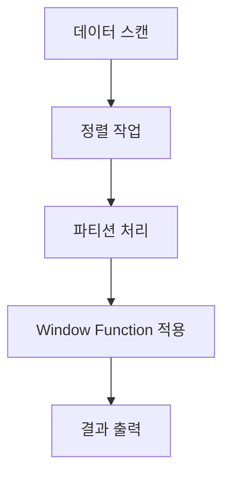

```table-of-contents
title: # 목차
style: nestedList # TOC style (nestedList|nestedOrderedList|inlineFirstLevel)
minLevel: 0 # Include headings from the specified level
maxLevel: 5 # Include headings up to the specified level
includeLinks: true # Make headings clickable
hideWhenEmpty: false # Hide TOC if no headings are found
debugInConsole: false # Print debug info in Obsidian console
```
# 개념 이해하기

Window Function은 마치 엑셀에서 스프레드시트의 특정 범위를 선택하고 그 안에서 계산을 수행하는 것과 같다. 예를 들어, 매장별 매출을 보면서 동시에 전체 매출에서 각 매장이 차지하는 비율을 계산하고 싶을 때 Window Function을 사용할 수 있다.

## 필요한 배경 지식
- SQL의 기본적인 SELECT문 사용법
- GROUP BY와 집계 함수의 이해
- ORDER BY를 통한 정렬 개념

# 기본 구문과 동작 방식


## Window Function의 기본 구조
```sql
SELECT
    column1,
    column2,
    WINDOW_FUNCTION() OVER (
        PARTITION BY partition_column
        ORDER BY sort_column
        ROWS/RANGE BETWEEN ... AND ...
    )
FROM table_name;
```

# 주요 Window Function 종류

## 순위 함수 (Ranking Functions)

```sql
-- 매출액 기준 매장 순위 산출
SELECT 
    store_name,
    sales_amount,
    -- 동일 매출 동일 순위, 건너뛰기
    RANK() OVER (ORDER BY sales_amount DESC) as sales_rank,
    -- 동일 매출 동일 순위, 순차적
    DENSE_RANK() OVER (ORDER BY sales_amount DESC) as dense_rank,
    -- 순차적 번호 부여
    ROW_NUMBER() OVER (ORDER BY sales_amount DESC) as row_num
FROM store_sales;
```

## 집계 함수 (Aggregate Functions)

```sql
-- 지역별 매장 매출 분석
SELECT 
    region,
    store_name,
    sales_amount,
    -- 지역별 총 매출
    SUM(sales_amount) OVER (PARTITION BY region) as region_total,
    -- 지역별 평균 매출
    AVG(sales_amount) OVER (PARTITION BY region) as region_avg,
    -- 지역 내 매출 비중(%)
    ROUND(sales_amount * 100.0 / 
        SUM(sales_amount) OVER (PARTITION BY region), 2) as sales_ratio
FROM store_sales
ORDER BY region, sales_amount DESC;
```

## 순서 관련 함수 (Lead/Lag Functions)

```sql
-- 매출 추이 분석
SELECT 
    sales_date,
    sales_amount,
    -- 전일 매출
    LAG(sales_amount) OVER (ORDER BY sales_date) as prev_day_sales,
    -- 다음날 매출
    LEAD(sales_amount) OVER (ORDER BY sales_date) as next_day_sales,
    -- 전일 대비 증감률
    ROUND((sales_amount - LAG(sales_amount) OVER (ORDER BY sales_date)) * 100.0 /
        NULLIF(LAG(sales_amount) OVER (ORDER BY sales_date), 0), 2) as growth_rate
FROM daily_sales;
```

# 실제 활용 사례

## 움직이는 평균 계산 (Moving Average)

```sql
-- 7일 이동평균 매출 계산
SELECT 
    sales_date,
    sales_amount,
    ROUND(AVG(sales_amount) OVER (
        ORDER BY sales_date
        ROWS BETWEEN 6 PRECEDING AND CURRENT ROW
    ), 2) as moving_avg_7days
FROM daily_sales
ORDER BY sales_date;
```

## 누적 합계 계산 (Running Total)

```sql
-- 월별 누적 매출 계산
SELECT 
    sales_month,
    monthly_sales,
    SUM(monthly_sales) OVER (
        ORDER BY sales_month
        ROWS UNBOUNDED PRECEDING
    ) as cumulative_sales
FROM monthly_sales;
```

# 성능 최적화

## 실행 계획 분석



## 성능 개선 전략

```sql
-- 파티션 크기를 고려한 인덱스 생성
CREATE INDEX idx_partition_sort ON sales(region, sales_date);

-- 필요한 컬럼만 선택하여 처리량 감소
SELECT 
    sales_date,
    sales_amount,
    AVG(sales_amount) OVER w as avg_amount
FROM sales
WINDOW w AS (
    PARTITION BY region 
    ORDER BY sales_date
    ROWS BETWEEN 3 PRECEDING AND 3 FOLLOWING
);
```

# 주의사항과 제한사항

1. 성능 고려사항
   - 큰 데이터셋에서는 정렬 작업이 성능에 영향을 미칠 수 있다
   - 적절한 인덱스 설정이 중요하다
   - 파티션 크기를 고려해야 한다

2. NULL 값 처리
   - NULL 값이 있는 경우 정렬 순서에 주의해야 한다
   - 집계 함수에서 NULL 처리 방식을 이해해야 한다

# 고급 활용법

## 여러 Window 함수 조합하기

```sql
-- 복합 분석: 순위, 점유율, 누적합계 동시 계산
SELECT 
    department,
    employee_name,
    salary,
    RANK() OVER (PARTITION BY department ORDER BY salary DESC) as salary_rank,
    ROUND(salary * 100.0 / SUM(salary) OVER (PARTITION BY department), 2) as dept_salary_ratio,
    SUM(salary) OVER (
        PARTITION BY department 
        ORDER BY salary DESC 
        ROWS UNBOUNDED PRECEDING
    ) as cumulative_dept_salary
FROM employees
ORDER BY department, salary DESC;
```

## 조건부 Window Function

```sql
-- 부서별, 직급별 다른 기준 적용
SELECT 
    department,
    position,
    sales_amount,
    CASE 
        WHEN position = 'Manager' THEN
            AVG(sales_amount) OVER (PARTITION BY department)
        ELSE
            AVG(sales_amount) OVER (PARTITION BY department, position)
    END as benchmark_sales
FROM employee_sales;
```

# 결론

Window Function은 복잡한 비즈니스 분석 요구사항을 효율적으로 해결할 수 있는 강력한 도구이다. 올바른 사용을 위해서는:

1. 기본 개념과 각 함수의 특성을 정확히 이해해야 한다
2. 성능 영향을 고려하여 적절한 인덱스와 최적화 전략을 사용해야 한다
3. NULL 값 처리와 같은 특수 상황에 대한 처리 방안을 숙지해야 한다
4. 실제 업무 상황에 맞는 창의적인 활용 방안을 고민해야 한다

이러한 원칙들을 잘 이해하고 적용한다면, 데이터 분석과 리포팅 작업을 더욱 효율적으로 수행할 수 있을 것이다.