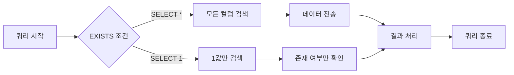
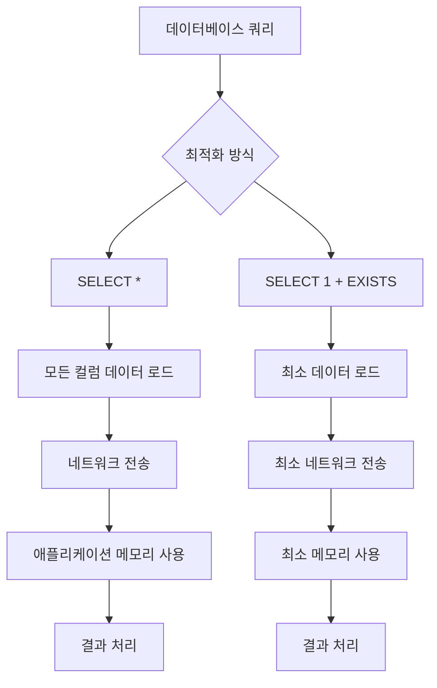

```table-of-contents
title: # 목차
style: nestedList # TOC style (nestedList|nestedOrderedList|inlineFirstLevel)
minLevel: 0 # Include headings from the specified level
maxLevel: 5 # Include headings up to the specified level
includeLinks: true # Make headings clickable
hideWhenEmpty: false # Hide TOC if no headings are found
debugInConsole: false # Print debug info in Obsidian console
```

# 개념 설명

데이터베이스 쿼리 최적화는 애플리케이션의 성능을 결정짓는 핵심 요소이다. 특히 레코드의 존재 여부만 확인하는 경우 `EXISTS`와 `SELECT 1` 기법을 활용하면 성능을 크게 개선할 수 있다.

## 실생활 비유

이 개념을 이해하기 위해 도서관에서 책을 찾는 상황을 생각해보자:

- `SELECT *`: 책을 찾기 위해 모든 책을 서가에서 꺼내 전체 내용을 확인하는 방식
- `SELECT specific_column`: 책의 표지와 목차만 확인하는 방식
- `SELECT 1 + EXISTS`: 책이 서가에 있는지만 확인하고 책을 꺼내지 않는 방식

우리가 단순히 특정 책이 존재하는지만 알고 싶다면, 책 전체를 꺼내 확인하는 것은 비효율적이다. 마찬가지로 데이터베이스에서도 레코드의 존재 여부만 확인할 때는 모든 데이터를 가져올 필요가 없다.

# 기본 동작 방식

## EXISTS 연산자

EXISTS는 서브쿼리가 하나 이상의 행을 반환하면 TRUE를 반환하는 SQL 연산자이다. 이 연산자는 실제 데이터를 반환하지 않고 존재 여부만 확인한다.

## SELECT 1 기법

`SELECT 1`은 실제 테이블 컬럼이 아닌 상수 값 1을 선택하는 것이다. 이는 다음과 같은 이점을 제공한다:

1. **성능 최적화**: 레코드 존재 여부만 확인할 때 실제 데이터를 검색하지 않는다.
2. **네트워크 트래픽 감소**: 불필요한 데이터 전송을 방지한다.
3. **메모리 사용량 감소**: 필요한 정보만 메모리에 로드한다.
4. **데이터베이스 엔진 최적화**: 대부분의 데이터베이스 엔진은 `SELECT 1`을 존재 확인으로 인식하고 쿼리 실행 계획을 최적화한다.

# 실제 사용 예시

## SQL에서의 사용 방법

### 비효율적인 방식 (모든 컬럼 선택)

```sql
EXISTS (
  SELECT *
  FROM posts
  WHERE posts.id = scraps.scrapable_id
  AND posts.deleted_at IS NOT NULL
)
```

### 최적화된 방식 (상수 값만 선택)

```sql
EXISTS (
  SELECT 1
  FROM posts
  WHERE posts.id = scraps.scrapable_id
  AND posts.deleted_at IS NOT NULL
)
```

## Laravel에서의 구현

Laravel에서는 `DB::raw()`를 사용하여 SQL 표현식을 직접 전달할 수 있다.

### 비효율적인 방식

```php
Scrap::whereHas('post', function ($query) {
    $query->whereNotNull('deleted_at');
})->get();
```

### 최적화된 방식

```php
Scrap::where(function ($query) {
    $query->whereExists(function ($subquery) {
        $subquery->select(\DB::raw(1))
            ->from('posts')
            ->where('posts.id', '=', \DB::raw('scraps.scrapable_id'))
            ->whereNotNull('posts.deleted_at');
    });
})->get();
```

## Django에서의 구현

```python
# 비효율적인 방식
Scrap.objects.filter(post__deleted_at__isnull=False)

# 최적화된 방식
from django.db.models import Exists, OuterRef, Value
Scrap.objects.filter(
    Exists(
        Post.objects.filter(
            id=OuterRef('scrapable_id'),
            deleted_at__isnull=False
        ).values('pk')[:1]
    )
)
```

# 고급 활용법

## 복잡한 쿼리에서의 활용

복잡한 조건이 포함된 쿼리에서도 EXISTS와 SELECT 1을 함께 사용할 수 있다:

```sql
SELECT users.*
FROM users
WHERE EXISTS (
    SELECT 1
    FROM orders
    WHERE orders.user_id = users.id
    AND orders.created_at > DATE_SUB(NOW(), INTERVAL 30 DAY)
)
AND NOT EXISTS (
    SELECT 1
    FROM user_flags
    WHERE user_flags.user_id = users.id
    AND user_flags.flag_type = 'banned'
);
```

이 쿼리는 "최근 30일 이내에 주문한 적이 있으며 차단되지 않은 모든 사용자"를 효율적으로 찾는다.

## 성능 측정

최적화 전후의 성능 차이를 확인하기 위해 쿼리 실행 계획(EXPLAIN)을 사용할 수 있다:

```sql
EXPLAIN SELECT EXISTS (
    SELECT *
    FROM large_table
    WHERE some_condition
);

EXPLAIN SELECT EXISTS (
    SELECT 1
    FROM large_table
    WHERE some_condition
);
```

특히 대용량 테이블에서는 두 방식의 성능 차이가 크게 나타난다.

# 주의사항

## 과도한 최적화 주의

모든 쿼리에 EXISTS와 SELECT 1을 적용하는 것이 항상 최선은 아니다. 다음 사항을 고려해야 한다:

- 실제 데이터가 필요한 경우에는 SELECT 1을 사용하지 않는다.
- 소규모 테이블이나 단순 쿼리에서는 최적화 효과가 미미할 수 있다.
- 데이터베이스 종류와 버전에 따라 최적화 효과가 다를 수 있다.

## 데이터베이스별 차이점

데이터베이스 엔진에 따라 최적화 방식이 다를 수 있다:

- MySQL: `SELECT 1`과 `SELECT *`의 성능 차이가 크다.
- PostgreSQL: 쿼리 플래너가 더 효율적이어서 차이가 적을 수 있다.
- SQL Server: EXISTS 쿼리에 대해 자체적인 최적화를 수행한다.

# 시각화 요소

## 쿼리 실행 흐름도



## 성능 비교 다이어그램



# 결론

EXISTS와 SELECT 1 기법은 데이터베이스 쿼리 최적화의 강력한 도구이다. 특히 레코드의 존재 여부만 확인하는 경우, 이 기법을 적용하면 다음과 같은 이점을 얻을 수 있다:

1. 쿼리 실행 시간 단축
2. 네트워크 트래픽 감소
3. 메모리 사용량 감소
4. 전체 시스템 성능 향상

대규모 시스템에서는 이러한 작은 최적화가 누적되어 큰 성능 향상을 가져온다. 따라서 EXISTS와 함께 SELECT 1을 사용하는 최적화 패턴을 적절한 상황에서 적용하는 것이 중요하다.

기억해야 할 핵심 원칙은 "필요한 정보만 요청하라"이다. 데이터의 존재 여부만 확인하는 쿼리에서는 모든 데이터를 가져오지 말고, 존재 여부만 확인하는 최적화된 방식을 사용하자.