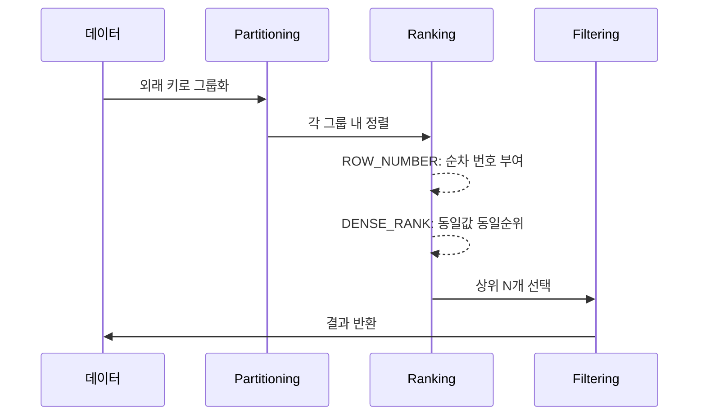

```table-of-contents
title: # 목차
style: nestedList # TOC style (nestedList|nestedOrderedList|inlineFirstLevel)
minLevel: 0 # Include headings from the specified level
maxLevel: 5 # Include headings up to the specified level
includeLinks: true # Make headings clickable
hideWhenEmpty: false # Hide TOC if no headings are found
debugInConsole: false # Print debug info in Obsidian console
```

# 배경 지식
이 문서를 이해하기 위해서는 다음과 같은 기본 지식이 필요하다:
- SQL 기본 문법과 SELECT 문 작성 능력
- [[JOIN]]과 WHERE 절에 대한 이해
- 데이터베이스 인덱스의 기본 개념
- 기본적인 데이터베이스 정규화 이해

# 개념 설명
## 실생활 비유로 이해하는 외래 키 중복 제한
식당의 예약 시스템을 생각해보자. 한 고객이 같은 시간대에 여러 테이블을 예약하는 것을 방지하고 싶다면, 이는 외래 키(고객 ID)의 중복을 제한하는 것과 같다. Window Function은 마치 예약 담당자가 각 고객별로 예약 건수를 확인하고, 정해진 수 이상은 받지 않는 것과 같은 역할을 한다.

## Window Function의 개념
데이터베이스에서 Window Function은 행들의 그룹(창)을 만들고, 각 그룹 내에서 계산을 수행하는 함수이다. 이는 마치 엑셀에서 특정 열을 기준으로 데이터를 정렬하고 순번을 매기는 것과 유사하다.

# 시스템 아키텍처

```mermaid
flowchart TB
    subgraph "Database Server"
        A[Raw Data Table] --> B[Window Function Processing]
        B --> C{Duplicate Check}
        C --> D[Filtered Results]
        
        subgraph "Window Function Layer"
            B --> E[ROW_NUMBER()]
            B --> F[DENSE_RANK()]
        end
        
        subgraph "Data Flow Control"
            C --> G[Accepted Records]
            C --> H[Rejected Records]
        end
    end
    
    subgraph "Application Layer"
        I[Data Request] --> J[SQL Query]
        J --> K[Result Processing]
        K --> L[Business Logic]
    end
```

# 기본 동작 방식
Window Function을 사용한 중복 제한은 다음과 같은 단계로 동작한다:

1. 데이터 파티셔닝
2. 순위/번호 부여
3. 필터링

## ROW_NUMBER vs DENSE_RANK 프로세스



# 실제 사용 예시와 상세 설명

## 기본적인 중복 제한 구현
```sql
-- 고객당 최대 2개의 주문만 허용하는 예제
WITH RankedOrders AS (
    SELECT 
        o.*,  -- 모든 주문 정보 선택
        ROW_NUMBER() OVER (
            PARTITION BY customer_id  -- 고객별로 그룹화
            ORDER BY order_date DESC  -- 최신 주문부터 정렬
        ) as order_rank
    FROM orders o
)
SELECT *
FROM RankedOrders
WHERE order_rank <= 2;  -- 상위 2개 주문만 선택
```

## 복잡한 비즈니스 규칙 적용
```sql
-- 고객별, 상품 카테고리별로 최대 2개 주문 제한
WITH CategoryRanked AS (
    SELECT 
        o.*,
        p.category_id,
        ROW_NUMBER() OVER (
            PARTITION BY o.customer_id, p.category_id
            ORDER BY 
                o.order_date DESC,
                o.order_amount DESC  -- 금액이 큰 순서로
        ) as category_rank
    FROM orders o
    JOIN products p ON o.product_id = p.id
)
SELECT *
FROM CategoryRanked
WHERE category_rank <= 2;
```

# Security 고려사항

1. 접근 제어
```sql
-- 역할 기반 접근 제어 설정
GRANT SELECT ON RankedOrders TO reporting_role;
GRANT SELECT ON CategoryRanked TO reporting_role;
```

2. 데이터 마스킹
```sql
-- 민감 정보 마스킹 처리
SELECT 
    order_id,
    CONCAT(SUBSTRING(customer_name, 1, 2), '***') as masked_name,
    order_date,
    order_rank
FROM RankedOrders;
```

# Performance 최적화

## 인덱스 설정
```sql
-- 성능 향상을 위한 인덱스 생성
CREATE INDEX idx_customer_order 
ON orders (customer_id, order_date DESC);

CREATE INDEX idx_category_customer 
ON orders (category_id, customer_id, order_date DESC);
```

## 실행 계획 분석
```sql
-- 실행 계획 확인
EXPLAIN ANALYZE
SELECT * FROM RankedOrders
WHERE order_rank <= 2;
```

# 문제 해결 가이드

## 일반적인 문제와 해결 방안

1. 성능 저하 발생 시
   - 파티션 크기 확인
   - 인덱스 사용 여부 검증
   - 실행 계획 분석

2. 데이터 일관성 문제
   - 트랜잭션 격리 수준 확인
   - 동시성 제어 메커니즘 검토

3. 중복 데이터 처리
   - DENSE_RANK 사용 검토
   - 업무 규칙 재검토

# 모니터링 및 유지보수

## 성능 모니터링 쿼리
```sql
-- 파티션별 데이터 분포 확인
SELECT 
    customer_id,
    COUNT(*) as record_count,
    MAX(order_rank) as max_rank
FROM RankedOrders
GROUP BY customer_id
HAVING COUNT(*) > 2;
```

# 결론
Window Function을 사용한 외래 키 중복 제한은 강력하면서도 유연한 해결책을 제공한다. 실제 구현 시에는 다음 사항을 고려해야 한다:

1. 비즈니스 요구사항의 정확한 이해
2. 성능과 보안의 균형
3. 확장성을 고려한 설계
4. 적절한 모니터링과 유지보수 계획

이 가이드를 통해 배운 내용을 기반으로, 각자의 상황에 맞는 최적의 구현을 할 수 있을 것이다.